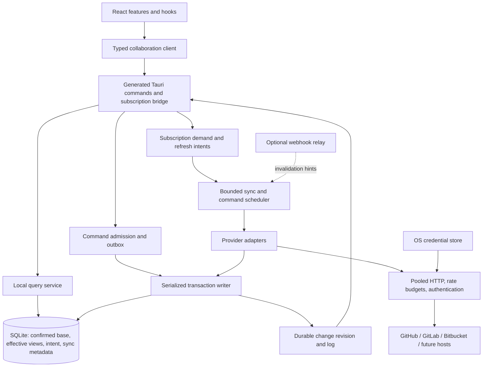
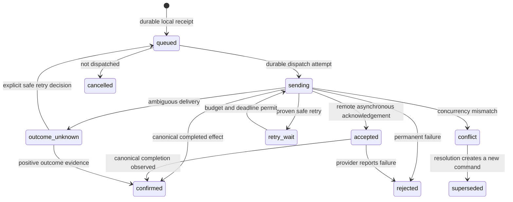

# Remote collaboration engine architecture

Status: architecture accepted as the implementation direction. Read-only and
bounded durable-write slices are published in unmerged review branches; section 23
retains their chronological evidence. The [8 October handoff](remote-collaboration-handoff.md)
records current scope, remaining work and exact-head CI. Proposed later-phase
contracts are not shipping APIs. The combined stack is locally qualified in
[PR #190](https://github.com/ruru-m07/gitru/pull/190): 838 frontend and 1,418 Rust
tests pass; remote CI and live provider/platform qualification remain separate.

Research date: **2 October 2026**. Repository inspection: HEAD
`ddaecfad99195f9ce57e46cd3b1bbc0bb02c666d` (`dev`), implementation branch
`ruru/remote-collaboration`. Revalidate provider behavior and dependency versions
during implementation, particularly on self-hosted installations.

## 1. Purpose and recommended foundation

Gitru should make remote collaboration feel like native local data: opening an
already synchronized pull request, changing views, searching cached issues, and
reading the inbox should not wait for provider HTTP requests. Connecting several
accounts should produce one coherent experience without mixing their permissions
or hiding important provider differences.

**Recommendation:** build a Tauri-independent Rust collaboration service with
SQLite as the durable local read model, a persistent command outbox, a bounded
reconciliation scheduler, and typed local queries/subscriptions. Use the existing
React and TanStack Query stack as the presentation and bounded projection cache.
Provider adapters translate domain operations into provider-specific APIs.

The providers remain authoritative for shared PRs, issues, reviews, and server
notification state. Gitru owns drafts, local preferences, pending intent, cached
observations, and its own local change log. This is a local-first experience over
external authoritative systems; it cannot guarantee offline completion of every
remote operation or a globally consistent snapshot of a provider.

**Confirmed product requirement:** connected provider accounts work without
signing into a Gitru cloud account. Direct desktop authentication, synchronization,
and offline reads are the baseline. A hosted authentication broker or webhook
relay may be an optional feature; it is not on the normal read path.

**Proposed rollout assumption:** GitHub.com first, GitLab second, Bitbucket Cloud
third. Design instance identities for enterprise hosts from the start; claim
support only for tested server versions. The exact enterprise launch order is
still a product decision.

This document is the source of truth for future implementation. Change decisions
here before changing the architecture in code, record why, and update the
implementation record in section 23. API examples are proposed contracts, not
exports that currently exist.

Reading guide: sections 1–5 and 22 explain the decisions; sections 6–17 define
contracts and correctness; sections 18–20 cover operations and verification;
sections 21 and 23 are the implementation roadmap and continuation record.

## 2. What the current repository actually provides

| Integration point | Inspected behavior | Design consequence |
| --- | --- | --- |
| `apps/desktop/src-tauri/Cargo.toml`, `src/lib.rs` | Tauri **2**, Tokio, managed Git state, command registration | Add one process-level collaboration runtime beside Git state |
| `crates/git/lib.rs`, `context.rs`; `crates/ipc/src/commands.rs` | Git services/cache live under context IDs; opening a tab can create a new context | Account sync must outlive tabs and local clones |
| `crates/git/cache.rs` | In-memory TTL cache with single-flight/stale-on-error behavior | Keep it for Git; do not use it as the durable remote replica |
| `apps/desktop/src/state/core/state-manager.ts` | TanStack Query: five-minute stale time, thirty-minute GC; repository watcher and native focus refresh Git queries | Remote queries use the durable revision bridge; Rust owns provider refresh |
| `src/components/webview-tab-host.tsx`, `src/bootstrap/app-root.tsx` | Child webviews run separate JS runtimes and QueryClients | A TS singleton cannot be the application-wide scheduler |
| `src/state/domains/repository-state.ts`, `src/hooks/use-repository.ts` | Domain/query and component-hook separation already exists | Add a collaboration client/domain rather than expanding RepositoryState |
| `src/store/*`, `crates/ipc/src/repo_manager.rs` | JSON plugin store persists UI state/repository registrations | Keep preferences there; put domain rows, outbox, cursors, and jobs in SQLite |
| `scripts/typegen.sh`, `packages/commands/` | Rust commands generate Zod-validated TS wrappers | Generate new DTOs/wrappers with `make typegen`; never hand-edit this package |
| `src/components/sidebar/index.tsx` | Hard-coded account avatars and inbox badge `"5"` | Replace only after real account and inbox queries exist |
| `src/routes/app/pulls/index.tsx` | “Cooking pulls” placeholder | Introduce actual feature UI in `src/features/pulls/` |
| `src/routes/app/inbox/index.tsx`, `issues/index.tsx` | Development prototypes; production redirects to Git | These are not existing collaboration implementations |
| `src/routes/auth/onboarding/index.tsx` | Fabricated user/session | Build a real desktop provider-account lifecycle |
| `apps/api/src/auth.ts`, `db/auth-schema.ts`, `index.ts` | Better Auth/GitHub social login and waitlist; PostgreSQL account-token columns | Gitru identity is separate from provider authorization; do not reuse social tokens as desktop collaboration sessions |
| `docs/security/threat-model.md`, Tauri capabilities/CSP | OS credential store required; deny-default webview networking; narrow child permissions | Rust owns HTTP and secrets; new commands validate caller/account scope |

These findings describe the implementation base. Repository watchers are present
on `dev`; existing clone/pickaxe/updater progress events are
ephemeral and do not provide a durable domain subscription protocol.

## 3. Goals, boundaries, and correctness rules

Goals are fast local reads, useful offline behavior, provider-independent feature
code, explicit account isolation, bounded resource consumption, and recoverable
background work. Support repositories that are not cloned locally.

Initial non-goals are mirroring every accessible repository, downloading all
historical code and comments, multi-device synchronization of Gitru drafts,
arbitrary third-party executable adapters, or rebuilding provider permission and
workflow systems.

The following rules are implementation requirements:

1. A local query never waits for provider HTTP. An uncached record returns a
   meaningful missing/partial state; hydration is a separate operation.
2. A “queued locally” receipt means intent and its optimistic projection have
   committed durably. It does not mean the provider accepted the operation.
3. One Rust runtime owns synchronization and database writes across webviews.
4. Every query, job, validator, asset, and mutation has explicit account and
   provider-instance scope. No implicit “currently logged-in account” fallback.
5. Apply data, page progress, outbox changes, and local change metadata atomically
   when they represent one database transition.
6. Never perform HTTP, credential prompts, or expensive content parsing inside a
   database transaction.
7. Partial results, failed pagination, and capped searches do not prove absence.
   Unknown permissions and unknown fields do not become empty/false values.
8. Provider timestamps, opaque ETags, and pagination cursors are not assumed to be
   monotonic revision numbers or durable change-log positions.
9. Transport events are recoverable hints. SQLite state and its persisted revision
   are authoritative for local subscriptions.
10. A retry must preserve command identity. An ambiguous remote write is not
    automatically treated as failed or retried.
11. Pending operations are reapplied over confirmed base state in deterministic
    order; a refresh must not erase user intent.
12. Expired/revoked credentials stop writes. Jobs from an old authorization epoch
    cannot commit into the current account view.
13. Cache eviction, migration, and reset never silently discard drafts, outbox
    records, conflict evidence, or unknown delivery outcomes.
14. Unsupported capabilities fail explicitly. Provider-specific extensions cannot
    bypass scheduling, credential isolation, or mutation recovery.

## 4. Research and technology decisions

These are architectural judgments derived from the linked primary sources, not
claims that one technology is universally superior.

| Candidate | Current capabilities and fit | Decision |
| --- | --- | --- |
| SQLite + SQLx | Indexed local queries, transactions, FTS5, worker-backed async SQLite access, migrations | Preferred storage; explicit writer owner and small read pool |
| SQLite + rusqlite | Strong SQLite-specific access, bundled engine, backup facilities | Viable alternative with a dedicated blocking DB actor; select only if the spike shows SQLx friction |
| TanStack Query | Already integrated; bounded view caching and React lifecycle | Keep as frontend query cache; query functions read local Rust data |
| TanStack DB | Live queries/normalized collections; v0.6 adds persistence/offline support including Tauri SQLite | Evaluate later as a bounded Rust-fed projection layer; do not create a competing database writer/outbox |
| Electric | Syncs Postgres read paths through Shapes; writes remain application responsibilities | Revisit if Gitru owns a hosted mirror; does not remove provider ingestion |
| PowerSync | Syncs managed client SQLite against a backend source database with application upload logic | Same hosted-mirror tradeoff; not necessary for standalone desktop |
| Zero | Query-oriented sync for application-controlled backend data | Future hosted product option; it does not supply provider delta or mutation semantics |
| RxDB | Custom replication handlers and local reactive queries; checkpoint/conflict protocol | More flexible, but provider APIs do not directly satisfy its ordering/deletion/conflict protocol; no initial JS replica |
| Automerge/CRDTs | Merge concurrently edited state among participating replicas | Potentially useful for Gitru-owned notes/drafts; provider transition APIs do not consume CRDT changes |
| IndexedDB/WASM SQLite in each webview | Browser-oriented local persistence | Adds independent stores and lifecycle coordination to an already native app; omit initially |
| Embedded server database or Node sidecar | Can centralize persistence/provider SDKs | Extra distribution/process cost without an initial need |
| Hosted PostgreSQL mirror + sync service | Can amortize ingestion and push to devices | Adds sensitive data custody, tenants, provider auth, operational cost, and an availability dependency; defer |

Sources: [SQLite WAL](https://sqlite.org/wal.html),
[SQLx connection options](https://docs.rs/sqlx/latest/sqlx/sqlite/struct.SqliteConnectOptions.html),
[SQLx migrations](https://docs.rs/sqlx/latest/sqlx/migrate/struct.Migrator.html),
[rusqlite](https://github.com/rusqlite/rusqlite),
[TanStack DB overview](https://tanstack.com/db/latest/docs/overview),
[TanStack DB persistence announcement](https://tanstack.com/blog/tanstack-db-0.6-app-ready-with-persistence-and-includes),
[Electric](https://electric.ax/docs/sync/),
[PowerSync](https://docs.powersync.com/architecture/architecture-overview),
[Zero](https://zero.rocicorp.dev/docs/introduction),
[RxDB replication](https://rxdb.info/replication.html),
[Automerge](https://automerge.org/docs/hello/).

Linear's current engineering account describes an ordered application change log,
client checkpoints, permission/subscription filtering, and replay. Gitru can
adopt those invariants for its own local log. It cannot assume GitHub/GitLab/
Bitbucket expose Linear's server log. Linear's specialized hosted read index
solves a much larger server workload and is not a reason to add that dependency
to Gitru. [Linear delta sync engineering, August 2026](https://linear.app/now/rebuilding-delta-sync-read-path).

Choose SQLx + SQLite provisionally; phase 0 must verify bundled SQLite, migrations,
backup/recovery tooling, type generation, and packaged cross-platform behavior.
Pin tested versions in Cargo.lock and the Bun lockfile instead of prescribing
unverified “latest” dependency numbers here.

## 5. System structure and responsibility boundaries



Keep the dependency direction:

- `crates/collaboration` owns domain models, provider contracts/adapters, storage,
  query planning, scheduler, outbox, normalization, and redacted errors. It knows
  nothing about Tauri windows or React.
- `apps/desktop/src-tauri/src/commands/collaboration.rs` and bootstrap wiring own
  IPC validation, calling-webview policy, channels/events, OS credential-store
  integration, browser OAuth callbacks, and lifecycle adapters.
- `packages/collaboration-client` (`@gitru/collaboration-client`) owns handwritten
  ergonomic handles, query options, subscription coordination, and React hooks
  over generated `@gitru/commands` DTOs. Split React exports from framework-neutral
  client exports.
- `crates/git` continues to own clone/fetch/checkout/worktree/diff operations.
  Collaboration-to-Git actions compose explicit operations; they do not bypass
  existing Git safeguards.
- Zustand/plugin-store keeps selected account, navigation, layouts, and
  preferences. It does not store provider entities, cursors, or tokens.
- `apps/api` is optional infrastructure only. Its existing sign-in service is not
  required for the desktop engine.

Start as one focused crate with modules. Split provider/storage/domain crates when
dependency boundaries, reuse, or compile cost justify it, not before the first
vertical slice.

## 6. Identity, provider instances, and account isolation

Distinguish four concepts:

| Concept | Identity | Example |
| --- | --- | --- |
| Provider implementation | Adapter family/version | github, gitlab, bitbucket-cloud, bitbucket-dc |
| Provider instance | Local UUID + canonical validated base URL, deployment flavor and optional API version | github.com versus github.company.example |
| Connected account | Local UUID + instance + verified remote actor ID | Personal and work accounts on the same host |
| Domain entity | Opaque local EntityId mapped to provider-native stable ID and scope | A PR that survives repo rename/transfer |

Provider instance identity includes host, port, and installation base path.
Credentials reference an account and a credential profile; one actor may need
different profiles for repository access and inbox access. Reauthentication
updates credentials for the verified actor; authenticating a different actor
creates a different account rather than repurposing a partition.

Use stable provider IDs when available. GitHub REST IDs/node IDs, GitLab project
IDs plus resource IDs/IIDs, and Bitbucket repository UUIDs/local PR IDs require
adapter-owned identity mapping. Never use login, email, repository slug, or URL as
the durable primary key. Do not merge users across providers by matching email.

Store aliases for URLs, repository paths, issue/PR locators, and different endpoint
representations. GitHub Issues and Pulls representations can expose different IDs
for the same PR; resolve the repository and number and attach both provider
identities to one PR. Never create a separate issue solely because it arrived
through an issues endpoint.
[GitHub issues behavior](https://docs.github.com/en/rest/issues/issues),
[GitHub pull requests](https://docs.github.com/en/rest/pulls/pulls).

`github:ruru-m07/gitru:67` is useful shorthand for a **locator**, not a primary key.
It omits actor and enterprise host, and the path can change. Prefer a structured
locator or ordinary provider URL at the boundary, then resolve to an EntityId.
For an uncached locator, return an unresolved handle and explicit hydration job;
do not disguise network resolution as synchronous `open()`.

Partition all provider observations by account, even if two accounts see the same
logical PR. Return account-bound entity views. A global identity registry may
link them for deliberate UI deduplication, but must not share bodies, permissions,
validators, or caches between partitions. Unified queries require an explicit
account set and retain the account on each item. Default to distinct actionable
rows if two actors have different notification or review state.

Keep `authorization_epoch` and account lifecycle generation. All jobs and commands
capture these; commit checks reject old generations after disconnect, scope
changes, or credential replacement. Disconnect cancels jobs, blocks commands,
deletes credentials, clears affected in-memory views and subscriptions, and
follows the chosen local-data retention policy. Discovered access revocation
hides the affected cached private scope and pauses its writes until access is
revalidated; revocation cannot be detected while completely offline.

Local repository linking is separate: `local_repository_id + remote_name →
provider_instance + remote_repository_id + preferred_account`. Parse HTTPS/SSH,
ports, GitLab subgroups, multiple remotes, and configured aliases in Rust.
`src/lib/parse-origin.ts` is currently presentation metadata and cannot be the
identity authority. Unknown custom hosts require explicit instance configuration;
a Git remote must not silently authorize sending credentials to an arbitrary host.

## 7. Unified domain models

Use a common semantic core plus explicit availability and typed provider facets.
Normalize immutable identity and relations; keep provider URLs/display paths
mutable. Shared values use opaque string IDs, UTC timestamps, and bounded text.
Keep large numeric provider IDs and local revisions out of JavaScript number
precision hazards by serializing them as strings.

| Model | Common fields and semantics | Important qualifications |
| --- | --- | --- |
| Account | instance, actor, credential profiles, scope observations, auth state | Gitru cloud identity is separate |
| Actor | ID, kind, display name, login, avatar asset reference | Users, bots, teams, deleted/unknown actors; email optional |
| Repository | ID, namespace/path, name, visibility, default branch, archive state | Namespace is not universally “owner”; access is account-specific |
| PullRequest | repo, number/display key, title/body, author, assignees, labels, state, draft state, source/target repo/ref/OID, times | Preserve merged versus closed; mergeability and review state are separately hydrated |
| Issue | repo/project, display key, title/body, author, assignees, labels, milestone, state/category, times | Provider workflow/status facet preserves richer states |
| Comment | subject, author, body, times, edit/delete permissions | Issue comments and diff comments are different kinds |
| Review and ReviewThread | reviewer, decision, commit anchor, thread, resolution, comments | GitLab approvals/discussions are not identical to a GitHub review object |
| Check/BuildStatus | head OID, source app, status/conclusion, URL, times | Unknown/pending/stale; do not imply the common model knows all merge rules |
| Label/Milestone | stable provider identity, name, color, description, scope | Team/project/repo semantics vary |
| InboxItem | account, source, subject reference, reason, activity time, remote/local read disposition | Native notification, actionable todo, and locally derived activity remain distinct |
| TimelineEntry | subject, kind, actor, time, versioned payload | Unsupported events retain typed extension/fallback display |
| Draft | account, subject/temp ID, body, expected anchor, generation | User-owned durable state, never ordinary cache |
| CommandReceipt | command ID, local revision, delivery state, conflict/error | Stable across restart and retried IPC submission |

Use `ValueState<T>` for values where missingness changes behavior:
`known(value)`, `not_loaded`, `unsupported(reason)`, `unavailable(reason)`.
For collection facets, add loaded range, completion, and last validation metadata.
SQL can store tagged value/status columns; the public DTO need not expose storage
representation. A PR summary must not null out a previously loaded body.

A source observation includes facet name, projection/field mask, endpoint/API
version, validator, provider updated time if meaningful, received time,
`validated_at`, schema/adapter version, and fetch generation. Different endpoints
have different authority for different fields. Preserve provider enum values in
typed facets so a new remote value becomes an unknown fallback rather than a
panic or an invented mapping.

Keep provider facets in versioned namespaced tables/DTOs, for example
`gitlab.approval_rules.v1` and `bitbucket.tasks.v1`. Core feature code uses
capabilities and common fields; specialized panels can narrow to a provider facet.
Avoid an untyped `Record<string, any>` becoming the real model.

### Notification semantics

A common inbox is a presentation aggregate, not an assertion that all providers
offer the same notification API. Keep server read/done state separate from
Gitru-local dismissed/snoozed/bookmarked state. Do not promise remote “mark
unread” when the provider only supports mark-read. A local dismissed item
reappears according to a persisted latest-activity fence, not whenever a poll
rewrites it.

GitHub notifications are threads and specify conditional polling and a minimum
poll interval. Current endpoint documentation states classic PAT authentication
and excludes GitHub App/fine-grained token support. The implementation also
recognizes existing OAuth credentials imported from GitHub CLI, but only when
`/user` reports the `notifications` or `repo` scope; GitHub documents those OAuth
scopes separately. Live notification behavior for each credential type remains
an integration-test gate. Unknown token types and unobserved scopes remain
unsupported rather than being inferred from a successful account connection.
[GitHub notifications](https://docs.github.com/en/rest/activity/notifications),
[GitHub OAuth scopes](https://docs.github.com/en/apps/oauth-apps/building-oauth-apps/scopes-for-oauth-apps).

GitLab todos are actionable items, not a full notification mirror. Their adapter
and UI should say “todos” where that distinction matters.
[GitLab todos](https://docs.gitlab.com/api/todos/).

Bitbucket Cloud's native issue-tracker endpoints were removed on 20 August 2026.
Its issue capability is unsupported. Jira or another external tracker is a
separate future connection, even when linked from a Bitbucket repository.
[Bitbucket Cloud changelog](https://developer.atlassian.com/cloud/bitbucket/changelog/#20-august-2026).

No supported general native notification-inbox API was established for Bitbucket
Cloud or Data Center in this research; mark that capability unsupported in the
initial adapters. Any derived activity uses `source_kind: local-activity` and
Gitru-local disposition, distinct from `native-thread` and `native-todo` items.
Data Center native issue CRUD is likewise unsupported; an external issue tracker
requires its own connection. Capability declarations are per item/operation.

## 8. Provider abstraction and capability contract

Use explicit resource operations and synchronization primitives, rather than one
giant CRUD adapter or an arbitrary provider HTTP escape hatch.

```rust
// Illustrative contract; exact async trait design is chosen in phase 0.
trait CollaborationProvider {
    async fn probe(&self, ctx: &RequestContext)
        -> Result<ProviderProfile, ProviderError>;
    async fn resolve(&self, ctx: &RequestContext, locator: Locator)
        -> Result<ResolvedIdentity, ProviderError>;
    async fn fetch_page(&self, ctx: &RequestContext, request: FeedRequest)
        -> Result<FetchPageOutcome, ProviderError>;
    async fn fetch_facet(&self, ctx: &RequestContext, request: FacetRequest)
        -> Result<FacetOutcome, ProviderError>;
    async fn execute(&self, ctx: &RequestContext, command: ProviderCommand)
        -> Result<DeliveryOutcome, ProviderError>;
    async fn reconcile_delivery(&self, ctx: &RequestContext, evidence: DeliveryEvidence)
        -> Result<ReconciliationOutcome, ProviderError>;
}
```

`RequestContext` is supplied by the engine: account, auth epoch, cancellation,
request budget/deadline, trace-safe ID, and HTTP/auth facade. It contains no Tauri
types. Adapters normalize external data into bounded batches and declare their
field authority, rate family, continuation, and completeness semantics. The engine
owns persistence, retries, scheduling, and optimistic projection rules.

`ProviderProfile` exposes tested operations and conditional support:
`supported`, `unsupported`, `requires_scope`, `requires_permission`,
`unknown`. Compute effective capabilities from adapter, installation/version,
credential type/scopes, repository policy, and current actor permission.
Recheck at command dispatch; cached capability checks are not authorization.

Each operation declares:

- input/result DTO and required facets;
- online requirement and offline admission policy;
- server concurrency guard: enforced revision/head, best-effort preflight, or none;
- remote idempotency/effect-verification strategy and ambiguity policy;
- affected entity facets, collection dependencies, and rate family;
- asynchronous completion handling and typed provider extension, if applicable.

For example, `PullRequest.setTitle`, `Issue.close`, `Comment.create`,
`Review.submit`, and `PullRequest.merge` have different delivery rules; treating
them all as `update(entity, patch)` loses essential semantics.

| Provider | Sync and feature constraints | Planned adapter behavior |
| --- | --- | --- |
| GitHub | PR lists have updated sorting but no universal delta cursor; issues feeds include PRs; REST and GraphQL have different budgets | REST baseline; targeted GraphQL batching where measured; alias identities and hydrate children separately |
| GitLab SaaS/self-managed | MR time filters, IIDs scoped to projects, todos, discussions/approvals; versions/plans/settings vary | Instance probes; capability-gated facets; inclusive overlap and reconciliation |
| Bitbucket Cloud | UUID identities, opaque next links, q/sort support, PR tasks/participants/draft fields; no native issue tracker | Independent adapter; all relevant PR states explicit; issue unsupported |
| Bitbucket Data Center | Different routes/auth/models/version fields from Cloud; external issue tracking | Separate adapter/test matrix; native issues/general inbox unsupported initially |
| Future Gitea/Forgejo/Azure/Jira | Different resource concepts and delivery guarantees | Add manifests, normalization, contract tests, and typed extensions without provider branches in core UI |

Sources: [GitHub pull requests](https://docs.github.com/en/rest/pulls/pulls),
[GitLab merge requests](https://docs.gitlab.com/api/merge_requests/),
[Bitbucket Cloud PRs](https://developer.atlassian.com/cloud/bitbucket/rest/api-group-pullrequests/),
[Bitbucket Data Center PRs](https://developer.atlassian.com/server/bitbucket/rest/v900/api-group-pull-requests/).

Provider SDKs can reduce endpoint boilerplate, but must allow pooled transport,
cancellation, header/validator access, redaction, and engine-controlled retries.
Default to explicit reqwest requests with serde models where SDK policy conflicts.
Pin provider API versions where supported; request only required fields, tolerate
unknown additions, and validate size/depth. Extension commands travel through the
same command machinery. Native dynamic plugins are deferred.

## 9. Local storage and schema

Use one database under Tauri's **local application-data directory**, separate from
repositories and shared/network mounts. Partition provider content by account.
A single DB makes atomic account lifecycle changes and a unified inbox practical;
account-scoped repository methods and composite keys enforce isolation.

Proposed schema groups:

| Group | Tables/concepts |
| --- | --- |
| Identity | provider_instances, accounts, credential_refs, entity_registry, provider_identity_aliases, locator_aliases, local_remote_links |
| Confirmed observations | repositories, actors, pull_requests, issues, comments, reviews, review_threads, checks, labels, milestones, relation tables, provider_facets |
| Effective query views | account-scoped effective PR/issue/inbox rows, relationships, search documents, local preferences |
| Coverage | subscriptions/sync_scopes, scope_membership, facet_coverage, page_validators, feed_checkpoints, reconciliation_runs |
| User intent | drafts, commands/outbox, command_dependencies, delivery_attempts, receipts, optimistic_effects, conflicts |
| Runtime/recovery | sync_jobs, rate_budget_state, account epochs, change_revision, change_log, schema_migrations |
| Assets | bounded blob/asset metadata and account-namespaced content-addressed files |

Confirmed base and effective views are distinct. The effective view applies
pending commands and local disposition to base rows so list membership, ordering,
counts, and detail views agree. Start with materialized effective rows updated by
the writer; do not assemble huge overlays in React. Pending temporary creations
participate in lists and get durable temp-to-provider ID mappings on confirmation.

A representative shape:

```sql
-- Conceptual excerpt, not a migration ready to run.
CREATE TABLE pull_requests (
  account_id TEXT NOT NULL,
  entity_id TEXT NOT NULL,
  repository_id TEXT NOT NULL,
  title TEXT NOT NULL,
  state TEXT NOT NULL,
  provider_updated_at TEXT,
  base_revision INTEGER NOT NULL,
  PRIMARY KEY (account_id, entity_id),
  FOREIGN KEY (account_id) REFERENCES accounts(id)
);
CREATE TABLE commands (
  account_id TEXT NOT NULL,
  command_id TEXT NOT NULL,
  target_id TEXT NOT NULL,
  authorization_epoch INTEGER NOT NULL,
  kind TEXT NOT NULL,
  payload_version INTEGER NOT NULL,
  payload_json TEXT NOT NULL,
  submission_hash TEXT NOT NULL,
  delivery_state TEXT NOT NULL,
  enqueue_order INTEGER NOT NULL,
  next_attempt_at TEXT,
  PRIMARY KEY (account_id, command_id),
  FOREIGN KEY (account_id) REFERENCES accounts(id)
);
CREATE INDEX effective_pr_list
  ON effective_pull_requests(account_id, repository_id, state, sort_time DESC, entity_id);
```

Full migrations add composite foreign keys for account-bound relations, constraints,
operation bases/guards, retry evidence, coverage, and validated enum handling.
Typed repositories always accept an AccountScope; no public raw-SQL IPC. Audit
every cross-account aggregate explicitly.

Initial DB configuration: WAL, foreign keys enabled on every connection,
`synchronous=FULL`, a bounded busy timeout, one serialized writer connection and
approximately 2–4 read connections. Keep transactions short; bounded write batches
yield between pages and prioritize interactive commands. WAL still has one writer,
and NORMAL durability can lose recent commits after power failure; drafts/outbox
justify FULL initially.
[SQLite durability settings](https://sqlite.org/pragma.html#pragma_synchronous).

Bundle and verify a tested SQLite release including the WAL-reset fix. Current
official guidance identifies SQLite 3.51.3+ or the documented 3.44.6/3.50.7
backports as fixed. Verify `sqlite_version()` and build features in packaged
platform tests, rather than trusting a system library.
[SQLite WAL](https://sqlite.org/wal.html).

Use indexed keyset pagination with deterministic ID tie-breaks. Do not keep
database read transactions open for the lifetime of a screen. Start FTS5 with
titles and bounded cached bodies, account-filtered before results leave Rust;
maintain index/content consistency transactionally and rebuild when projections
change. Do not index all diffs by default.
[SQLite FTS5](https://sqlite.org/fts5.html).

Large diffs/attachments use account-namespaced blobs: write temp file, atomic rename,
then commit metadata; collect unreferenced files later. Never share a sensitive blob
across account authorization boundaries solely because its content hash matches.
Draft text stays in the durable DB. Files referenced by drafts/outbox are durable
user intent, distinct from rebuildable provider attachments. Flush contents and
platform-supported rename/directory metadata before acknowledging their DB
reference; protect them from eviction/GC until all intent references are released.
SQLite FULL alone cannot make a separately stored attachment durable. Test crash
and power-loss recovery with referenced attachments, not only text commands.

## 10. Local API and developer experience

Prefer an explicit account-bound client and inert handles:

```ts
const remote = collaboration.forAccount(accountId);

// Local construction only; provider/host is bound by the account.
const pr = remote.pullRequests.open({
  repository: { path: "ruru-m07/gitru" },
  number: 67,
});

const snapshot = await pr.read(); // SQLite only; may be missing/partial
const stop = pr.watch((next) => render(next));
const refreshJob = await pr.ensureFresh({
  facets: ["summary", "reviews"],
  reason: "user-refresh",
});

// Durable command admission; delivery is tracked separately.
if (snapshot.data === null || snapshot.entityBaseRevision === null) {
  throw new Error("Load the PR before changing its title");
}
// The UI also gates on capabilities; Rust rechecks authorization on submission.
const receipt = await pr.setTitle({
  commandId: crypto.randomUUID(),
  title: "Improve remote collaboration",
  expectedBaseRevision: snapshot.entityBaseRevision,
});
await remote.commands.waitForLocalRevision(receipt.localRevision);
```

The missing state has no entity revision; this example's mutation requires a
loaded editable snapshot. Commands reject absent bases instead of guessing.
A URL/shorthand parser is convenience syntax:
`remote.pullRequests.open(locator)` can remember a locator but does not claim that
it already resolved an immutable identity. A separate resolve/hydrate job fills it.
`forAccount` removes provider knowledge from normal operations while preserving
the actor responsible for writes. `open()` does not allocate a forever-live
subscription or start hidden HTTP.

Local query result contract:

```ts
type LocalResult<T> = {
  data: T | null;
  availability: "missing" | "partial" | "ready" | "inaccessible";
  coverage: {
    scope: string;
    completeness: "unknown" | "partial" | "complete-within-scope";
    localHasMore: boolean;
    remoteHasMore: boolean | "unknown";
  };
  localRevision: string;
  entityBaseRevision: string | null;
  authorizationViewToken: string;
  validatedAt: string | null;
  syncState: "idle" | "syncing" | "offline" | "rate-limited" | "auth-required" | "error";
  pendingCommandIds: string[];
};
```

“Complete” always means a defined scope/range/observation, not all provider data.
`localRevision` is the database transaction sequence; `entityBaseRevision` is the
confirmed entity/facet base against which a command was composed, and is null for
missing entities and collection-only results. Query/effective-view versions are
separate. Commands following pending edits capture dependency order and the
relevant base/effective fields; they do not mistake optimistic state for provider
confirmation.

An empty complete local range and an uncached range must render differently.
Expose local/remote pagination separately; “load more” requests a remote hydration
job if local coverage is exhausted. Cache-only search labels its coverage; remote
search is an explicit online operation whose results can be imported as partial
observations.

React helpers such as `usePullRequests({ accounts, repositories, filter })`,
`usePullRequest({ accountId, entityId })`, and `useInbox({ accounts })` hide the
subscription bridge. Query keys include account set/epoch, entity/query kind,
facets, canonical filter/sort, and pagination.

For remote local-read queries set `networkMode: "always"` so TanStack's browser
online manager cannot suppress SQLite reads; set `refetchInterval: false`,
`refetchOnWindowFocus: false`, and appropriate stale/GC behavior. “Always” applies
to the **local query function**, not a provider request. Subscription commits
invalidate or update only matching projections. Focus/visibility reports demand
to Rust once per webview; Rust coalesces it across the app.

Use a validated query DSL over supported filters/sorts, not arbitrary SQL or
GraphQL from components. Stable handles identify entities; query results and
receipts describe availability and effects.

## 11. Sync engine and incremental reconciliation

### 11.1 Scheduling unit and ownership

A sync scope is account + resource/facet + normalized filter/range, for example a
repository's recent PR index, one PR's reviews at head H, or an account's native
notification feed. It records desired coverage, strategy/version, checkpoint,
continuation, generation, last successful validation, and backfill state.

Separate intent from execution:

- subscriptions, local repository links, pins, inbox subjects, and user refreshes
  produce demand;
- a deduplicated job planner turns demand into bounded work;
- an account/host-aware scheduler obtains rate/concurrency permission;
- an adapter fetches outside the DB;
- the writer validates generations, applies normalized changes, updates coverage
  and progress, recomputes effective views, and appends change metadata;
- subscribers see the committed result.

Persist resumable jobs and outbox attempts; activity leases and in-flight tasks are
ephemeral. On restart, recover expired leases and incomplete pages. A sending
mutation becomes outcome-unknown until reconciled; a fetching read can be retried.
Use a process lock/single-runtime policy so a second app process cannot dispatch
the same outbox independently. Do not add distributed locking for one desktop.

Background sync runs while the app process is running. Sleep suspends it; resume
triggers reconciliation. Quitting does not leave an OS service running.

### 11.2 Progressive bootstrap and working set

After account verification, serve local account/repository state immediately.
Discover repository metadata in bounded pages, then prioritize user-selected
repositories and account inbox demand. Do not hydrate every repository an account
can access.

Proposed default coverage: open PR/issue summaries plus a recent closed window
(e.g. 90 days), inbox subjects, pinned items, and recently visited detail facets.
That window is a product setting, not an API guarantee. Keep older history as
demand-driven backfill. Some APIs require scanning beyond the desired window;
report and budget that cost rather than claiming cheap delta support.

Hydration tiers:

1. Minimal identity and summary needed for lists and badges.
2. Body and related actors/labels for likely-to-open items.
3. Reviews, threads, checks, timeline, and small diff summaries for active/pinned PRs.
4. Full diffs, attachments, historical comments, and deep backfill on explicit demand.

Selection/hover prefetch submits low-priority deduplicated jobs; it cannot launch
unlimited requests. Cancel irrelevant speculative work when demand disappears.
Accounts and repositories with no active demand retain bounded metadata and a
lower reconciliation cadence.

### 11.3 Incremental strategies are endpoint-specific

Adapters declare `timestamp-window`, `updated-order-scan`,
`conditional-snapshot`, `membership-reconcile`, or a tested event/cursor
strategy. There is no universal `changesSince()` contract.

GitHub PR listing has update ordering; its issue listing has `since` and includes
PRs. Use the latter as a dirty-entity discovery input and hydrate PR facets. Both
open and closed transitions need appropriate state filters. GitLab MRs expose
inclusive update-time bounds, but these are filters over current resources, not
an immutable log. Bitbucket Cloud uses q/sort and opaque next links; Data Center
uses its returned page continuation. Children have independent freshness scopes.
[GitHub issue lists](https://docs.github.com/en/rest/issues/issues),
[GitLab MR filters](https://docs.gitlab.com/api/merge_requests/),
[Bitbucket pagination](https://developer.atlassian.com/cloud/bitbucket/rest/intro/),
[Data Center REST paging](https://developer.atlassian.com/server/bitbucket/rest/v1004/).

For a timestamp strategy:

1. Read the last completed watermark W and choose lower bound W minus an overlap
   interval. Use a server-time upper bound only if the endpoint supports it and
   its semantics are understood; local wall-clock “now” alone is not safe.
2. Persist the run's parameters and page continuation. Fetch pages with stable
   endpoint ordering/tie-breaks where supported; otherwise flag mutable paging.
3. Commit each page's data, seen identities, validator, and continuation together.
   Retrying a committed page is harmless.
4. Advance the completed watermark only after the intended traversal succeeds.
   Timestamp overlap, equal timestamps, deduplication, and secondary identity
   checks are mandatory. Where no safe upper bound exists, retain overlap and
   regular full-scope reconciliation rather than claiming gap-free delta.
5. On expired continuation or changed auth/filter/adapter version, restart that
   traversal safely without clearing existing local data.

A moving offset-paginated list can skip items even with timestamp overlap.
Periodically perform broader reconciliation, rescan mutable boundaries, and
directly revalidate known objects missing from a run. “Complete within scope”
means a completed observed traversal; it is not an atomic provider snapshot.

GitLab todos need membership reconciliation because their API does not establish
an updated-time delta feed. GitHub search has result caps; activity events have
retention and latency limits. Use search/events for discovery/hints, never as proof
that the replica contains every matching item.
[GitLab todos](https://docs.gitlab.com/api/todos/),
[GitHub search](https://docs.github.com/en/rest/search/search),
[GitHub events](https://docs.github.com/en/rest/activity/events).

### 11.4 Absence, deletes, and permission changes

Maintain scope membership with run ID, last-seen observation, and verification
state. A successful traversal can nominate missing membership for verification;
an incomplete/failed/capped traversal cannot. Absence from an open list may mean
closed, transferred, hidden, or missed through mutable paging.

For suspected missing items, request a canonical detail/status or relevant
permission endpoint under a bounded budget. Remove the item from a scope only
when its status/membership is established, or mark membership uncertain. Do not
infer a global entity tombstone from a list miss. A provider 404 can conceal lack
of access; distinguish deleted, inaccessible, and unknown only when evidence
allows. Retain minimal tombstone/identity metadata as appropriate to prevent
reappearance from old responses.

When scope access becomes inaccessible, atomically suppress effective rows,
search documents, counts, subscriptions, and asset access, and pause its outbox.
All query/FTS/replay/asset paths filter current accessible scopes and authorization
epochs in Rust. Protected retention of old bodies, if offered, is a deliberate
policy and must not make them discoverable through search or global deduplication.

### 11.5 Stale response and write races

At fetch start, capture authorization epoch, scope generation, facet/base revision,
and request fingerprint. At commit:

- reject results from old account/scope generations;
- apply only fields the endpoint actually observed;
- reject known older provider revisions/timestamps where that comparison is valid;
- serialize competing refreshes for a facet or refetch when incomparable responses
  would overwrite a newer observation;
- recompute pending effects on the accepted base.

A mutation invalidates the relevant fetch generation. A request started before
the mutation cannot undo its acknowledged result. ETags are compared for equality,
not ordered. Parent `updated_at` cannot order review/check observations.

Providers can also return stale data to a request started after an accepted write.
Keep a bounded acknowledgement/observation barrier for affected fields and perform
targeted reconciliation. Do not instantly clear a 202 overlay or revert an
acknowledged effect on one inconsistent list read. If the acknowledgement barrier expires while observations still disagree and
revisions are incomparable, enter an explicit observation-uncertain state. Retain
acknowledgement evidence and show the acknowledged effect alongside the divergent
latest observation for reconciliation; expiry proves neither failure nor a
competing edit, and cannot trigger retransmission or a silent rollback.
If later canonical evidence
shows a real competing change, surface it; never suppress it forever to preserve
optimism. Adapter tests must define the operation's observation/completion rule.

## 12. Caching and invalidation

There are three distinct layers:

1. SQLite confirmed observations + effective views: durable local data and intent.
2. Rust query/projection caches: small, keyed by query and committed revision.
3. Each webview's TanStack Query cache: only active/recent view DTOs.

A TTL answers “when should we consider refreshing?” It does not establish validity,
permissions, or completeness. Keep `observed_at`, `validated_at`, facet coverage,
provider validators, and pending effects separately. A valid 304 updates validation
time without incrementing entity content revision; it may still change visible
sync/freshness metadata.

Key HTTP validators by account/credential visibility epoch, provider instance,
method, canonical URL/query, representation/Accept headers, API version, and
projection. A 304 for page one does not establish that all later pages or child
facets are unchanged. Invalidate relevant validators after a successful mutation,
auth/scope changes, and adapter representation changes.

The writer produces a change set describing affected account/repository/entity/
facet/collection namespaces plus lifecycle changes. Initial behavior re-queries
affected local list/count projections and patches detail only when safe. Include
old and new dependency keys: relabeling or closing a PR affects list membership,
sort order, counts, search, and its detail. Do not invalidate the entire app after
each item changes.

Serve stale permitted data while reconciliation runs, with visible freshness and
offline/rate/auth status when relevant. Provider failure does not delete good
cached content. A revoked/inaccessible scope takes precedence over stale fallback.
Use no duplicate webview provider cache or frontend persistence replica.

Read-your-writes follows the effective view: command admission and effective
projection commit together and return a local revision. Every local query after
that revision includes the command's effect until conflict/rejection/cancellation
or confirmed completion.

## 13. Query subscriptions and reliable IPC

Use typed generated commands for local reads, query subscriptions, refresh
requests, command submission, receipts, account lifecycle, and demand reporting.
Prefer Tauri Channels for compact ordered batches. They are not durable storage.
If the existing generator cannot represent Channel/structured result DTOs, phase 0
must either extend the generator in its source or use a targeted typed event hint
plus generated snapshot/catch-up commands. Do not hand-edit generated wrappers or
introduce ad-hoc string invokes.

Tauri recommends Channels for ordered throughput; global events are suited to
simpler communication. This motivates the transport choice, not a guarantee of
delivery across webview reloads.
[Tauri frontend messaging](https://v2.tauri.app/develop/calling-frontend/).

### Snapshot and catch-up protocol

Persist an incrementing DB transaction revision and compact change log in the same
transaction as state changes. Entity/facet revisions and query result versions are
separate. Serialize revision values as decimal strings. Do not substitute
`PRAGMA data_version`, whose semantics are connection-local.
[SQLite data_version](https://sqlite.org/pragma.html#pragma_data_version).

Proposed subscription protocol:

1. Register a scoped subscriber/lease with the coordinator and start buffering
   hints before reading its snapshot.
2. In one short SQLite read transaction, read the requested projection and the
   committed revision R. Registration and snapshot coordination ensure all changes
   after R are buffered or replayable.
3. Deliver snapshot R; discard buffered hints already covered by it and replay
   subsequent relevant ranges.
4. Messages carry subscription ID, auth epoch, `fromExclusive`,
   `throughInclusive`, and affected keys or projection deltas. The cursor
   advances through **scanned** revisions even when some changes are irrelevant;
   filtered subscribers do not assume numeric sequence gaps imply lost messages.
5. On gap/overflow/reload, call catch-up after the last acknowledged revision.
   If history was compacted or authorization changed, return `ResetRequired`
   and obtain a new authorized snapshot.
6. Account disconnect/revocation sends a lifecycle reset and forbids replay of old
   content. The query cache is removed, not merely marked stale.

Every local read, snapshot, catch-up response, and buffered batch includes an
authorization-view token. A unified multi-account query uses an epoch vector or
equivalent opaque generation covering all included accounts/scopes. The client
cancels old requests/subscriptions and rejects obsolete view tokens, request
generations, and older projection revisions before writing QueryClient data.
This prevents a delayed IPC completion from refilling a cache cleared by
revocation. Rust remains the authorization authority. Test revocation while a
local read/snapshot is in flight and old messages are buffered.

Deduplicate equivalent subscriptions per webview. Each subscriber acknowledges
progress and holds a renewable activity lease; close/unmount unregisters it,
and expiration cleans up crashed windows. Slow subscribers get coalesced
invalidations and eventually a reset, never an unbounded memory buffer.
Log retention is bounded by time/bytes; it is a catch-up facility, not an
indefinite audit log.

Initially send invalidation batches and requery bounded local projections.
Incremental list deltas can follow once correctness and profiling justify them.
A list cursor contains its query identity and result revision; membership/order
changes require restarting the page window or an explicit reset. Do not splice
pages from different revisions and call the combined result a snapshot.

## 14. Commands, optimistic updates, offline support, and conflicts

### 14.1 Command admission and durable intent

Submission includes account, client-generated command UUID, kind/version,
target, payload, expected base fields/revision or head, and dependencies.
Rust derives/checks the provider instance through the account; it never trusts
independently supplied account/instance pairs.

Validate inputs/capability/scope, capture a minimal base for conflict resolution,
persist the command and optimistic effect, recompute affected effective views, and
return a receipt after commit. Same UUID + same canonical submission returns the
existing receipt; same UUID + a different submission is an error. This makes a lost IPC response
safe to retry locally without creating a second remote command.

UI may show a transient saving state before the receipt; only after the durable
acknowledgement may it say queued. Do not also maintain an independent TanStack
optimistic overlay over the Rust effective state. Client previews must retire at
the receipt revision.

Serialize commands per target/dependency chain, with bounded parallelism for
unrelated targets. Commands retain the original actor/profile; never reroute a
pending write through another connected account.

### 14.2 Delivery state machine



Auth/rate/offline blocking reasons can attach to queued/retry_wait/accepted;
they do not erase delivery evidence. Persist attempt start before dispatch, then
record response/evidence. A crash between marking sending and receiving a result
is ambiguous even if the request might never have left the device.

For dependent title edits A → B → C, the unsent successor retains its original
user-observed base and predecessor relation, but computes a separate execution
base after B is confirmed. Accepted/outcome-unknown predecessors block dependent
delivery. Rejection, cancellation, or supersession re-evaluates successors and
may produce a conflict; it never blindly dispatches a stale chain. Preserve
immutable submitted intent while recording execution-base changes separately.

Conflict resolution with changed intent creates a new superseding command UUID.
Retain the original conflict receipt/attempts and update the derived execution
dependency graph while preserving original submitted dependencies and their hash.
Hash the complete canonical submission (kind, target, guards, dependencies and
payload); preserve its original hash across payload migrations. Retransmitting a
command UUID cannot change those submitted fields.

A 202 or queue/auto-merge acknowledgement means accepted, not merged/completed.
Keep its operation receipt and reconcile asynchronously. On definitive rejection
remove only that command's effect and replay later commands over current base;
preserve text/draft/conflict evidence.

Exactly-once remote delivery is not a general promise. Use provider idempotency
keys only where documented for the operation. An identical remote body is not
proof that a particular comment attempt created it; user/time/body matching can
be ambiguous. Prefer returned remote IDs or strong endpoint evidence. Without
proof of completion or non-delivery, retain outcome-unknown and require user
resolution before repeating a non-idempotent create.

### 14.3 Offline admission policy

| Operation | Proposed offline behavior | Dispatch/concurrency policy |
| --- | --- | --- |
| Local bookmark/snooze/draft | Fully local | No provider write |
| Mark native item read/done | Queue only where supported fenced semantics permit | Enforced activity fence where available; otherwise online best effort or local disposition |
| Change title/body/labels/assignees | Queue supported desired-state intent | Compare affected base fields, merge independent changes, use server guard if available |
| Close/reopen issue or PR | Optional queue with visible pending state | Revalidate current workflow/state; no implied approval or merge |
| Create comment or issue | Save draft; explicit offline send may queue | Non-idempotent outcome-unknown recovery required |
| Create PR | Durable draft initially | Online branch/head/permission validation; creation can be ambiguous |
| Submit review/approval, resolve diff discussion | Durable draft; send online | Bind to inspected head/anchor and current permissions |
| Merge, delete resource, destructive branch action | Online only | Require a tested server-enforced guard where the safety contract depends on it |

Unsupported operations stay unsupported offline. Users can edit drafts even when
credentials are expired. Cached navigation/search/details work offline within
stored coverage; uncached bodies/diffs show unavailable state and keep hydration
intent. Offline detection is a scheduling hint, not proof a private host is
unreachable; use per-instance failures/circuit state.

### 14.4 Conflict handling and provider guarantees

Use operation-specific three-way comparison: captured base B, current remote R,
desired intent L. If affected remote fields still equal B, apply L. If remote
already equals L, record observed convergence with appropriate delivery evidence.
Merge independent field edits; expose overlapping text/workflow changes rather
than silently taking last-write-wins. Preserve label/assignee add/remove intent
where possible instead of always replacing a stale entire set.

This protects user intent but is **best effort** unless the provider enforces a
conditional write. A preflight GET followed by PATCH still races. The UI and
capability contract must distinguish guarded from best-effort operations.

GitHub/GitLab merge endpoints expose expected head SHA guards. Always send the
head the user inspected. Bitbucket Data Center exposes versioned operations;
test whether the supported version also protects the reviewed head. Bitbucket
Cloud's documented merge endpoint does not establish an expected-head guard.
The strict common `merge({ expectedHead })` capability remains unsupported there
until verified; any online provider-native alternative must disclose its weaker
semantics rather than claiming the same guarantee.
[GitHub merge](https://docs.github.com/en/rest/pulls/pulls#merge-a-pull-request),
[GitLab merge](https://docs.gitlab.com/api/merge_requests/#merge-a-merge-request),
[Data Center versioned PR operations](https://developer.atlassian.com/server/bitbucket/rest/v900/api-group-pull-requests/),
[Bitbucket Cloud merge](https://developer.atlassian.com/cloud/bitbucket/rest/api-group-pullrequests/).

Reviews and inline comments retain head/base/start OIDs, paths, line/side anchors,
and provider-required position metadata. A force-push marks a draft anchor stale;
remap only with an explicit verified mapping and show conflicts. Checks and
approvals bind to the relevant head; old success cannot authorize merging a newer
head.

GitHub bulk mark-read exposes a last-read timestamp fence, while its single-thread
mark-read does not document equivalent compare-and-swap. Revalidate queued read
intent; newer activity means skip/conflict or Gitru-local dismissal. Without an
enforced per-item fence, preflight is best effort and must not promise that no
new activity can be consumed in the intervening race.
[GitHub thread and bulk read operations](https://docs.github.com/en/rest/activity/notifications#mark-a-thread-as-read).

Cancellation after dispatch means stop waiting/attempts, not “undo remote action”.
Undo is a new compensating command, subject to provider permissions and current
state.

## 15. Authentication and multiple accounts

Account connections are independent of Gitru social sign-in. Obtain the remote
actor from the provider after every authorization and after adding a credential
profile. Two profiles belong to one account only if they verify the same actor on
the same instance. Select profiles by operation and supported scopes; do not
silently use a different actor's token to fill an inbox.

| Adapter | Proposed initial authentication | Integration gates |
| --- | --- | --- |
| GitHub.com | Manual PAT; optional import of an existing GitHub CLI account | Confirmed product decision: Gitru does not initiate OAuth/device login. Verify the actor and actual credential capabilities; an existing CLI credential may itself be OAuth |
| GitHub Enterprise | PAT first or tested registered flow | Host/version/policy/device support; separate registration may be required |
| GitLab.com | Direct manual PAT with actor and repository-operation probes | Initial R110 rollout; OAuth/PKCE and self-hosted trust remain later separately qualified strategies |
| Bitbucket Cloud | Current API token initially; optional confidential OAuth broker | No established secretless native OAuth flow in examined docs; never ship consumer secret |
| Bitbucket Data Center | PAT/admin-configured integration initially | OAuth/PKCE/secret requirements and capabilities verified per version |

For providers whose product flow uses OAuth, GitHub's current OAuth documentation
supports PKCE and expiring tokens, but the
web code exchange still documents a client secret; device flow does not require
one. GitLab supports public-client PKCE, with device flow generally available
since 17.9. Bitbucket Cloud documents secret-based exchanges and retired app
passwords; Data Center PKCE examples still use secrets. These are reasons for
provider-specific auth strategies, not a universal OAuth wrapper.
[GitHub OAuth](https://docs.github.com/en/apps/oauth-apps/building-oauth-apps/authorizing-oauth-apps),
[GitLab OAuth](https://docs.gitlab.com/api/oauth2/),
[Bitbucket Cloud OAuth](https://developer.atlassian.com/cloud/bitbucket/rest/intro/),
[App-password retirement](https://support.atlassian.com/bitbucket-cloud/docs/revoke-an-app-password/),
[Data Center OAuth](https://confluence.atlassian.com/bitbucketserver/bitbucket-oauth-2-0-provider-api-1108483661.html).

Use the system browser, state/nonce validation, PKCE where supported, exact
registered callback validation, short-lived connect-session IDs, cancellation,
and restricted loopback/deep-link handling. OAuth callback support is a dedicated
native path; it must not loosen the general HTTPS external opener. Device flows
obey polling interval/slow_down and never log codes or tokens.
[Native OAuth guidance](https://www.rfc-editor.org/rfc/rfc8252/).

Secrets live in macOS Keychain, Windows Credential Manager, or Linux Secret
Service through a tested Rust credential abstraction; SQLite stores references
and nonsecret capability observations only.
[Keyring platform interfaces](https://docs.rs/keyring/latest/keyring/v1/index.html).

Stored credentials are never returned to webviews. A manually entered PAT/API
token passes once from the trusted main account form to Rust; never persist it
in Zustand/localStorage/query cache, browser URLs, telemetry, or error strings.
Clear the form promptly and do not claim JavaScript memory can be securely wiped.
Child webviews can request authorized domain commands, not credential export or
account-connect management.

Refresh is single-flight per credential profile. Store each rotated token pair as
one versioned secret envelope, with explicit recovery tests for vault failure.
The provider refresh and local vault write are not a distributed transaction:
a crash after rotation can require reauthentication. Preserve pending intent,
pause delivery, and report auth-required rather than discarding the outbox.
Credential replacement advances the relevant epoch and revalidates access.
For queued, undispatched intent, revalidate the same actor, profile, permissions,
and command preconditions before binding a fresh dispatch epoch. Preserve command
UUID, immutable payload, ordering, and attempt history. Sending/accepted/unknown
work is reconciled rather than reset to queued. A late response from an old epoch
may record minimal delivery evidence against its existing attempt, but cannot
repopulate provider content or authorize new work under the current account view.

Local disconnect is separate from upstream token/grant revocation. Adapters
declare whether revocation is supported and its scope/cross-device effects. The
UI must not claim that removing local credentials revoked provider access.

If the OS vault is unavailable/locked, fail the credential operation clearly.
No silent plaintext fallback. Offer reconnect/session-only mode only with an
explicitly designed nonpersistent policy. Validate exact host and credential
audience; cross-host redirect must not carry Authorization.

Use least-privilege scope requests and incremental consent. An installation grant,
SSO restriction, token expiry, and account sign-in are separate states. Show the
actor responsible for every mutation, particularly when personal/work accounts
overlap.

### 15.1 Confirmed GitHub PAT and CLI import policy

The user selected PAT authentication for GitHub collaboration on 2026-10-02.
Manual token entry remains available. The connection dialog may discover
existing `github.com` accounts through GitHub CLI in the background and offer
an explicit account choice; detection does not import credentials or start sync.
Gitru does not run `gh auth login`, switch the CLI's active account, change its
configuration, or initiate its own OAuth/device flow. CLI browser login can have
created an OAuth credential previously; the UI describes that source accurately
and does not promise that every PAT grants more permissions than OAuth.
[GitHub CLI login modes](https://cli.github.com/manual/gh_auth_login).

Native discovery uses `gh auth status --hostname github.com --json hosts` with
a fixed metadata-only `--jq` projection, without `--show-token`. JSON status
support requires GitHub CLI 2.81 or later; unsupported/missing/unavailable CLI
states leave manual PAT entry usable. JSON authentication failures do not imply
nonzero process exit, so parse each account's authentication state.
[GitHub CLI status](https://cli.github.com/manual/gh_auth_status),
[JSON status introduction](https://github.com/cli/cli/releases/tag/v2.81.0).

Discovery returns only bounded login/host/active/availability metadata and opaque
native candidate IDs with a five-minute expiry. Selection revalidates metadata,
runs `gh auth token --hostname github.com --user <selected-login>` natively,
verifies the provider `/user` identity, then enters the same secure vault and
authorization-epoch lifecycle as manual token entry. No token crosses back into
JS, a query cache, SQLite, analytics, URLs or error strings. Disconnect removes
Gitru's copy and does not log the account out of GitHub CLI.
[Explicit CLI token selection](https://cli.github.com/manual/gh_auth_token).

The runner uses recognized absolute install paths, neutral working directory,
argument arrays, null stdin, disabled prompting/debug/paging/update notices,
bounded output and deadlines, and wiped native output buffers. Stored-account
selection removes `GH_TOKEN`/`GITHUB_TOKEN` and enterprise token environment
overrides so a different environment credential cannot replace the chosen user.
Custom CLI installations outside the recognized locations currently fall back
to manual PAT. Recognized executable locations are resolved on every invocation
so retrying discovery can detect installation, removal, or an upgraded symlink.
E2E builds and the default standalone runtime disable personal
CLI discovery; explicit fixture runners test the behavior without touching a
developer's accounts or keychain.
[GitHub CLI environment precedence](https://cli.github.com/manual/gh_help_environment).

Gitru has one native window with a main host and embedded tab webviews. Every
Accounts control sends the fixed, payload-free `gitru:open-account-settings`
UI hint to the explicit main webview; there is no separate window for users to
find. A single host dialog mounts the form only after pending native child
creation/visibility work settles and every native tab is hidden. Tab creation
is deferred during suspension; closing restores the currently selected tab
without destroying its session. Events are not authenticated caller identities
and carry no credentials or connection/disconnection instructions. All credential
commands still validate the local main caller. Repository sync selection uses
the ordinary local-domain caller policy so the picker works inside content tabs.

## 16. Rate limits, errors, retries, and backpressure

Centralize budgets by provider instance + verified principal/installation +
resource family, with credential-profile attribution. Several tokens for the same
user may share an upstream budget; multiple accounts/credentials do not multiply
a known shared allowance.

Observe response headers and endpoint policy; reserve budget for user actions and
auth recovery. Use conservative initial concurrency (e.g. 2–4 requests per host
and one mutation lane per principal), adaptive reduction, fairness between
accounts/repos, and starvation bounds for backfill. These are tuning defaults,
not documented provider limits.

GitHub has primary and secondary constraints and supports conditional requests.
GitLab.com/self-managed limits vary; some endpoints do not advertise useful
remaining-budget headers. Bitbucket Cloud uses rolling/auth-dependent budgets;
Data Center can be admin-configured. Do not hard-code one universal hourly quota.
[GitHub rate limits](https://docs.github.com/en/rest/using-the-rest-api/rate-limits-for-the-rest-api),
[GitLab.com limits](https://docs.gitlab.com/user/gitlab_com/rate_limits/),
[GitLab self-managed limits](https://docs.gitlab.com/rate_limits/api/),
[Bitbucket Cloud limits](https://support.atlassian.com/bitbucket-cloud/docs/api-request-limits/),
[Data Center rate limiting](https://confluence.atlassian.com/bitbucketserver094/improving-instance-stability-with-rate-limiting-1489803023.html).

Priorities: user-requested writes/refresh and visible details; inbox/active
repository indices; pins/recent views; background reconciliation; speculative
prefetch/backfill. Aging prevents low-priority scopes from never being checked.
Coalesce duplicate jobs, bound queues/page sizes/response bytes, and drop redundant
refresh intent rather than allowing a backlog of identical polls.

| Error class | Engine response |
| --- | --- |
| Offline/DNS/TLS/timeout on read | Keep cached data; bounded exponential retry with full jitter |
| 401/expired credentials | One refresh attempt where supported, then auth-required |
| 403 | Classify auth, scope, SSO, policy, or rate restriction using adapter evidence; no blind retry loop |
| 404/410 | Resolve identity/access/deletion semantics; do not blanket-delete cache |
| 409/412 or head/version mismatch | Fetch fresh base; conflict workflow; no unconditional retry |
| 422/validation | Permanent actionable rejection unless adapter proves transient |
| 429/secondary throttle | Respect Retry-After/reset/poll minimum; persist cooldown and reduce concurrency |
| 5xx on read | Bounded jittered retry; circuit breaker per host/resource family |
| Network/5xx after mutation dispatch | Operation-specific ambiguous-delivery handling; HTTP status alone is insufficient |
| Provider schema/normalization error | Retain good cache; stop poisoned scope, emit redacted adapter diagnostic |
| SQLite busy/disk full/corruption | Bounded local retry only where safe; refuse a durable receipt if commit failed |

Retry waits never occupy an active worker. Persist retry deadlines/attempt counts,
cap retries and command age, use monotonic time for in-process deadlines and
validated wall time for restart recovery, and cap clock-skew-derived waits.
Writes never inherit a generic HTTP retry policy.

Public errors carry a stable code, operation/account scope, retryability,
retry-after/deadline, safe message, and conflict/unknown-outcome reference. Raw
provider bodies and URLs containing secrets/content do not reach UI or logs.
Errors on cached reads can live beside useful data; mutations retain a receipt
and preserved user text.

## 17. Polling, webhooks, and optional cloud infrastructure

Adaptive polling is the standalone baseline. Proposed intervals are starting
budgets to measure, always constrained by provider headers, cooldowns, and
available quota:

| Demand | Starting cadence |
| --- | --- |
| Native inbox | Approximately 60 seconds, never below provider minimum |
| Visible PR checks/reviews | Approximately 15–60 seconds while useful |
| Active repository summary index | Approximately 1–3 minutes |
| Selected inactive repositories | Approximately 10–30 minutes |
| Wider retained history | Hours/daily, incremental within budget |
| Resume/reconnect/manual refresh | Coalesced prioritized reconciliation |

Increase intervals for repeated 304/no-change results, idle/background windows,
battery constraints, or near-limit signals. Preserve a bounded reconciliation SLA
for selected scopes where budget allows; expose last validation and rate-limit
delay rather than guaranteeing freshness under exhausted quota. If every view is
hidden, active-demand cadence drops; explicit pins can retain configured coverage.

Provider events/webhooks are hints to revalidate affected scopes. They can be
duplicated, reordered, incomplete, missed, or unavailable to a desktop without
public ingress. GitHub does not automatically redeliver failed webhook
deliveries, which reinforces the need for polling/reconciliation.
[GitHub failed deliveries](https://docs.github.com/en/webhooks/using-webhooks/handling-failed-webhook-deliveries),
[GitLab webhooks](https://docs.gitlab.com/user/project/integrations/webhooks/),
[Bitbucket webhooks](https://developer.atlassian.com/cloud/bitbucket/rest/api-group-webhooks/).

If demand justifies an optional relay:

1. Add a separate service/module to `apps/api` with provider signature/secret
   validation, replay prevention, delivery-ID deduplication, bounded payloads,
   durable ingest acknowledgement, and tenant/grant isolation.
2. Route minimal entity/scope hints to enrolled devices over authenticated
   reconnectable SSE/WebSocket with a relay cursor and bounded retained history.
3. Do not broadcast repository bodies or credentials; grant revocation cancels
   routing. Relay enrollment must never authorize broader provider access.
4. After reconnect/gap/relay outage, the desktop reconciles from APIs.
5. Keep separate broker auth if a provider requires a confidential client secret.
   Provider token exchange does not require turning normal provider reads into
   a Gitru cloud proxy.

A hosted mirror is a later architecture extension, not an invisible prerequisite.
It needs a separate threat model, cost/ingestion design, retention controls, and
multi-device semantics. Electric/PowerSync/Zero become relevant only after that
source-of-truth boundary is deliberately introduced.

## 18. Performance, memory, storage, and security

Measure end-to-end local read → IPC decode → React commit, not just SQL duration.
Initial targets below are hypotheses and release gates to benchmark on defined
reference hardware, not measured results:

- Warm cached detail/list navigation: p95 under 100 ms to useful content; local
  query/IPC portion ideally under 30 ms.
- Cold cached landing: useful list under 500 ms after runtime/storage readiness;
  first app paint remains independent of provider network.
- Durable optimistic admission: p95 under 50 ms on reference local SSD.
- Synthetic dataset: 5 accounts, 100 selected repositories, 100,000 PR/issue
  summaries and 500,000 cached child records without full JS hydration.
- Bounded collaboration memory overhead: target under 100 MB across Rust and the
  active webview working set on that dataset; report per-additional-webview cost
  separately. Tune explicit caches, never rely only on entity count.
- Provisional limits: 50–100 rows per IPC list page, about 1 MiB per batch with
  large content delivered separately, and a configurable disk budget (initially
  around 1 GiB for rebuildable collaboration content).

Use EXPLAIN/query-plan assertions for common filters, keyset indices, batched actor
lookups, virtualized lists, structural sharing, memoized selectors, and coalesced
notifications. Avoid N+1 hydration from each row, loading all repo data into MobX/
Zustand, and returning diffs through summary commands. Cancel abandoned read jobs,
bound compressed/decompressed response sizes and JSON depth, and pool HTTP
connections.

Evict heavy assets/diffs first, then old unpinned child facets and unused summary
ranges. Pins/explicit offline coverage protect chosen content within configured
limits. Drafts, outbox, pending effects, ambiguity evidence, intent-referenced files, and minimum identity
metadata are never ordinary LRU entries. Eviction updates coverage and increments
query change metadata so “ready” does not lie about missing content.

Track WAL growth and long readers; use passive checkpoints on maintenance cadence
and bounded batches. Compaction/FTS rebuilds should not block interaction for a
large unbounded transaction. Copying a live main DB file without its WAL is not
a backup; use a consistent SQLite backup mechanism.
[SQLite backup API](https://sqlite.org/backup.html).

Remote titles, markdown, avatar links, attachments, pagination URLs, and provider
errors are untrusted. Sanitize rendering; no arbitrary HTML/script. Validate
pagination and redirect destinations against the configured adapter/instance
allowlist; do not follow provider-supplied URLs with credentials to new origins.
Self-hosted instances can legitimately use private addresses, so trust is an
explicit instance configuration, not a blanket ban on private IPs.

Cache avatars/assets through Rust with content-type/size limits and opaque asset
IDs. Asset serving rechecks account/scope access. Do not wildcard CSP to accept
every self-hosted provider domain; revise asset capability/CSP narrowly and verify
packaged builds as required by `docs/security/threat-model.md`.

App-data permissions and OS disk protection are the initial storage baseline;
SQLite plaintext is not encryption. Decide enterprise at-rest requirements before
GA. If SQLCipher is required, it affects bundled SQLite, cross-platform packaging,
key recovery, backup and migrations and must be tested in phase 0/its own ADR.
Do not claim keychain-stored tokens also encrypt cached private discussions.

Telemetry, if explicitly enabled under existing policy, records only redacted
aggregate latency/job/error categories. No repo identifiers, account names, text,
remotes, provider URLs, tokens, or raw errors. Keep a local opt-in diagnostic view
with bounded nonsensitive queue/rate/coverage information for support.

## 19. Database migrations and schema evolution

Version storage schema, public DTOs, provider facet schemas, normalized projections,
sync strategies, and command payloads separately. A provider adding a field does
not necessarily require a migration; changing identity or command interpretation
does.

Use embedded forward migrations with checksums and recorded compatibility bounds.
During bootstrap, open/migrate storage before remote commands/subscriptions become
ready; render native/React shell and local Git independently. Acquire the runtime
lock, stop sync dispatch, take a consistent backup for destructive changes, then
migrate transactionally where SQLite permits. Chunk large backfills with durable
progress and explicit readiness/coverage; do not hold UI hostage to a giant rewrite.

Migrate pending commands/drafts with versioned converters and preserve actor,
client UUID, delivery evidence, dependency ordering, and ambiguity state.
Unknown command versions are quarantined for recovery/user action, not replayed
with guessed semantics. Changed normalization may rebuild disposable effective
views/FTS/validators but cannot erase user intent.

An older app refuses unsupported newer schema with a recoverable message; do not
attempt automatic down-migration of dispatched commands. Test rollback via the
previous compatible binary and backup recovery, not just migration SQL syntax.
An older backup cannot include receipts created after it. On restore, advance a
recovery generation and quarantine all restored potentially dispatchable commands;
none auto-send because the snapshot says queued. Reconcile against independent
provider/attempt evidence or require manual resolution, especially for creates.
Test backup-with-queued-command → remote-success → restore-old-backup and prove
that no duplicate is sent. Retain recoverable newer receipts when available, but
do not make safety depend on their survival.

Separate recovery paths: rebuild provider cache/projections; repair/export durable
user intent; reconnect credentials. Never “delete database and resync” as a generic
response to migration/corruption. Test disk-full/interruptions and retain a safe
backup before replacement.
[SQLx migrator](https://docs.rs/sqlx/latest/sqlx/migrate/struct.Migrator.html),
[SQLite ALTER TABLE](https://sqlite.org/lang_altertable.html).

## 20. Testing and observability

Correctness tests are part of each phase, not deferred to the final provider.

| Layer | Required cases |
| --- | --- |
| Domain/identity | PR/issue aliasing, repo rename/transfer, nested namespace, custom base path, 64-bit IDs, deleted actors, unknown enums/facets |
| Provider contracts | Pagination/304/permissions/unknown fields, all relevant states, token types, API versions, field-mask authority, malformed URLs, response limits |
| Sync simulation | Equal timestamps, mutable page movement, overlapping windows, partial traversal, expired cursor, missing/deleted/inaccessible resources, independent child changes |
| Storage | Real temp SQLite/WAL, atomic page checkpoint, account-scoped foreign keys/FTS, no content leak across scopes, durability/reset/migration/backup |
| Outbox | Crash before/after each commit and dispatch boundary, lost response, duplicate IPC UUID, changed payload, 202, ambiguous create, refresh crash, command dependencies |
| Conflicts | Concurrent field edits, label sets, new head, stale inline anchor, remote rejected write, optimistic list/count consistency |
| Scheduler | Shared budgets, secondary throttle, Retry-After/poll minimum, clock skew, fairness, cancellation, queue saturation, circuit breaker |
| Subscription | Snapshot/register race, dropped/out-of-order hints, irrelevant sequence ranges, overflow/reset, log compaction, webview reload, epoch revocation |
| Frontend | Ready/missing/partial/offline/auth states, cached offline reads, pending/conflict receipts, account switch, real badges, keyboard/accessibility |
| Packaged runtime | Vault behavior, SQLite version/features, CSP/assets, sleep/resume, offline restart, no required Gitru cloud login |

Use deterministic fake provider servers, fake time/network, bounded replayable
fixtures, and property/state-machine tests for randomized response/command order.
Store sanitized fixtures without tokens/private user content; maintain schema
contracts when official APIs change. Real sandbox-account tests are an opt-in
integration lane with isolated credentials, quotas, and cleanup, not mandatory
public-network dependencies in normal CI.

Add a second provider's divergent fixtures before declaring the common contract
stable. Contract tests check semantics, not identical HTTP shapes.

Extend the current Vitest config to include a new client package. Use the existing
fail-closed Tauri command mocks. Rust tests operate on temp DBs and fake HTTP/vault
adapters. Extend packaged E2E isolation/reset to collaboration DB/assets and fake
credential namespace under `com.ruru.gitru.e2e`; never reset real user credentials.

The embedded driver cannot directly target child webviews. A fixed-action,
E2E-only event probe exercises the actual native-child Accounts handoff from one
retained main executor; this is a focused lifecycle regression, not general
multi-client synchronization coverage. Add a dedicated runtime integration
harness for multiple clients/subscribers and retain native lifecycle tests. Do
not claim broader multi-webview coverage from embedded-main-window E2E alone.

Track local read p50/p95/p99, commit/IPC payload latency, job age, scope validation
age, rate cooldowns, outbox pending/unknown counts, WAL/disk/cache sizes, and
subscription resets in nonsensitive local diagnostics. Performance regression
fixtures require fixed hardware/config and dataset definitions.

For implementation changes, run relevant focused suites followed by
`make typegen` when signatures change and `make verify`; packaged security/runtime
changes also require the separate E2E target. Local checks and remote CI remain
distinct. The current implementation evidence is recorded in section 23.

## 21. Phased implementation plan and acceptance gates

Implement reviewable vertical slices; do not build all providers or an elaborate
generic engine before testing real user flows. Phases are ordered by dependency,
not calendar estimates.

### Phase 0 — Feasibility and contract spikes

Deliver: minimal throwaway/prototype storage-runtime seam, fake provider server,
generated structured DTO/error/channel experiment, vault/auth experiments, and
a benchmark harness. Choose tested SQLx/SQLite/keyring versions, query DTO shape,
and Channel fallback only after packaged verification.

Verify:

- Tauri 2 typegen handles tagged unions, structured errors, string revisions, and
  subscription transport without manual generated edits.
- SQLite bundles the tested WAL fix/FTS features on Linux/macOS/Windows.
- A committed intent and snapshot revision survive crash/restart.
- Vault failures and account isolation are reproducible without real credentials.
- Direct GitHub PAT/explicit CLI import and GitLab PAT operation probes are viable;
  notification token and Bitbucket auth restrictions are explicit.

Gate: record spike results and final dependency/auth choices here. Prototype code
must not become an unreviewed shipping foundation.

### Phase 1 — Storage, identity, and local query skeleton

Deliver `crates/collaboration`, bootstrap runtime state, forward migrations,
accounts/instances/entities/aliases, base/effective query model, change log,
local-query commands, and `@gitru/collaboration-client`. Use fake data/provider.

Gate: account/scope-filtered local reads, deterministic pagination, race-free
snapshot/catch-up, reload/reset recovery, cold cached view, and offline local
navigation with no HTTP from query functions. Runtime lifetime is independent of
RepoContext/tab disposal.

### Phase 2 — GitHub read-only vertical slice

Deliver secure account connection, repository discovery/selection, PR and issue
summary feeds, body hydration, explicit local repo links, background scheduler,
conditional requests, rate budgets, and real PR/issue pages.

Gate: provider network never blocks cached navigation; bootstrap is progressive;
close/merge/rename and child changes reconcile; partial lists are labeled; app
restarts offline with useful cached views. Multiple webviews do not duplicate
provider jobs. Credentials never enter persisted frontend state.

### Phase 3 — Native inbox and richer PR details

Deliver GitHub notification credential profile where supported, capability-aware
inbox, reviews/comments/checks/timeline, active-detail prefetch, and cached avatars.
Replace dummy account buttons/badge. Introduce local disposition with clear
remote read semantics. Provider interaction in this phase is read-only; remote
mark-read/done delivery lands with the durable outbox in phase 4.

Gate: token-type restrictions handled honestly; badges come from effective local
data with coverage; local disposition has no remote write; stale-head
checks/reviews cannot masquerade as current. Unsupported inbox sources render a
capability state rather than fabricated native notifications.

### Phase 4 — Durable mutations and offline behavior

Deliver desired-state edits, operation-specific outbox, drafts, conflict UI,
delivery reconciliation, optimistic list/count/search changes, and guarded online
merge/review actions. Add non-idempotent creates only with explicit ambiguity UX.

Gate: crash tests at every delivery boundary; duplicate local submission cannot
duplicate dispatch; ambiguous writes never silently retry; rejected commands
preserve text; offline edits survive restart; refresh cannot overwrite pending
intent; remote mark-read/done observes activity-fence limitations; merge requires
a tested head guard.

### Phase 5 — GitLab abstraction validation

Start GitLab.com with PAT actor verification and repositories (R110), then add
MR/issues/todos and discussions/approvals facets; optional public-client
auth against selected supported versions. Add enterprise instance configuration,
registration, and private-host trust controls according to product priority.

Gate: ordinary common feature code requires no GitHub branches; todos semantics
remain explicit; subgroups/IIDs and multi-account hosts work; unsupported
plan/version features degrade through capabilities. Revise common contracts based
on actual differences before expanding further.

A small GitLab fake/read-only adapter should be exercised earlier during phases
0–2 to reveal contract bias; phase 5 is full supported-product integration.

### Phase 6 — Bitbucket and provider expansion

Add Bitbucket Cloud PRs, API-token auth, tasks/participants/draft facets and
locally derived activity where useful. Native issues/inbox remain unsupported.
Implement Data Center as a separate adapter only for explicitly tested versions.
Introduce container/work-item abstractions before Jira/group-scoped issue sources.

Gate: Cloud/DC tests are separate, opaque pagination honored, no removed issue
API dependency, merge concurrency limitations visible, account isolation intact,
and each supported feature has a declared capability/delivery policy.

### Phase 7 — Scale, reliability, and optional push

Deliver measured resource budgets, retention/eviction, large migrations, diagnostic
tools, accessibility polish, optional TanStack DB projection experiment, and
optional webhook relay if polling budgets/user demand warrant it.

Gate: targets in section 18 measured with tail latencies; memory/disk bounded;
backfill does not starve interaction; relay outages/gaps recover through polling;
no required Gitru login introduced. Security and provider contract tests pass
across supported platforms/versions.

Cloud mirror/multi-device draft sync receives a separate architecture proposal;
it must not silently change this desktop-first foundation.

### Planned repository additions

```text
crates/collaboration/
  src/
    domain/          # IDs, resources, availability, capabilities
    providers/       # contracts, github, gitlab, bitbucket_cloud, bitbucket_dc
    storage/         # writer, queries, migrations, effective projections
    sync/            # scopes, planner, scheduler, reconciliation
    commands/        # admission, outbox, delivery, conflicts
    subscriptions/   # revision, snapshots, catch-up
    errors.rs
  migrations/
  tests/             # fake-provider, crash, migration, property tests
apps/desktop/src-tauri/src/commands/collaboration.rs
packages/collaboration-client/src/  # client, query options, React hooks
apps/desktop/src/features/{pulls,issues,inbox,accounts}/
apps/desktop/src/bootstrap/collaboration-bridge.ts
```

Update Cargo workspace membership, Bun exports/dependencies, explicit Vitest
projects, bootstrap lifecycle, command registration/generation, and narrow security
capabilities as each phase lands. Keep route files thin per `docs/conventions.md`.
Use existing `@gitru/ui`/coss and relevant local UI/Effects skills during UI work.

## 22. Decisions to review and major failure modes

The recommended decisions are Rust runtime + SQLite, direct desktop auth,
account/scope-partitioned observations, explicit provider capabilities, local
query subscriptions, operation-specific durable commands, adaptive polling, and
progressive coverage. The following remain deliberate review points:

| Decision | Recommended position | Revisit trigger |
| --- | --- | --- |
| Enterprise rollout | Instance-aware from day one; test/ship by demand | User requires a specific enterprise host/version at launch |
| SQLx versus rusqlite | SQLx initially | Backup/build/threading/typegen spike exposes material cost |
| TanStack DB | Optional bounded projection later | Measured Query invalidation/list recompute cost justifies change |
| At-rest encryption | Explicit product/security decision before GA | Enterprise/private-data requirement mandates SQLCipher |
| Offline coverage | Selected repos + pins + recent window | Measured budgets/user needs require full history packs |
| GitHub inbox auth | Supported separate credential profile | Tested official token support changes |
| Webhook relay | Optional later | Polling rate/cadence cannot satisfy selected-scope UX |
| Hosted mirror | Defer | Multi-device/shared ingestion benefits exceed operational and privacy cost |
| Provider-native unsafe merge semantics | Strict guarded common API; separate capability | A tested endpoint establishes server-enforced head concurrency |

Top failure modes and planned defenses:

- “Fast” UI backed only by JS cache: disappears on reload → durable SQLite and
  local-only query functions.
- Timestamp feed treated as a complete log: missed edits → overlap, coverage,
  independent facets, and reconciliation.
- Partial paging treated as deletion: data vanishes → qualified absence plus
  direct verification.
- Multiple tabs each poll: rate exhaustion → one Rust scheduler and demand leases.
- Retry creates duplicate comments: timeout is ambiguous → durable attempt
  evidence and outcome-unknown UX.
- A refresh erases pending edits: double authority → base/effective separation.
- Account revoked but FTS/avatar still reveals content: incomplete isolation →
  centralized epoch/access gates across every read surface.
- Provider differences leak as switches everywhere: weak contract → capability
  metadata and typed facets with second-provider tests.
- Memory expands with repository size: whole replica hydration → bounded pages,
  projection caches, tiered content, explicit retention.
- Migration/reset loses pending work: treating intent as cache → independent
  durable intent semantics and recovery fixtures.

These constraints are more valuable than an elegant `PR.open()` spelling. The
ergonomic client should emerge from the tested lifecycle and correctness rules.

## 23. Decision and implementation record

| Date | Entry | State |
| --- | --- | --- |
| 2026-10-02 | Researched official provider/storage/sync docs and inspected current repository | Completed design research |
| 2026-10-02 | User confirmed provider accounts work independently of Gitru cloud sign-in | Confirmed requirement |
| 2026-10-02 | User authorized implementation using parallel agents | Accepted direction; staged implementation |
| 2026-10-02 | Independent repository, provider, and sync-correctness review; recovery and concurrency corrections incorporated | Reviewed design; implementation verification recorded below |
| 2026-10-02 | Isolated worktree from `dev`, branch `ruru/remote-collaboration` | Implementation in progress |
| 2026-10-02 | Added Rust storage/runtime/provider seam, generated IPC and local TypeScript client | Initial foundation; verification below |
| 2026-10-02 | Added GitHub.com PAT repository/PR/issue/native-inbox reads, selection, background paging and private drafts | Read-only slice; no live account or cross-platform verification claimed |
| 2026-10-02 | Replaced production collaboration placeholders and fabricated sidebar accounts/badge | Actual local query UI; fixture-only browser verification |
| 2026-10-02 | Workspace checks, 34 latest collaboration Rust tests, 166 frontend tests, release benchmark and two packaged macOS E2E specs passed | Verified initial read slice; live credentials and other platforms remain gates |
| 2026-10-02 | User selected manual PAT and optional existing GitHub CLI account import instead of a Gitru OAuth flow | Implemented native discovery/import, account picker, token creation links and regression coverage; validation below |
| 2026-10-02 | PAT/CLI follow-up checks: 178 frontend tests, 47 collaboration Rust tests, workspace Clippy/formatting, production frontend build and two packaged macOS E2E specs passed | Verified fixture/native boundaries; live credential import and other platforms remain gates |
| 2026-10-02 | User exposed unreachable Accounts form in content tabs; added single host dialog, tab-to-host UI request and native visibility suspension; corrected child repository-selection policy | Regression fixes; validation below |
| 2026-10-02 | Single-window Accounts follow-up: 194 frontend tests, 3 native caller-policy tests, workspace Clippy/formatting, lint/types, production frontend build, actual native computer-use inspection and both packaged macOS E2E specs passed | Verified host/child dialog handoff and tab restoration; live credentials and other platforms remain gates |

### Initial implementation contract and deliberate limits

The first slice uses a typed `RemoteItem` read projection and account-bound
`collaboration.forAccount(account)` client. Its local `items`, `item`, and
`repositories` calls never start provider HTTP. `refresh` is a separate queued
intent; drafts await the SQLite commit before the UI acknowledges saving.
Provider immutable native IDs identify PR/issue rows; repository/number are mutable
locators. The future full canonical graph, alias resolver, common mutation API,
base/effective outbox overlay and review/check/comment facets are not implemented.

Implementation locations are `crates/collaboration/src/{domain,storage,runtime}`,
`src/providers/`, `apps/desktop/src-tauri/src/{collaboration_setup,commands/collaboration}`,
`packages/collaboration-client`, and `apps/desktop/src/features/collaboration`.
Bootstrap uses `src/bootstrap/query-bridge.ts`. The engine is managed once per app
process, with an exclusive writer lease preventing a second process from opening
the same collaboration database and running another scheduler.

Chosen versions: SQLx **0.9.0**, `libsqlite3-sys` **0.37.0** (SQLite **3.51.3**),
keyring **3.6.3**, Rust **1.94.1**. OS vault access is serialized and uses the
blocking pool. Linux uses Secret Service, macOS Keychain and Windows Credential
Manager. [Keyring 3.6.3's platform feature documentation](https://docs.rs/keyring/3.6.3/keyring/)
supports these explicit native backends; there is no plaintext fallback.
SQLx migrations use `run_direct` so the initialization future is Send when Tauri
spawns it. Unix files are private; at-rest encryption remains a product gate.

The local release build exposed [Rust's macOS LINKEDIT alignment bug](https://github.com/rust-lang/rust/issues/157750)
while loading SQLx's proc-macro library. The workspace release build override
retains debug information for build-time dependencies; runtime release
optimization is unchanged. The release storage benchmark passes with this
setting. Revisit the workaround when upgrading the pinned compiler.

The current type generator misses injected `Webview`, Serde enum names and
nullable `Option` fields. `make typegen` therefore applies a fail-closed,
source-derived correction script, with generated-wire contract tests. Generated
files remain generated from Rust; the long-term gate is replacing this seam with
a generator that handles the complete Serde contract directly.

Native snapshots expose a decimal revision and persisted global authorization
view. Catch-up is bounded to 256 records and advertises `has_more`; 4,096 records
are retained before a reset is required. A listener is installed before catch-up;
clients serialize drains, repair event gaps, cancel/remove scoped caches on
lifecycle changes, and reject delayed reads from obsolete authorization views.
Events carry only revision hints. Draft commits also publish hints. Projection
pagination cursors bind the query, authorization view and SHA-256 digest of the
selected visible feed data revisions. Relevant observations or selections
require restarting the page sequence; unrelated accounts, drafts and sync-status
updates do not. The global revision remains the change-log catch-up position.

Feed continuation reuses a persisted run/checkpoint across the 10-page budget.
Only a complete single-page feed retains an HTTP validator; page-one 304 cannot
prove unchanged later pages. Mutable-feed membership requires **two** successful
complete enumerations before hiding unseen membership. Partial, failed and 304
responses do not increment absence; canonical cached rows/drafts survive. Pending
absence disables conditional validators so a second full traversal actually
occurs. Repository picker/list membership follows the same authorized visibility
rules, including notification-only references. Absence retains canonical detail;
actual discovery denial hides discovered repository data. A newly denied scope
advances the global authorization view and emits a reset, preventing delayed
private snapshots from repopulating UI caches. Access-denied scopes stay hidden
until a successful authorized observation.
`body_omitted` distinguishes unavailable oversized content from authoritative
null and prevents either accidental body erasure or resurrecting a cleared body.

The scheduler currently has one HTTP worker and a 128-scope admission limit,
rotates background candidates, honors persisted per-account REST quotas, and
uses bounded backoff/jitter. Known account quotas survive same-actor reconnect.
Provider token capture and authorization failures coordinate with the lifecycle
lock; old responses cannot revoke or populate a newly connected partition.
GitHub rename redirects and continuation links accept only the selected
repository's named resource path and exact immutable native-ID resource path;
other repository IDs, resources, hosts and credential-bearing URLs are rejected.
Periodic discovery is 10 minutes, selected PR/issues 3 minutes and inbox at least
60 seconds (provider hints can increase it). These are initial policies, not the
foreground-demand/weighted scheduling system described in the final design.

Current authentication is direct GitHub.com PAT or explicit import of a saved
GitHub CLI account, as specified in section 15.1. Opening the main account dialog
discovers account metadata in the background; it does not request a token.
Selecting an account retrieves its credential natively, verifies `/user` matches
the selected login, then uses the same OS-vault/account lifecycle as PAT entry.
The UI links to fine-grained PR/issue read permissions and explains classic inbox
scopes. Token creation and provider links use the existing native HTTPS opener
command, preserving the main webview's restricted plugin permissions.
No Gitru device/OAuth flow, enterprise host, GitLab, Bitbucket or cloud relay is
implemented. Inbox capability requires a classic `ghp_` or existing OAuth `gho_`
credential with observed `notifications`/`repo` scope. Fine-grained or unknown
credential types can connect for repository features but do not enable the
inbox. Notification subject hydration is pending; browser links currently lead
to the repository.
There are no remote writes, outbox dispatch, merge, mark-read, comments/reviews,
optimistic remote edits, or offline remote delivery yet. Private drafts are
durable, preserve text on generation conflict, and remain after disconnection;
an independent disconnected-account draft recovery UI is still needed.

Phases 0–3 are partially implemented; none is declared complete solely from local
tests. Remaining early gates include live packaged vault/PAT verification, all
supported OS builds, actual IPC/UI latency and memory measurements, independent
detail hydration, local repo mapping, foreground demand, retention/eviction,
backup/reset recovery and process-crash fault injection. Implement outbox delivery
before exposing remote mutation controls. Continue from the current code and this
record rather than assuming the broader proposed contracts are already present.

### Local verification evidence (2026-10-02)

The following records the initial read slice before the PAT/CLI follow-up below.

- Frontend: **166 tests** passed, including 18 client tests and 10 collaboration
  UI tests; root lint/type checks and the production desktop frontend build
  passed. Client lint is included in Turbo. `make typegen` generated 89 commands;
  wire tests cover Serde enum names, nullable fields and injected native inputs.
- Browser fixture QA: actual collaboration components at 1280 px and 390 px,
  including feeds, search, details, private draft saving and account settings.
  The narrow account dialog's scroll width equals its 390 px viewport width.
  Fixtures remain under tests and never seed production storage.
- Offline release storage benchmark: 10,000 cached issues, 50-row pages, 200
  reads each; indexed list p50 **223 µs**, p95 **243 µs**; FTS p50 **4,086 µs**,
  p95 **4,329 µs** on this Apple Silicon machine. Synthetic temporary data,
  warm local reads; excludes IPC/rendering and app memory consumption.
- Native: Rust workspace tests passed on this macOS host; the latest focused
  collaboration run passed **34 tests** (14 provider/credential unit tests,
  6 runtime tests, 14 storage tests). Strict workspace Clippy, formatting and
  E2E-feature compilation passed. Native caller authorization has a separate
  regression test in the desktop shell.
- Packaged macOS: optimized E2E app built and **2 specs passed**, covering real
  collaboration storage/IPC snapshots and the existing UI/Tauri/Rust/Git
  workflow. Artifacts are in
  `artifacts/e2e/2026-10-02T08-11-38-635Z-16564/`. The collaboration spec validates
  generated wire schemas against a fresh isolated database. E2E credentials use
  the in-memory test vault; the production OS vault was not exercised.

### PAT/CLI follow-up verification (2026-10-02)

- Frontend: **178 tests** passed, including **22** client tests and **18**
  collaboration UI tests. Root lint/type checks passed. `make typegen` generated
  **91** commands; generated-wire tests include CLI metadata enum names and
  opaque candidate input. Token creation and provider-link regression tests
  use the actual native HTTPS command name rather than an unavailable opener
  plugin permission.
- Native: **47 collaboration tests** passed (**24** unit, **9** runtime,
  **14** storage); strict workspace Clippy and formatting passed. Isolated
  temporary executables cover installation/replacement, environment filtering,
  stdin closure, output limits, timeout and process cleanup. Injected runners
  cover explicit user selection and candidate expiry; the `/user` identity
  mismatch test proves neither vault writes nor account creation occur.
- Browser fixture QA: actual account dialog at **1280 px** and **390 px**,
  multiple CLI accounts, connection with the required PAT field empty, discovery
  retry, status feedback, keyboard access to token creation, and Escape closing.
  The narrow dialog has **390 px** client and scroll widths; vertical scrolling
  exposes the PAT controls. Temporary preview entrypoints were removed.
- Final build: production desktop frontend build passed. The optimized packaged
  macOS E2E app passed **both specs**, including the real native CLI discovery
  command returning the disabled fixture state and the existing UI/Tauri/Rust/Git
  workflow. Artifacts are in
  `artifacts/e2e/2026-10-02T10-10-01-848Z-39343/`. The build continues to emit the
  existing frontend chunk/font warnings; no live accounts or OS vault entries
  were accessed by E2E.

### Single-window Accounts regression verification (2026-10-02)

- Frontend: **194 tests** passed, including **26** account/workspace tests and
  **8** native-tab visibility tests. The latter cover real creation versus the
  normal warm-up timeout, HMR survivors, delayed shows, draining failed hides,
  cold tabs during a modal, and restoring the currently selected tab. Root
  lint/type checks and the production frontend build passed; production output
  contains no E2E child-probe event names.
- Native: **3** caller-policy tests passed. Main-only credential discovery,
  connection and disconnection remain restricted; local child views may select
  repositories and read authorized domain data. Strict workspace Clippy and
  formatting passed. No command signatures changed in this regression fix.
- Computer-use QA: a bundled macOS build with a separate QA identifier, the
  in-memory E2E vault and disabled personal CLI discovery ran the real host/tab
  layout. Clicking Accounts in the actual Inbox child displayed the PAT form
  in the same window; closing the dialog restored Inbox. The QA check neither
  entered credentials nor connected an account. The unbundled dev executable
  could not be attached through the computer-use app selector.
- Packaged macOS: **both E2E specs passed** (**3 test cases**), including the
  actual Inbox child-to-host Accounts request, credential-form confinement,
  unchanged child instance/route after closing, and cleanup back to the
  embedded test route. The existing UI/Tauri/Rust/Git workflow also passed.
  Artifacts are in `artifacts/e2e/2026-10-02T11-30-35-130Z-86393/`.

No live PAT/CLI credential import, native production vault or Linux/Windows
validation is implied by these fixtures, native tests or the benchmark. No
personal CLI credentials were inspected and no remote CI run was created.

### Foundation publication and continuation (2026-10-03)

Current continuation adds [PR #147](https://github.com/ruru-m07/gitru/pull/147),
RURU-97, on the reviewed provider-registry branch, and
[PR #149](https://github.com/ruru-m07/gitru/pull/149), RURU-100, stacked on #147.
Both issues are In Review. Independent detail facets
now have cache-only queries, explicit epoch-bound coalesced hydration, bounded
paging/restart intent and atomic source/coverage/access/revision metadata.
Known null/empty, missing, omitted, oversized and partial observations remain
distinct. Retained body authority survives omitted/oversized and timestamp-free
304 responses; deselect/reselect cannot revive an old facet lease. A metadata-only
accessor shares the caller's SQLite snapshot for contextual capability reads.
Local validation passes 114 collaboration, 3 command-caller, 36 client and 177
desktop frontend tests, types/lint/Clippy/formatting, and the 9 CLI cases after
the ancestor fixture correction. Independent storage and runtime/client reviews
are accepted. Production GitHub detail endpoints/UI remain RURU-77/78, the next
read experience chunks. RURU-100's atomic account/repository/resource policies,
shared local deadline coordinator and ordinary workspace/sidebar consumers
pass 127 native, 44 SDK, 193 desktop and 3 caller-policy tests, scoped types/lint,
build/Clippy/formatting, both independent reviews and native synthetic fixture QA.
Same-actor grant refresh retains private text and inspected CAS; actor/subject
switching resets the buffer. RURU-99's separate editor/recovery extraction needs
narrow merge reconciliation. Migration 0004 adds rebuildable
details; RURU-106's restore policy still refuses unreviewed schemas 0003/0004.
These are published review stacks, not merged or release-qualified features.

Eight scoped draft PRs are published: #141 foundation, #142 credential cutover,
#143 migration recovery, #144 saved draft recovery, #145 backup/recovery native
core, #146 registry, #147 independent details and #149 contextual capabilities.
RURU-106 remains In Progress. The exact `c215389` foundation head passes frontend,
Clippy/formatting, Linux/macOS/Windows Rust, all CodeQL analyses and Linux/macOS
packaged E2E; Windows packaged E2E remained pending when recorded. Test-only
checked iteration repairs newly reported synthetic `Vec::remove` logging-model
alerts in #142/#147 without suppression, while retaining exact-one fixture and
original content assertions. These signed descendant heads have restarted CI;
completed ancestor checks do not qualify a child's current head. The hourly
continuation checks live issue dependencies, overlap and CI before proceeding.

A later #147 Linux run captured OS code 26 (`Text file busy`) at the inherited
credential crash-test snapshot spawn. Fixture audit/review corrected the only
two parent-written executable snapshots (RURU-95 and RURU-106) with waited Unix
child writers; no retries, test serialization or production change is introduced.
The observed error and source-inferred descriptor mechanism are distinguished
in the work notes. The signed repairs are propagated through the review stacks;
the current RURU-100 native suite again passes 127 tests. Fresh exact-head
Linux/platform and security checks remain pending.

The foundation received independent native and frontend review with no new
blocking findings. `make verify` passed on macOS on 3 October, including the
194 frontend tests, workspace lint/type checks, production frontend build,
Rust formatting/Clippy and all Rust workspace tests. The packaged macOS rerun
passed both specs and all three cases. The signed foundation commit
`baafef75e82743b756b412bd5d7bc443636c76c8` is published in draft
[PR #141](https://github.com/ruru-m07/gitru/pull/141) against `dev`; remote CI
and live provider/vault gates remain pending. RURU-138 is In Review;
follow-on issues use isolated branches from this foundation until its review
completes. RURU-95 (credential cutover),
RURU-99 (private draft recovery) and RURU-105 (migration fixtures) are the
first parallel batch, subject to live blockers and explicit file ownership.

That batch is now In Review in separate signed stacks:

- [PR #142](https://github.com/ruru-m07/gitru/pull/142), RURU-95: versioned native
  vault references and a durable staged/retired cutover journal. Local validation
  passed 58 collaboration tests, including 25 actual process-kill checkpoints.
- [PR #143](https://github.com/ruru-m07/gitru/pull/143), RURU-105, stacked on #142:
  frozen v1→v2 upgrade/downgrade-refusal and migration-failure recovery. The
  integrated local suite passed 70 tests, including 12 migration cases.
- [PR #144](https://github.com/ruru-m07/gitru/pull/144), RURU-99: bounded private
  draft recovery without active provider access and generation-bound native
  export. Local validation passed 208 frontend, 49 collaboration and 11 desktop
  tests. Native bundled fixture QA verified two disconnected actors with the same
  missing subject, exact Unicode export, save-first editing, copy, cancel/reopen,
  and private file permissions. Recovery covers explicitly saved drafts.

Each branch records its design and evidence in
`docs/architecture/collaboration-work/RURU-<number>.md`. Remote CI remains a
separate gate. Foundation CI exposed an initial child-probe readiness race and
four CLI fixture `Vec::remove` logging-model alerts; scoped test fixes passed
local packaged E2E/CLI checks and the exact-head remote matrix was restarted.
No production credential logging or rule suppression was introduced.
Exact-head dynamic CodeQL runs have now been observed on stacked children
#142, #143, #146 and #147. Each merge still requires every relevant analysis to
complete and zero relevant alerts on the exact proposed head. Do not infer a
policy change from the observed run availability or reuse an ancestor's scan.

CI follow-up: production migrations and frozen SQL fixtures now explicitly use
LF in Git attributes, preserving SQLx checksums and literal text on Windows.
The migration stack's exact `d776d663` head passes Windows Rust tests. The
foundation's `7c5364d` CodeQL analyses and aggregate pass with zero open PR alerts.
Its Linux collaboration assertions passed, but the subsequent desktop-smoke
session failed to find the host; artifacts recorded a native view registering
after cleanup. A delayed dialog suspension release is a source-backed causal
inference. The host now invalidates its owner and geometry immediately on
unmount, fences asynchronous lookup/creation/show, and waits for old native close
before remount adoption. Six lifecycle regressions pass; four failure cases
fail against the previous source. All 200 frontend tests, desktop/E2E types,
scoped lint and fresh packaged macOS E2E (both specs/all three cases) pass.
The E2E order and assertions remain unchanged. The new remote matrix remains
required; this local repair is not a Linux/Windows packaged pass claim.

Subsequent exact-head CI on `e1ad8c569` passed Linux and macOS packaged E2E
and all three CodeQL analyses. Windows checks were still pending when recorded.
The provider-registry stack's Linux Rust job `111149561690` exposed an
intermittent newly-installed CLI fixture failure before its first account
assertion. Its original status/OS error was not captured, so the exact cause is
unconfirmed. The fixture wrote its executable in the multithreaded test parent,
matching the concurrent-fork writable-descriptor race documented in
[Rust issue 114554](https://github.com/rust-lang/rust/issues/114554).
Unix fixture publication now writes synthetic scripts in an isolated child,
closes input and waits for writer exit before chmod/symlink publication. The
parent never owns the executable's writable descriptor. All existing discovery,
upgrade, selected-account, timeout and output-bound assertions remain; safe
status assertions improve future failure evidence. Nine focused CLI tests, all
47 foundation collaboration tests and all-target Clippy pass locally on macOS.
No production runner behavior, retry, test ordering or global
test serialization changed. Fresh Linux CI remains the qualification gate;
this source-backed correction is not a locally reproduced Linux failure claim.

Windows Rust jobs `111152076847` and `111152155586` then recorded a distinct
expiry-fixture panic: subtracting five minutes from `Instant::now()` underflowed
on a freshly booted runner. CLI candidates now store an equivalent monotonic
expiry deadline and are accepted only strictly before it. The existing expired
selection test sets the deadline to now; a deterministic boundary test covers
fresh, before, exactly at and after expiry without backdating an instant. Account
selection and the five-minute lifetime are unchanged. Independent review accepts
the equivalence. All 48 foundation collaboration tests pass locally; actual
Windows CI remains required for this platform-specific correction.

Those lanes are published in separate draft PRs based on #143:

- [PR #146](https://github.com/ruru-m07/gitru/pull/146), RURU-76: explicit
  installation registry, canonical identities, persisted aliases and local
  capability/resource resolution. Local checks pass 83 native, 32 client,
  171 desktop frontend and 3 command-caller tests. Independent review found an
  initial pending-query invalidation race; the shared bridge now cancels affected
  provider reads before invalidation, with seven real QueryObserver regressions.
  Authored draft writes retain their separate generation rules. A synthetic
  10,000-row warm identity lookup measured 78µs p95, excluding IPC/rendering.
- [PR #145](https://github.com/ruru-m07/gitru/pull/145), RURU-106 native core:
  verified WAL-consistent snapshots, physical credential-reference redaction,
  inspected nonce/checksum/CAS replacement and preserved original bundles.
  Local checks pass 88 native tests, including 14 independently authored recovery
  cases and nine real hard process terminations. Newer current drafts remain
  recoverable in the original bundle when incoming drafts replace active data.
  The issue stays In Progress: actual writer shutdown, native picker/dialog UI,
  reviewed schema-0003 recovery policy and Windows power-loss qualification remain
  open. Core policy deliberately refuses v3/unknown/outbox schemas. The parallel
  stacks do not yet form a release-qualified combined backup feature.

This batch adds RURU-97 independent detail storage/hydration in draft #147 and
RURU-100 contextual capability consumers from the reviewed #146 contract.
RURU-97 is In Review; RURU-100 remains In Progress. Both record their contracts
before major edits. Detail coverage
is separate from summary coverage; local reads never initiate provider HTTP.
Contextual capabilities distinguish authorized saved reads, remote sync and
remote writes across account/repository/resource targets. Temporary network or
quota errors must not hide still-authorized cached content; access denial does.
Private draft recovery stays independent. Shared IPC generation is sequenced
after the detail contract freezes. Publication authorizes review; no PR is
merged without user authorization.

RURU-100's complete contextual slice is locally implemented atop the signed
RURU-97 contract. Its separate native reader captures account/repository/resource
ownership, authorization, visibility, detail evidence and both facet/account
quota barriers in one SQLite snapshot. Saved reads, synchronization and remote
writes remain distinct; every remote write is explicitly unsupported. The
ordinary workspace and sidebar use typed policy/inbox semantics, with shared
unsupported/denied/missing/read-only boundaries and private drafts outside
provider gates. One bridge-owned local deadline timer repairs eligibility after
cooldown expiry. Local evidence passes 127 collaboration, 44 SDK and 193 desktop
tests, including actual authorization-reset/CAS and pending-query races; both
independent reviews accepted the source. Native fixture QA and final publication
gates are recorded in [RURU-100's work note](./collaboration-work/RURU-100.md).
RURU-99's separately published authored recovery/editor extraction still needs a
narrow merge reconciliation preserving recovery/copy/export and its own CAS
rules. Remote CI/security and live-account qualification remain separate gates.

### Resource description and metadata contract (2026-10-03)

RURU-77 and RURU-78 now implement cached PR and issue details from #149's signed
`6799e6d` head in isolated managed worktrees. Their approved common contract is
recorded before implementation in [RURU-77's work note](./collaboration-work/RURU-77.md).
The existing Body facet owns one resource endpoint; description and typed
metadata publish atomically under the same native dispatch and authorization
fences. Migration 0005 is additive rebuildable metadata storage. Each field keeps
its saved source clock, validation time and latest observation; absent/null/empty/
oversized values remain distinct. Matching conditional responses validate only
fields known in their preceding representation. Selected detail headers can
project authorized endpoint values without implying fresh list membership.

The PR adapter and common native contract are one lane; the issue mapper and
synthetic fixtures are another. A single frontend owner consumes the frozen
generated contract, avoiding competing common UI or schema changes. Validation,
publication and live provider qualification are pending for these slices. Live
CI is now green for every reported check on all eight published heads, including
Rust and packaged E2E on Linux/macOS/Windows. Five report completed CodeQL
analyses (#141/#142/#143/#146/#147); no current exact-head run is observed for
#144/#145/#149, which retain that separate security gate. No PR has been merged.

### Linear implementation backlog (2026-10-03)

The remaining work is organized under
[RURU-53](https://linear.app/catra/issue/RURU-53/build-a-provider-independent-local-first-remote-collaboration-engine)
as **49 direct sub-issues**: 44 new issues and five existing children updated
to concrete remaining slices. See
[remote-collaboration-backlog.md](./remote-collaboration-backlog.md) for the
published issue index, acceptance criteria and verified blocker relationships.
The publication snapshot has 106 direct dependency edges and no cycles; six
immediate independent lanes are Todo. Recheck live Linear state before picking
work, especially when multiple contributors share files.

The backlog follows the accepted independent desktop account and PAT/CLI
decisions. It includes persisted locator aliases, independently cached details,
foreground demand, retention and restore gates before remote delivery, and
separate GitLab/Bitbucket rollout. Enterprise/Data Center/webhook assessments
remain conditional later scope. RURU-138 tracks review and publication of the
existing local foundation; creating this backlog does not imply implementation,
production authentication verification, a published PR or completed remote CI.

For future work, read this document and relevant current source before editing.
Record accepted architecture changes, phase completion evidence, unresolved
integration gates, and tested provider/server/dependency versions here. Do not
mark a phase complete from a demo or local-only result while its acceptance gates
remain unresolved.


### RURU-77 local qualification

The shared cached resource metadata contract and GitHub pull detail endpoint
are locally complete in the signed review lane. [RURU-77's work note](./collaboration-work/RURU-77.md)
records 143 native, 51 SDK, 208 desktop and three caller-policy passing tests,
forward migration 0005, generated IPC and accepted independent reviews. Actual
isolated macOS WKWebView QA verifies immediate cached metadata, known-null body,
large wrapped labels, actor isolation and explicit-save draft persistence. A
label-height overlap found during native QA was fixed and the app rebuilt.
No personal credential or live provider was used. Exact-head remote CI starts
after publication; RURU-78 will stack its issue adapter on this frozen contract.


### RURU-78 local qualification and shared detail delivery

RURU-77 is published in draft [PR #150](https://github.com/ruru-m07/gitru/pull/150)
at signed `7e282ad`, with exact-head remote CI running. The companion
[RURU-78 work note](./collaboration-work/RURU-78.md) records the integrated GitHub
issue endpoint and capability, eleven new mapper/HTTP/store cases, seven new UI
cases and actual isolated native WKWebView issue/account/draft QA. Local totals
are 154 native and 215 desktop passing tests; formatting/Clippy/types/lint and
packaging pass. Shared schema 0005/IPC/view code is inherited unchanged. Issue
endpoint identity rejects PR representations and retains field authority/304
masks. Signed draft publication and remote CI remain separate from live provider
qualification and merging. RURU-98's approved foreground lease contract follows.


### RURU-98 implementation contract

[RURU-98](./collaboration-work/RURU-98.md) is the next bounded scheduler slice,
starting from signed cached PR details #150. Native-issued, caller-owned
45-second activity leases coalesce visible list/detail demand; a 15-second SDK
heartbeat renews liveness without provider polling or durable automatic intent.
Native host visibility/close/window gates fence owners. One committed HTTP page
is the scheduling quantum, with preserved traversal checkpoints, weighted
interactive/reconciliation and account rotation, bounded queue reservations and
strict persisted quota/retry/poll barriers. Manual Sync remains explicit durable
intent. The approved work note defines deterministic lifecycle, saturation,
offline and fairness acceptance; implementation and qualification are pending.


### Exact-head read-detail CI checkpoint — 3 October 2026

Signed PR [#150](https://github.com/ruru-m07/gitru/pull/150) (`7e282ad`) and
[#151](https://github.com/ruru-m07/gitru/pull/151) (`863967f`) each pass all 11
reported checks, including three-platform Rust and packaged desktop E2E. No
exact-head CodeQL check is reported; security and production provider/vault
qualification remain separate. Both remain open and unmerged. RURU-98 lease/page
fairness integration and RURU-96 native local-link integration are in progress
in isolated worktrees with saved contracts.


### RURU-98 local qualification checkpoint — 3 October 2026

Foreground demand now uses caller/session/account/scope-bound ephemeral leases,
native activity/visibility/expiry fences and one bounded SDK heartbeat. Automatic
interest creates no durable detail intent; manual Sync remains explicit. The
single native worker yields at committed pages, preserves traversal checkpoints,
rotates accounts/scopes and reserves selected-detail capacity while guaranteeing
reconciliation turns. Native cadence and persisted provider/retry/quota deadlines
control eligibility; renewals cannot reset those barriers. Same-label failed
close-disposal and slow-start readiness are fenced and tested.

Local159 native/82 SDK/223 desktop tests,6 caller cases, types/lint/Clippy/fmt,
normal103-command generation, frontend build and actual isolated two-native-tab
macOS QA pass. Post-Quit SQLite confirms zero automatic durable detail demand,
zero credentials, preserved metadata/drafts and strict cooldowns. Detailed bounds,
review findings/fixes and evidence are in [RURU-98's work note](./collaboration-work/RURU-98.md).
Signed draft publication/remote CI is the next step; live provider/vault and
R102/R103/R121 gates remain distinct. RURU-96 native links and SDK/UI navigation
continue in an isolated sibling worktree; no partial link UI is claimed complete.
No PR has been merged.


### RURU-98 restack onto cached issue details — 3 October 2026

The two signed RURU-98 commits from published PR #152 head `9046322` are replayed
onto signed RURU-78/PR #151 `863967f`, inheriting GitHub issue details. Both
chronicles remain intact. The only code-range adjustment is a test-only issue
omission case that now proves one account/epoch/subject Body lease across two
revisions and zero automatic durable hydration, preserving its cached text and
staleness assertions. Runtime, schema and generated command contracts are
unchanged.

Combined local validation passes 170 collaboration, 6 caller, 82 SDK and 230
desktop cases, including 12 frozen migration and 7 focused issue-view cases;
types/Biome/workspace Clippy/formatting pass. Full evidence and old-head versus
new-head qualification boundaries are in [RURU-98's work note](./collaboration-work/RURU-98.md).
All 11 reported remote checks passed on the old `9046322` head only. Parent
review/publication and the new exact-head matrix remain pending; prior native
macOS QA is not represented as a rerun of this combined branch. No merge occurs.

### RURU-96 implementation contract

[RURU-96's work note](./collaboration-work/RURU-96.md) records the next independent
local-clone link slice before implementation. Native Rust enumerates bounded,
credential-safe effective Git remotes and matches only exact configured provider
instances/transport aliases. User-confirmed links preserve durable local and
immutable remote IDs with CAS/proof/access fences; migration 0006 retains authored
intent independently of provider cache. Actual inspect/change/remove, ambiguity
choices and navigation both ways are required before completion. No Git remote,
branch, provider demand or credential is changed by cached navigation. Conditional
enterprise and physical directory relocation remain separate scope.


### RURU-96 local qualification and stack integration

RURU-96 implements bounded safe Git observations, explicit account/endpoint
choices, durable authored links and transport mapping CAS, actual settings and
navigation in both directions. [Its work note](./collaboration-work/RURU-96.md)
records 172 native, nine caller, 61 SDK and 249 desktop passing tests plus real
isolated macOS clone-import/link/change/remove/mapping/restart QA. UI findings
were fixed and rebuilt; four authored drafts and strict quota barriers remain
intact with zero credential records. This synthetic qualification is separate
from remote/platform/security/live-account and schema0006 recovery gates.

The review stack is being aligned to R78 → R98 → R96 before R79 storage starts.
RURU-98 PR152 old signed head9046322 passed all11reported checks including all
three native/E2E platforms, with no exact-head CodeQL reported. Its signed local
restack onto R78 includes 170 native/82SDK/230desktop passing checks; new-head
remote CI awaits publication. No PR is merged, and generated IPC is regenerated
only after the combined native command/source contract freezes.


### RURU-96 combined review publication checkpoint — 3 October 2026

The review stack now follows R78/#151 → R98/#152 (`2d415938`) → R96. Authored
local clone/account/endpoint links, explicit transport mapping settings and cached
navigation are qualified together with the native foreground scheduler. The
[RURU-96 work note](./collaboration-work/RURU-96.md) records 188 collaboration,
11 caller, 93 SDK and 264 desktop tests, types/lint/workspace Clippy/formatting,
normal110-command generation and a fresh combined native macOS GUI check. Cold
saved routes, two duplicate-name clones, mapped SSH push actor scope and main-host
settings suspension/resume all pass. Post-Quit preserves three authored links,
one mapping, four drafts and strict cooldowns with zero credentials or automatic
durable detail intent. R106's recovery ceiling remains unchanged.

R96's signed draft publication targets #152; its own exact-head CI is pending.
At this checkpoint #152's restacked head passes reported frontend, native
formatting and all three Rust platforms plus Linux/macOS packaged E2E; Windows
packaged E2E is still running. No exact-head CodeQL is reported. No PR has been
merged. R79's reviewed parser stage remains isolated; SQL0007 may begin only once
this actual0006 ancestor is established, with strict notified-subject provenance
and explicit finite identity discovery as recorded in its approved work note.


### RURU-79 notified-subject integration — 3 October 2026

RURU-79 now implements the recorded contract atop R96/#153's actual signed
repair `0eb71a5` (inherited by signed merge `ab958df`). Forward0007 adds only
rebuildable selector/discovery state and indexed immutable-alias lookups;
previous migration bytes and R106's conservative recovery ceiling are unchanged.
A cache-only account/instance/immutable-parent/kind/number resolver opens PR/issue
Body and metadata immediately. Only current, non-denied inbox provenance grants
that exact subject independently of local repository selection. All hidden
canonical claims and contradictory immutable Native representation targets take
part in ambiguity. Mutable path/web aliases after a rename and several distinct
issue-side aliases naming one PR do not create false conflicts.

Notification membership/denial withdrawal fences pending detail/discovery and
provider projections atomically, preserving private drafts and their generations.
Existing independently selected cached detail remains readable after discovery
absence; actual discovery denial still wins. The old absence-versus-denial
regression remains unchanged. Shared item/detail/context/demand predicates and
point commit recheck the same grant rather than creating a second access policy.

Explicit identity discovery has durable finite intent (16/account,64/process,
three attempts per generation), one HTTP worker and strict persisted REST/retry
barriers. It accepts no renderer URL or native ID. PR responses prove immutable
parent via their own base repository; named-only issue responses remain typed
IdentityUnverified. Unsolicited304 cannot bootstrap identity/content. Verified
identity, aliases, bounded summary and shared Body/metadata publish in one point
transaction without feed membership, cursor, selection or mark-read writes.
Same-epoch stale responses may preserve consumed account quota only; stale
subject/error/denial/intent effects and old epochs remain fenced.

Normal112-command generation adds eight named schemas and changes no existing
schema semantics. Local evidence passes249 collaboration tests (two existing
ignored subprocess helpers), all12 frozen-v1 migration cases,11 collaboration
caller/lifetime tests (15 complete desktop-native package tests),106 SDK and287
desktop tests. Workspace all-target Clippy and native formatting pass. Fresh isolated macOS
QA and cold restart pass with six separate authored drafts, both parents
unselected, eight unchanged unread notifications, zero credentials and one
strictly paused explicit intent (attempts0). Fresh packaged macOS E2E passes all three cases; review publication and
exact-head remote CI are tracked on the linked RURU-79 and attached PR. Independent adversarial review
reproduced and repaired older-selector rollback, immutable representation
ambiguity, and a missing provider:rest subscription dependency. The shared
frontend retains canonical private draft CAS separately from historical thread
drafts and acknowledges explicit durable read receipts. Read experience never
silently selects a repository or marks a notification read.

R96 repaired head `0eb71a5` now passes all11 reported checks, including
Linux/macOS/Windows packaged E2E and all three Rust platforms; the final Windows
E2E check completed2026-10-03T12:11:26Z. R98 head `2d415938` passes all11 reported checks. Neither reports
exact-head CodeQL. R79 is locally qualified for review; live provider/vault and platform/security
qualifications remain distinct from its exact-head remote CI. No PR has
been merged. See [RURU-79's work note](./collaboration-work/RURU-79.md) for current
native proof, frontend and isolated QA evidence.


### RURU-101 qualification lane — 3 October 2026

Live dependency/PR/worktree overlap audit selects independent facet reconciliation
qualification at R79/#154 `1a51a75`, in its own attached worktree.
[R101's pre-code contract](./collaboration-work/RURU-101.md) requires a source-backed
validator/overlap/absence/head policy and independent observable regressions before
any storage correction; provider facets that are Unsupported remain so. R110's
GitLab account/repository lane uses a separate checkout. Parent #154 currently has
a real macOS Rust socket-fixture failure, which root repairs before publishing
next PRs. Local checks, exact-head CI and live provider/vault gates stay distinct.
No PR has been merged.


R101 source audit establishes that `whole_scope` means validator authority, not
full-enumeration absence. Six independent cases produce four actual gaps:
collection clock loss after304, a nullable child timestamp erasing retained-field
clock evidence, continuation representation drift qualifying absence, and current-
head checks remaining fresh after an accepted new head. Full multipage absence
and historical Reviews are green controls. The approved work note records narrow
schema-free native receipt/provenance/field-clock corrections before source edits,
with conservative legacy JSON and unchanged public DTOs/provider support.

### Next bounded lanes after RURU-79 review publication — 3 October 2026

[R79/#154](https://github.com/ruru-m07/gitru/pull/154) is published at signed
`1a51a75a0f122c1e41288a9b6b6ca09421a38025`, stacked on repaired R96/#153.
Its exact-head remote matrix is running; local249 native/106SDK/287desktop,
frozen migration12, caller11, isolated native cold restart and packaged macOS
E2E3 pass. Parent R96 and R98 each pass all11 reported checks; CodeQL/live
provider/platform recovery gates remain distinct. No PR is merged.

Live Linear, PR, worktree and file-overlap audit selects R110 GitLab.com accounts/
repositories and an independent R101 facet reconciliation qualification lane.
Both begin in attached isolated worktrees at the actual R79 head, preserving its
shared scheduler/access/cache contracts; implementation blockers are reviewed
ancestors, not silently marked Done. [R110's contract](./collaboration-work/RURU-110.md)
records direct PAT operation probes, fixed installation trust, the existing owned
vault cutover and an explicitly repository-only profile. OAuth/PKCE, enterprise,
Data Center and relay spikes stay separate. R101 must preserve conservative
qualified absence and add independent facet/validator/head/epoch evidence, not
rewrite existing paging or invent unsupported provider operations.


### RURU-110 local implementation qualification — 3 October 2026

GitLab.com manual PAT actor/member-project probes and a repository-only native
profile now use the shared owned vault journal/cutover, immutable actor/installation
identity, SQLite selection and resumable keyset feed. GitLab MR/issues/inbox/write
facets remain explicitly Unsupported; accounts remain independent of cloud.
A fixed main-only command is normally generated113, with every existing284 named
Zod schema semantically unchanged. SDK/UI add a transient manual form and accurate
provider/capability guidance. No migration changed (frozen0001..0007), and R106
restore's v1/v2 acceptance ceiling remains separate.

Independent tests/reviews drive fixes for long valid quota truncation,503/redirect
Retry-After loss, unparseable extreme deadlines, proven-actor partial-probe quota
loss and a picked worker bypassing a newly stored barrier. Quota merge is atomic
under writer/current-epoch guards, including known inactive actors without grant
reactivation; successful probe quota commits with credential promotion. Existing
GitHub CLI/login/cancel/crash/cleanup behavior and authored cache/draft boundaries
remain tested. Local qualification:285native+2existingignored,12frozenmigration,
37focusedGitLab (six independent actual local HTTP/lifecycle cases),110SDK,299
desktop (12 new GitLab cases), types/scopedBiome/frontend build, all-target
collaboration Clippy and format pass. Synthetic fixtures do not qualify a live
PAT, production vault or other platforms. Root still integrates the repaired
R79 ancestor and qualifies caller/native GUI/package before PR publication.
No PR is merged. See [R110 work note](./collaboration-work/RURU-110.md).

### Exact-head remote CI repair — 3 October 2026

Published R79/#154 `1a51a75` passes frontend/lint/types/build, Clippy, Linux
Rust and packaged Linux/macOS E2E in run37122670576; Windows is still running.
The macOS Rust job111201717043 fails two synthetic HTTP fixture cases at
notification_subject_discovery/tests.rs345 with Darwin WouldBlock35. The
nonblocking listener's flag is inherited by accepted sockets on that platform;
read timeout does not turn them blocking. The test helper now explicitly makes
the accepted socket blocking before the existing bounded read timeout. No
production HTTP behavior, deadline, assertion or CI ordering is changed.

Local correction: all16 focused notification-discovery adapter cases and all120
collaboration library cases pass (one existing subprocess-entrypoint ignored);
workspace formatting passes. Previously qualified GUI/package evidence remains
on its recorded executable; fresh remote checks qualify the repaired PR head.
Logs: `/tmp/gitru-ruru79-macos-ci-failure.log`,
`/tmp/gitru-ruru79-accepted-socket-tests.log`,
`/tmp/gitru-ruru79-accepted-socket-lib.log`,
`/tmp/gitru-ruru79-accepted-socket-fmt.log`. No PR is merged.

### RURU-110 integrated native qualification and review — 3 October 2026

Signed native source719fb63 inherits the R79 socket repair; signed picker04af1e8
adds provider-aware labels after actual same-login native QA. All285 native cases
(two existing ignored helpers), all12 frozen-v1 migration cases,15 native caller/
updater cases,110 SDK and final300 desktop cases pass. Normal113-command typegen
preserves all284 existing named schema semantics. Actual desktop/E2E types,
scoped Biome, production frontend build, workspace all-target Clippy-Dwarnings
and format pass. Fresh macOS packaged E2E passes all3 cases/two specs after the
picker correction, including real UI→Tauri→Rust→Git and child Accounts handoff.

Dedicated e2e-feature app `com.ruru.gitru.ruru110.qa` disables native vault/CLI and
uses task-only empty Git configuration. Final rebuilt executable SHA256
`7e9f5e6f6995584ef8135e53fe18b1b734cc257bb0bdcef24291820a6fb8ee76` shows
main-only manual GitLab PAT form through actual child handoff and dialog scrolling,
distinct GitHub/GitLab labels, cached nested repositories and typed unsupported PR
feed. Cold process reopen preserves GitLab-A selections2, GitLab-B0 and same-login
GitHub0. Post-Quit readonly SQLite proof preserves six native repository identities,
three private drafts generation1, zero credential refs/cleanup/automatic detail
intent, and all three strict2099 provider barriers. No token was entered/submitted;
no personal credentials/config/vault or live provider was inspected. Evidence:
`/tmp/gitru-ruru110-qa/final-post-quit-evidence.json`, final source logs and
`/tmp/gitru-ruru110-picker-packaged-e2e.log`.

Parent R79/#154 repaired e6fe69e now passes all11 reported exact-head checks,
including Rust and packaged E2E on Linux/macOS/Windows; final Windows cleanup
completed2026-10-03T13:24:08Z. No exact-head CodeQL is reported. R110's own remote
matrix starts on publication and is separate from local Mac/synthetic evidence.
Live PAT/production vault, other platforms and power-loss gates remain distinct.
No PR is merged. R101 facet qualification and R103 retained native-webview harness
continue in separate attached worktrees; final shared source integration is
sequential. See [R110 contract](./collaboration-work/RURU-110.md).

### RURU-101 integrated facet reconciliation qualification — 4 October2026

Signed source1cb9bea integrates R110/#155725b9f2 and repaired R79/e6fe69e.
Full combined native qualification completed3 October:311 cases pass, including
165 library and146 integration cases, with two existing ignored subprocess
helpers; all12 frozen-v1 migration cases and15 native caller/updater cases pass.
Workspace all-target Clippy-Dwarnings and formatting pass. The one-off initial
cold-reopen OS Busy does not recur in the combined run; weak ownership and fatal
immediate reopen assertions remain. Its original cause is not claimed resolved.

Normal make typegen regenerates113 commands; all285 existing named Zod schemas
preserve normalized initializer semantics and public DTOs stay unchanged. After
interruption, resumed4 October SDK110, actual SDK/desktop/E2E types, source binding
lint and the285-schema comparison pass. Regenerated files are generator output,
including ordering/cache metadata changes, not handwritten IPC. Native receipt,
versioned stored provenance and finite field clocks remain private to the engine;
frozen0001..0007 and R106's restore ceiling are unchanged.

Independent source-backed regressions drive retained clocks through304/null
observations, qualified full collection absence, continuation representation
restart, current-head stale/metadata conflict veto, pre-HTTP captured lease/subject
fences and exact old-job terminal cleanup. Historical Reviews and ordinary feed
paging/absence/selected-cache/private CAS remain qualified controls. Full trusted
enumeration is distinct from terminal delta/uncertain paging and whole_scope
continues to mean validator coverage. No production Comments/Reviews/Checks
adapter is enabled; future endpoint/head policies and live provider tests remain
separate rollout tasks. No UI behavior or Tauri authority is expanded.

A review PR is stacked on published R110/#155; this new head's remote CI starts
at publication. ParentR110 Rust and packaged E2E on all three platforms plus
CodeQL pass, while its Vercel API deployment status remains Pending and the
connector currently requires reauthentication. Local evidence does not replace
new-head CI, live provider/vault or power-loss qualification. No PR is merged.
R103's retained native-webview harness inherits this final source sequentially.
See [R101 work note](./collaboration-work/RURU-101.md).


### RURU-103 integrated local checkpoint and current remote evidence — 4 October 2026

R101/#156 head63e1197 passes all11 reported checks in run37185030333, including
Rust and packaged E2E on Linux, macOS and Windows. No exact-head CodeQL run is
reported. After Vercel reconnection, R110/#155 head725b9f2 deployment
`dpl_6UXbMPbqvvj1Fd6RXKGtCFFMiBdU` is READY and its build completed3 October
13:41:13Z; GitHub still reports its stale Vercel status Pending. The other14
reported checks pass. No failed attached collaboration checks or duplicate PRs
were found, and no merge is authorized.

R103 inherits both exact published heads. Full `make verify` passes locally:
477 frontend/SDK/UI tests across53 files, all repo lint/types, production desktop
build, workspace Rust tests, formatting and default all-target Clippy. This
includes28 focused frontend protocol/probe/observer cases,36 owned-process helper
cases and2 environment-isolation cases. Additional feature lanes pass19 actual
core cases and26 native app cases, with15 default native caller/updater cases;
core/app feature Clippy also passes. Normal `make typegen` produces116 commands;
independent AST comparison preserves all285 previous named Zod schemas and adds
26 fixture schemas. Production built JS contains none of the fixture bootstrap
markers. Frozen migrations and provider authority policy remain unchanged.

The finite synthetic native controller, real query/SDK probe, pinned WDIO service
adapter, owned-handle crash coordinator and separate three-platform CI lane are
checkpointed before retained execution. These local tests do not yet qualify
actual packaged shared webviews, captured IPC returns, hard-kill/restart or the
normal packaged E2E lane on this head. Collaboration DB/vault/checkpoints live
under each private run root; ordinary app/window persistence uses only the fixed
harness-ID OS namespace and is never reset. A dependency startup failure before
its child handle is registered uses the dependency's cleanup; it is not claimed
as independently proven forced-exit ownership. See the
[R103 work note](./collaboration-work/RURU-103.md) for the accepted contract.


### First retained launch and runner failure corrections — 4 October 2026

Signed checkpointdc97ef9 builds the actual macOS harness release. First native
main launch creates its real secondary view, but WDIO cuts executeAsync off at
10.002s because its HTTP timeout was10s while script/scenario bounds were190s/
160s. Later null receipts are fallout; no scenario/crash success is claimed.
Artifacts remain under `artifacts/e2e-harness/2026-10-04T08-20-28-598Z-19412`.
Root aligns the transport deadline to200s and separates outer `runner.log` from
the dependency-owned `wdio.log`, avoiding diagnostic truncation.

Installed WDIO9.31.7 also swallows ordinary service-hook errors and afterTest
rejections. The pinned launcher now promotes lifecycle failures to the actual
SevereServiceError with finite public stage/code and preserved causes. Actual
installed dispatcher regressions qualify fatal prepare/worker/complete behavior
and an ordinary swallowed control; process helper cases now total39. A finite
qualification-error receipt checked at user onComplete and the outer runner
prevents swallowed crash-evidence failures from producing green qualification.
Outer crash proof independently matches complete driver ack, phase, exact binary,
PID/session/scenario/kind and observed SIGKILL. Two actual installed-hook/proof
regressions pass. Production engine policy stays unchanged. Retained packaged
rerun and normal packaged E2E remain open gates.


### Bounded second retained receipts and isolation refinement — 4 October 2026

Second native launch31996a6 produces complete bounded receipts: actual reload/
recreation, normal public tab lifecycle and peer authority pass on macOS. Cold
concurrent demand and hint catchup fail before their first observations; delayed
local read during disconnect fails before the captured-return gate. These are
open harness qualification failures, not engine or restart success. Evidence is
retained at `artifacts/e2e-harness/2026-10-04T08-32-49-542Z-20754`. A source-backed
probe schema incorrectly names cold DetailValueState unknown instead of actual
not_loaded; the frontend owner is correcting this without changing production
DTOs/fences. Preserve NotReady/old-binding safety around phase changes.

The pinned CLI imports dotenv/config. Root forces it to a fresh task-owned empty
driver.env, preventing cwd .env reload after the inherited-environment whitelist.
An actual installed dotenv/config subprocess regression with entirely synthetic
files qualifies the empty override against an unconfigured sentinel control;
owned-process cases now total40. This change accesses no personal config. Normal
packaged E2E is being checked separately while the probe correction proceeds.


### Cold-state and React-binding regressions; normal package control — 4 October 2026

The cold-cache observation test independently reproduces the prior ZodError and
now uses generated DetailValueStateSchema, including real not_loaded. A probe
regression proves a fresh native phase with an uncommitted React binding returns
NotReady and performs zero local query calls, then reaches one real query-path
call after commit while preserving the editor. The executor retries only that
pre-IPC NotReady for its explicit gated reads; it never counts NotReady/timeout
as captured stale/cancelled success or changes native/provider authority. All30
focused frontend cases and desktop/E2E types/lint pass locally.

Separate normal packaged macOS E2E passes all3 cases across2 specs on this source:
local collaboration snapshots, real Inbox child-to-host account dialog with exact
tab restoration, and UI/Tauri/Rust/Git repository smoke flows. Actual log is
`/tmp/gitru-ruru103-normal-e2e.log`. This is distinct from retained webview/crash
qualification, whose complete corrected run and Linux/Windows CI remain pending.


### Native captured-read lock regression and bound action settlement — 4 October 2026

Third retained macOS runfede493 passes cold concurrent demand plus reload, normal
tab lifecycle and peer authority. Reverse/dropped hints and monotonic Body/dirty
editor observations also pass before a main edit receives the correct pre-IPC
NotReady after a phase update. Fixed finite edit/save/read actions now settle only
that NotReady within existing bounds; accepted mutations run once, all other
errors remain failures.32 frontend cases/types/lint pass. Precise CAS substages
will expose actual editor/save/conflict evidence in the next retained run.

Disconnect's held local Body path then exceeds190s with no result receipt. Two
source reviewers identify a self-deadlock in the new harness matcher: cloned
webviews lock the same actual Tauri ResourceTable twice before entering the Held
state/timer. A bounded real-thread regression reproduces the old timeout/exit101.
Sequential lexical pointer snapshots release both guards before current caller
revalidation, preserving exact label/resource identity/current proof. Four real
ResourceTable mutex regressions qualify same/different allocation, label mismatch,
guard drop before proof and stale proof rejection.30 native feature cases and
feature Clippy/fmt pass; no production guard or IPC signature changes.

A separate speculative core-status AuthRequired concern is rejected after source
and existing regression review: inactive Store::detail already returns empty
Unavailable evidence, and old-epoch held-response tests successfully release
through post-disconnect status and assert committed Body evidence None. No blanket
catch or core policy change is made. Actual retained proof remains incomplete;
third-run artifacts are `artifacts/e2e-harness/2026-10-04T08-41-14-989Z-23734`.


### Explicit SDK completion after query cancellation — 4 October 2026

The fourth retained macOS run at 36a5307 passes five main scenarios, including
actual withheld-read disconnect. The hint scenario qualifies reversed/dropped
hints, dirty draft preservation, an actual private-draft CAS conflict, 300 writes
with a 256-row catch-up page and 4,100 writes producing ResetRequired. Its final
obsolete-read assertion fails. Artifacts are
`artifacts/e2e-harness/2026-10-04T08-56-17-023Z-25115`; crash phases did not run.

Installed TanStack Query source and a real QueryClient regression establish that
cancelling a cached refetch with revert enabled can resolve the prior cached value.
That query completion cannot identify the held native read's final outcome.
Explicit probe reads now call the existing account-scoped SDK directly, retaining
its actual authorization fence and generated local transport. Ordinary UI hooks,
QueryClient cache behavior and independent UI snapshot observations are unchanged.
A second regression invalidates the actual singleton SDK fence during held
transport and observes the real stale authorization outcome. Bounded result
receipts now retain retention-reset and disconnect read outcomes before assertions;
only stale_view or cancelled qualify. All 35 focused frontend cases, both desktop
and E2E TypeScript checks, scoped lint and diff checks pass. Complete retained
packaged main/crash/restart and Linux/Windows qualification remain pending.


### Crash driver teardown boundary — 4 October 2026

Signed 6e87965 now passes all six retained main scenarios in the actual macOS
release binary. The retention-reset and disconnect receipts both observe real
SDK stale authorization. The first before-commit fixture issues its real native
checkpoint and the launch-owned exact process exits on SIGKILL with matching
proof. WDIO still exits 1 because killing during afterTest removes its embedded
server before normal DELETE session teardown. This run is incomplete, not a
qualified crash/restart pass; artifacts are
`artifacts/e2e-harness/2026-10-04T09-07-22-613Z-26124`.

Installed WDIO 9.31.7 and embedded Rust driver 1.4.0 source confirm DELETE removes
only a driver session map entry, leaving native views, collaboration work and
SQLite alive. The launcher now kills the exact post-health-check captured app
only at successful worker-end, before delegated native cleanup. afterTest writes
only its strict passed acknowledgment. No connection error or nonzero exit is
relabelled success. Completion requires matching crash proof and always delegates
cleanup. A monotonic 45-second window from worker start conservatively precedes
the before-commit provider gate's 60-second expiry; fresh acknowledgment is also
bounded to 15 seconds with one millisecond filesystem rounding tolerance. Failed,
missing, late, foreign or spontaneously exited workers cannot qualify a crash.
Focused tests use real owned Node children, installed dispatcher behavior and
failed/late teardown controls. Actual native crash/restart rerun remains pending.


### R103 retained local qualification completed — 4 October 2026

Final signed runner source c0e06bb, with the release application built from
6e87965, passes the entire retained macOS pipeline: six real native webview cases,
before-commit forced crash, fresh restart, committed-before-hint forced crash and
fresh restart. Both crashes carry exact launch-owned SIGKILL/observed-exit proof;
both restarts use different native PIDs/session UUIDs on the same respective
retained fixture. Before-commit reopen sees no saved Body before fresh interest;
after-commit reopen sees the exact committed Body/facet revision before interest.
Both actors retain their private drafts, with no phantom ephemeral/durable demand
or provider calls before renewed interest. Retention reset and disconnect both
carry actual SDK stale_view receipts. The default app's three packaged macOS E2E
control cases also pass separately.

Safe artifacts: `artifacts/e2e-harness/2026-10-04T09-17-51-218Z-27055`.
Application SHA256: cbc8cfa2260d8ced4910d206041ed6dfe053d9ac226bc2c3dd1fe341ffdb1537.
All five driver stages exit 0; passing owned fixture roots are cleaned. Ordinary
preferences remain in the fixed harness-ID OS namespace and are never reset.
No personal credentials, native keyring, GitHub CLI login, provider network or
Gitru cloud sign-in are used. This qualifies process crash, not power loss or
production provider/vault behavior.

Final make verify passes: 497 frontend/SDK/UI cases across 54 files, repository
lint/types/production desktop build, default workspace formatting/Clippy and
663 Rust cases (three explicitly ignored). Additional feature validation passes
330 collaboration cases (two ignored, including all 19 retained core cases),
30 native app cases and workspace all-target feature Clippy. Normal typegen has
116 commands; independent AST comparison preserves all 285 prior Zod schemas
with 26 additive fixture schemas. Default built assets contain neither the
retained executor global nor installer; generated finite schema literals can
remain shared. Linux/Windows retained packaged jobs are newly wired and still
require remote CI. No merge is authorized or performed.

R111 GitLab resource reads and R121 bounded navigation prefetch now progress in
separate attached worktrees based on published R101/#156, with signed pre-code
contracts and disjoint provider/runtime-test versus SDK/UI ownership. Their local
checks and publication are still pending; no R103 fixture code is required by them.


R103 delivery: [draft PR #157](https://github.com/ruru-m07/gitru/pull/157) is open
and attached, stacked on #156. Linear RURU-103 is In Review. The qualified source
and signed publication are retained; the initial remote matrix is running,
including the three new retained packaged jobs. No merge was performed.


### RURU-103 remote Windows and subsequent local investigation — 4 October 2026

Published5efea64 remote run37192175309 passes the new retained Linux/macOS jobs
and ordinary Rust/packaged E2E on all three platforms. Retained Windows
job111406556841 fails launcher preparation before any scenario after an actual
spawn; its safe artifact does not expose a native exception. Source audit proves
Bun/libuv canonical paths omit the Windows extended prefix that Rust retains.
The runner/helper now resolve actual filesystem identities then use consistent
namespaced Windows spelling for native roots/binaries/evidence; POSIX spelling,
symlink/type/dev/ino/environment/actual-child ownership checks remain strict.
Focused path/process/proof57 tests pass/one Windows-only case skipped locally,
E2E types and scoped lint pass. This is not a local Windows execution claim.

The first runner-only unchanged cbc8cfa macOS rerun fails concurrent-demand and
disconnect before any new provider dispatch. The SDK separately reproduces a
hidden-to-visible document transition while awaiting native event subscription;
no DOM listener exists yet and the prior visibility sample stays false. Sampling
again after listener installation fixes that source defect;113 SDK tests include
three actual held-listener visibility controls. The new bb3b7d4 macOS executable
passes concurrent-demand, catchup and reload but still fails normal-host startup,
authority counter stability and disconnect provider capture. Current receipts
cannot prove visibility as the previous run's cause or attribute legitimate
background writes to denied peer calls. Full post-fix retained qualification is
still open; historical c0e06bb qualification is not presented as new-head evidence.

Failure diagnostics now preserve finite first-error classification, separate
cleanup failure and bounded pre-cleanup actual document/native owner observations.
Normal lifecycle substages distinguish route/inventory/handshake failures. Source
review also identifies two fixture setup races: phase changes wake eligible live
jobs before the next gate is armed, and known saved Body is not evidence that a
manual foreground lease cannot refresh it. Counter assertions remain exact;
actual committed-facet warmup and zero-lease phase/gate ordering are being qualified.
No production native gate is weakened; no personal credentials/provider/vault used.
Logs /tmp/gitru-ruru103-{windows-job,path-tests,path-retained-native,
 demand-startup-tests,startup-retained-native,failure-diagnostics-tests}.log;
safe failed artifacts09-59-15-158Z-37949 and10-11-07-212Z-72795 remain task-owned.
R111/#159 and R121/#158 are separately published review slices on #156. No merge.


Source fixes frozen before the next native build: finite activation consumes
actual setter/inspector generations (false-to-true legitimately issues a newer
native generation); hidden and older-replay controls remain enforced. Final
frontend harness checks49/4 files and desktop/E2E types/lint pass. The production
SDK visibility correction passes113 SDK cases. The inherited writer-lease fix
from R111 is integrated verbatim; its331-case native qualification, deterministic
pre-fix duplicate-descriptor Busy and preserved clone/final-owner assertions are
recorded in R111. R103's feature/native package must qualify this combined source
separately. No public DTO/signature change or hand-generated IPC occurs.


### RURU-103 repaired-source local qualification — 4 October 2026

Signed combined source `9554cc3f4b4481ae03be40d8e58068d115c2ab2b` passes the
entire rebuilt macOS retained pipeline, not merely the historical executable.
All six main cases and both forced-crash/fresh-restart pairs pass; every one of
five driver stages exits zero. Before-commit SIGKILL owns PID20219 and restart
PID20281; committed-before-hint SIGKILL owns PID20335 and restart PID20392.
Each restart has its own native session UUID and retains its matching earlier
checkpoint. Before-commit data is missing until fresh actual demand; committed
Body/facet20 survives the after-commit restart before interest. Both actors keep
private draft generation1; startup remains inert until real interest.

Artifact run: `artifacts/e2e-harness/2026-10-04T10-39-36-631Z-19854`.
Rebuilt native SHA256:
`30db1b4ad5ecf07873e6552ebb43854ec398c4610c84324b3eb7b531dfb76031`.
Retention reset and disconnect observe actual SDK `stale_view`; all eight peer
operations observe permission denial with exact unchanged account, revision,
owner, provider-call and vault-access evidence, plus successful main renewal and
release. Normal public tab creation/navigation/disposal passes. Actual committed
facet warmup and zero-lease phase/gate ordering remove the identified fixture
setup races without relaxing native authority or counter assertions. Finite
pre-cleanup diagnostics retain first failure and separate cleanup outcomes;
activity inspection may register/refresh its requesting native owner and is not
claimed to be mutation-free. Earlier failed artifacts remain historical evidence.

Fresh full checks on this source pass: 522 frontend/SDK/UI tests across56 files,
one Windows-only case skipped on macOS; repository lint/types; production frontend
build; default workspace665 Rust tests/three ignored; feature collaboration332
cases/two ignored; native feature30 cases; default and feature all-target workspace
Clippy; formatting and diff checks. Default assets contain neither fixture executor
global nor installer across403 JavaScript files. The earlier normal packaged macOS
3-case control remains separately recorded, not rerun/new-source qualification.
Logs: /tmp/gitru-ruru103-final-repair-{tests,lint,types,build,default-tests,
default-clippy,native-tests,native-app-tests,native-clippy,native-fmt}.log and
/tmp/gitru-ruru103-diagnostics-retained-native.log. No new Rust command signature
or DTO changed in this repair; existing normal typegen evidence still applies.

This qualifies the combined source locally on macOS with synthetic provider/vault
fixtures. The Windows canonical-spelling repair still needs its actual remote
retained job; previous published5efea64 Linux/macOS retained successes do not
qualify the new source. Remote matrix restarts after publication. Live provider,
production keyring, other platforms and power-loss behavior remain separate.
No personal credentials or cloud account are inspected; no merge is performed.


### Windows native-path identity follow-up — 4 October 2026

Exact published #157 cce498b passes retained Linux/macOS and ordinary Windows
E2E, but retained Windows job111420764848 fails native startup before any scenario
with `Invalid native collaboration harness input`. Its owned artifact preserves
`C:\\Users\\RUNNER~1\\AppData\\Local\\Temp` in the namespaced launch root.
The job actually runs Bun1.3.0+b0a6feca; any earlier1.3.7 source assumption does
not describe this job. Bun1.3.0's default Windows realpath walker preserves
non-symlink DOS aliases; its native resolver uses uv_fs_realpath. See the exact
[JS source](https://raw.githubusercontent.com/oven-sh/bun/bun-v1.3.0/src/js/node/fs.ts)
and [native source](https://raw.githubusercontent.com/oven-sh/bun/bun-v1.3.0/src/bun.js/node/node_fs.zig).

Signed source b5154effa039c7dab3a2b0accc7d9ca114a54786 resolves actual filesystem
identity with realpathSync.native before restoring Rust's Windows namespace.
Root/type/symlink/dev/ino/environment/actual-child guards remain strict. An actual
resolver spy proves native selection; the owned Windows child regression exercises
the real short alias when supplied by the host, proves matching filesystem identity
and rejects alias spelling without signaling the child. It fabricates no DOS name
or filesystem response. Full frontend523 tests pass/one Windows-only skip on macOS,
plus full lint/types and diff checks. Logs:
/tmp/gitru-ruru103-native-realpath-{focused-tests,final-tests,final-lint,final-types}.log.
Fresh retained local qualification and exact-head remote Windows execution remain
separate gates; this source audit is not a passing Windows scenario claim.


### Real-surface and native-path repair qualification — 4 October 2026

Signed source `dbed691b7ca9880db9f6695edc393fe7defcfee7` combines the actual
Windows native resolver with private fixture window show/unminimize/focus and
bounded actual DOM-visibility preconditions. Every visibility-dependent mount and
ordinary host startup observes the real document first; disconnect observes two
actual admitted SDK leases before advancing its gate. No fabricated visibility,
production authority change, extended deadline or polling delay is introduced.
Four new executor regressions preserve the hidden/native-active distinction,
normal-host admission and actual lease ordering. Native fixture focus uses only
its exact guarded child/main windows; projection locks are released before restore.

The first freshly compiled combined run12-02-10-744Z-43546 passes authority but
fails other cases while both actual documents remain hidden, with zero SDK leases.
Cleanup succeeds; no crash stage runs. The user then confirms the desktop is
available. An unchanged-source, unchanged-binary rerun passes all six main cases
and both exact-owned SIGKILL/fresh-restart pairs, with all five driver stages zero:
`artifacts/e2e-harness/2026-10-04T12-11-00-118Z-44210`.
Native SHA256:
`d226d6c88f93e03c5abb43b1aae7de92aee81239debafbdcf88e473729f606f3`.
Before-commit owns PID44487/session23ab3d87-a91e-48f7-9fa4-d67dedffac15,
restart PID44557/sessionf29b1244-891d-4364-a173-cb4b4624b1ee; checkpoint has no
committed facet and fresh demand produces facet21. Committed-before-hint owns
PID44610/sessionb939302c-2e21-4167-9782-4151e8c71087, restart
PID44664/sessiondce54d86-0866-4bf7-9828-43c79818f958; facet20 survives with zero
provider/vault reads before interest. Both retain draft generation1. Retention and
disconnect reject actual obsolete reads; all eight peer denials preserve exact
account, revision, owner, provider and vault counters, with main lease renewal and
release successful. Ordinary tab creation, navigation, modal pause, disposal and
recreation pass. Process crashes do not qualify power loss.

The earlier hidden runs remain failure evidence. Their exact OS trigger was not
recorded and is not inferred from the successful rerun. CUA could not bind the
unbundled fixture executable; no GUI mutation or personal app was performed.
Both ordinary and fixture lanes intentionally use unbundled binaries with pinned
Tao Regular activation policy, so no packaging change is inferred from that tool
binding limitation. SDK hidden-document suspension and native admission remain
correctly enforced.

Fresh checks on this repair: frontend527 passed/one Windows-only skip across56
files; executor12/12; full repository lint/types; native feature app30/30; feature
workspace all-target Clippy with warnings denied; formatting/diff; production
frontend build. All403 default JavaScript assets exclude fixture executor/global
and installer. The earlier9554cc3 full core/default workspace tests remain
separate evidence for unchanged core, not freshly rerun counts for this repair.
No Rust signature/public DTO changed; existing normal typegen evidence applies.
Logs: /tmp/gitru-ruru103-surface-final-{tests,lint,types}.log,
/tmp/gitru-ruru103-visible-{native-app-tests,native-clippy,native-fmt,
default-build,retained-native}.log and
/tmp/gitru-ruru103-available-desktop-retained.log.

This is current-source local macOS qualification with synthetic provider/vault.
The Windows short-alias native-path fix still requires new-head retained remote
execution; old Linux/macOS successes and ordinary Windows E2E are distinct.
Live provider, production keyring, platform and power-loss claims remain outside
this evidence. No personal credentials inspected; no merge performed.


### Exact-head Windows retention-return lifetime seam — 4 October 2026

Published #1579ef7148 passes13/14 reported checks/statuses, including retained
Linux/macOS and ordinary Windows E2E. RetainedWindows job111434742147,
run37201765360, artifact2026-10-04T12-40-04-421Z-6136 now successfully launches
under actualBun1.3.0+b0a6feca5; all6 main scenarios execute,5 pass. The earlier
native short-alias setup rejection is gone on this head, but full Windows
retained qualification is still failed. NativeSHA256
`eef8f0e922525c7aae7b852cdce4d24a6c9e27122a4d88e1b8b364695c017252`.

Only hints-and-catchup fails at release of the real held local Body snapshot after
retention reset: generation6 gate2bedf9ba-a945-474c-aafd-8a3b552d4097 is TimedOut,
and release_local_read rejects its terminal state with stale_view. Both documents
are actually visible with active native owners and2SDK leases; dirty text/CAS and
real ResetRequired are already observed at revision4431. Cleanup succeeds. No
crash stages execute after main failure. Artifact has no individual control times,
so exact FillRetention duration is not claimed. Source proves the held native15s
return gate/child10s protocol currently span4100 sequential real Store::save_draft
transactions plus reset/catchup. The lifetime seam is established by source order
and terminal gate receipt, not inferred desktop availability.

Before another fixture edit, accept bounded preparation: capture the child's real
reset/cursor baseline while hints are dropped, perform the same4100 real writes
BEFORE arming or starting its held Body read, then verify that actual child reset
count/cursor have not advanced and remain behind the pruned native revision. Arm
and capture the real SDK read under its unchanged pre-reset fence, observe Held,
then wake the actual bridge, require ResetRequired and all dirty/CAS/cache controls,
release within the existing bounds, and require actual stale_view/cancelled. The
native query data revision may already equal the filled revision; the tested old
property is the SDK authorization generation before ResetRequired, not older data.
No fabrication, pre-accepted stale outcome, timeout increase, retry, reduced write
count, retention threshold, permission or production SDK change. If the child
already caught up during preparation, fail rather than claim a pre-reset fence.
Meaningful held-preparation/early-catchup controls and fresh combined retained
execution must qualify this next fixture change; current historical passes do not.


R1035376f3b fresh retained Mac run rejects pre-arm catchup correctly: child
cursor331→4431/reset0→1 despite nativeDrop filtering, both actual documentsvisible.
Pinned Tauri catch-all EventTarget::Any receives main-targeted events too. The
[signed bounded contract](./collaboration-work/RURU-103.md) permits an ordinary
SDK own-Webview collaboration listener, preserving global broadcasts and all
real catchup/reset/fence/deadline controls. No repair is remotely qualified yet.


### RURU-103 revision target and retention repair qualified — 4 October 2026

Signed201005db corrects ordinary SDK revision listener to actualWebview scope
while preserving intentional global broadcasts. Wire regression is RED→GREEN;
535 frontend tests/one platformskip, lint/types and production build pass. Fresh
serialized retained Mac binary13070937 passes all6 main scenarios and both owned
SIGKILL/fresh-session restart pairs (all5 stagesexit0). Actual childcache22/28
stays unchanged until reverse/publicwake; real retention331→4431 ResetRequired
fences a genuinely held return as stale_view while retaining dirty/CAS state.
Full evidence/previous failure boundaries are in the [R103 work note](./collaboration-work/RURU-103.md).
Publishing to existing #157; new exact-head remote CI remains pending separately
from these local results. Previous9ef7148 retainedWindows failure is not labeled
a new-head Windows pass. No merge or live credentials.

### RURU-111 GitLab MR/issue reads qualified locally — 4 October 2026

GitLab.com selected projects now synchronize all-state MR and issue summaries and
independent singleton Body/common metadata through the existing native scheduler,
SQLite, provider traits and ordinary shared detail UI. Immutable global IDs remain
separate from project IIDs; numeric routes and bounded account/epoch/project/kind
cursors preserve identity across renamed display paths and copied issue moves.
Unconditional MR creation-order offset and issue ID keyset traversals fail partial
on malformed/replayed/cross-scope paging; neither is claimed an atomic snapshot.
List clocks do not validate Body. Omitted/null/empty/oversized descriptions and
missing asynchronous MR diff references retain explicit states. GitLab inbox,
discussions, approval/check facets, remote writes and self-hosted instances remain
unsupported. No migration, public DTO or generated IPC signature changes occur.

Local evidence: full collaboration329 passed/two ignored, workspace all-target
Clippy-Dwarnings and format, complete frontend413 tests/48 files, repository lint,
types including desktop/E2E/testing and production frontend build pass. Shared
GitLab MR/issue UI tests preserve private drafts and use ephemeral detail demand
without durable hydration. Actual synthetic HTTP-to-Runtime-to-SQLite regressions
cover inert cold reopen, copied identities, concealed404 and late old-epoch cache/
quota veto. No personal credentials, live provider or production vault was used.
The review PR is stacked on #156; its remote platform checks qualify its own head.
No PR is merged. See [R111 work note](./collaboration-work/RURU-111.md).

Vercel reauthentication is resolved: #155's exact725b9f2 deployment
`dpl_6UXbMPbqvvj1Fd6RXKGtCFFMiBdU` is READY with build completed3 October13:41:13Z,
although its GitHub check still reports Pending. No check override or redeploy is
claimed. #156's reported11 checks pass; no exact-head CodeQL is reported there.


Final independent review found an async diff-reference missingness edge. Base now
requires both the MR SHA and diff_refs.head_sha to be known, nonempty and equal
before accepting start_sha. Missing, null, empty and mismatched heads leave Base
Omitted while independently qualified Body/title/state remain available. Eight
actual HTTP shapes preserve the known matching-head target-start control. After
this correction the full collaboration suite still passes329/two ignored,
focused HTTP14/14, workspace all-target Clippy-Dwarnings and formatting pass.
Logs: /tmp/gitru-ruru111-async-head-{http,full,clippy,fmt-check}.log.


### RURU-111 inherited Linux immediate-reopen repair — 4 October 2026

Published5eab038 run37194446146 passes frontend/Clippy and macOS/Windows Rust;
Linux job111413272739 fails the unchanged demand cold-reopen test at1228 with
Busy immediately after close/drop. The same earlier one-off R101 boundary is now
an actual repeated failure; it is not declared fixed by isolated local success.

A deterministic actual-Store regression keeps a duplicated Unix file descriptor:
reader close and a surviving Store clone remain Busy; after weak Inner proves all
owners gone, the old raw File still blocks immediate reopen. A raw OS control
confirms flock remains attached to the shared open file description across dup/
fork until explicitly unlocked or all duplicates close. The exact process that
may have inherited a descriptor in remote CI is not instrumented or claimed.

A private WriterLease now explicitly unlocks only on final Inner destruction,
with its field after writer/readers so their handles drop first. The stable lock
inode, clone/close exclusivity, crash OS release and bootstrap failure/cancellation
ownership stay intact. No early close unlock, sleeps, retry masking, schema/public
API or original demand-test assertion changes occur. New tests also prove closing
the old duplicate cannot release the reopened owner's independent lock.

Focused raw/Store controls2/2, unchanged demand restart1/1 and existing ownership
case1/1 pass. Full collaboration331/two ignored, workspace all-target
Clippy-Dwarnings and formatting pass. Pre-fix red and final green logs:
/tmp/gitru-ruru111-writer-lease-{baseline,red,green,demand,ownership,full,clippy,
 fmt-check}.log. A new signed #159 head must qualify its own remote platforms;
old failing CI is retained as history. The same private fix is integrated into
R103 before its next retained native build. R106 coordinated shutdown/current-
schema backup qualification remains open. No PR is merged.


### RURU-112 bounded Bitbucket Cloud account slice started — 4 October 2026

Live Linear/PR/worktree/dependency audit selected R112 after R111/#159 repaired
`ebb8ae1` passes its exact Linux Rust job; its Windows packaged check remains
separate. Reviewed R76/R100 prerequisites are unmerged. An isolated attached
worktree on that head now owns the first repository-only account slice, with
native adapter/runtime/test and SDK/UI work in parallel under disjoint paths.
Signed pre-code contracts ee0edda/e9bd990/f1d1a14 live in
[the R112 work note](./collaboration-work/RURU-112.md). R112 remains In Progress:
PR summaries/Body and explicit native participant/task facets require later chunks.

Current official Bitbucket sources confirm token-only Bearer API tokens and the
removed native issue/app-password endpoints. The proposed fixed public connection
uses existing native vault/actor/epoch cutover, no Gitru cloud or ambient credential
lookup; only repository capability is supported in this slice. Workspace-to-member-
repository opaque continuation state is account/epoch bound and bounded. Shared
per-job page limits merely yield, so this private cursor persists continuation
fingerprints and a20 accepted-page/20workspace limit across resumption/reopen.
Exhaustion remains Partial without inferred absence; capped large accounts need a
later explicit restart/coverage policy. Response-detected loops reject the page;
bounded retries may refetch its current URL but never follow the repeated target.
Username-only clone metadata is validated then discarded, not executed/persisted.

At the frozen additive main-only command signature, normal make typegen passes114
commands. Independent AST comparison preserves all285 prior schemas and adds only
Bitbucket connect params. Adapter/UI implementation and qualification are underway;
this record does not claim live provider, platform, completed R112 or publication.
R103's repaired source is separately published in #157 atcce498b with fresh macOS
retained proof and exact-head remote CI running; R121/#158 and R111/#159 stay review
stacks. No merge is authorized or performed.

### RURU-112 first account/repository slice qualified — 4 October 2026

Signed source4dad563 implements manual token-only Bitbucket Cloud accounts and
UUID member-repository discovery in the existing native vault/SQLite/scheduler,
generated SDK command and ordinary account dialog/repository picker. Repositories
alone are supported; PR/Body and explicit participants/tasks remain required and
R112 stays In Progress. Durable20 accepted-page/20workspace/fingerprint caps retain
Partial coverage/historical authorized rows across cold/manual resume; a capped
large account still needs a later explicit restart/coverage policy.

Actual HTTP17 plus Runtime/SQLite7 focused cases pass24; full default workspace706
top-level tests/three ignored passes, including355 collaboration and native caller
policy. Clippy/fmt and fresh24 after the equivalent style cleanup pass. Frontend431
tests/50files, lint/types and production build pass. Normal typegen114 preserves
all285 prior schemas,237 aliases,113 commands/events and adds only token connect.
Known-actor invalid-presentation quota regression is recorded red/green without
credential staging/cache replacement. Full evidence and platform/live limitations
are in [R112's work note](./collaboration-work/RURU-112.md). Publication and exact-
head remote qualification remain separate. No live credentials or merge.


### RURU-112 second bounded slice contract — 4 October 2026

First account/repository draft #160 exact968cd524 passes all11 reported checks,
including all-platform Rust/ordinary packaged E2E. R112 stays In Progress: PR and
explicit participant/task facets remain. The next isolated stack accepts the
[PR-summary/Body contract](./collaboration-work/RURU-112-pulls.md) before code.
Compound repoUUID/local PR identity, exact all-state opaque pagination, durable20
page/history bound, singleton rendered.description.raw authority, full-OID refs,
and typed unsupported differences use the existing Runtime/SQLite/SDK. The stable
UUID repository child route is explicitly a documentation inference until live
qualification; no provider credentials are read. No migration/scheduler/SDK
production change is planned. R103/#157 latest9ef7148 repair is separately pushed
with local all5 retained stages passing; its new remote matrix runs independently.
No merge. First #160 remains unchanged while the new reviewable slice is prepared.


R112 PR-read integration first49-case native run:45 passed,4 failed. Two actual
HTTP singleton failures expose lost account cooldown during detail error conversion;
[the signed work contract](./collaboration-work/RURU-112-pulls.md) now permits a
bounded existing-barrier correction in runtime/details.rs. Original red quota
assertions stay intact; old-epoch data/quota fencing remains required. Two fixture
assumptions were corrected to actual cold-admission/historical-coverage semantics.
Fresh post-fix qualification is pending. #1579ef7148 separately passes13/14 remote
checks; retainedWindows now starts and passes5/6 main scenarios but fails actual
retention-reset stale_view. Owned artifacts are under investigation; not qualified.


### RURU-112 PR reads qualified locally — 4 October 2026

Signed source6892db97 implements Bitbucket all-state PR summaries and singleton
raw Body/common metadata through existing local projections. The independent
detail-error cooldown regression is repaired through captured account/epoch
barriers, with both original red assertions green.49/49 focused native cases and
731 full default workspace tests/three ignored pass; all-target Clippy/fmt pass.
Frontend438/51files, lint/types and production build pass. Full evidence and
coverage/routing/platform limits are in the [PR-read work note](./collaboration-work/RURU-112-pulls.md).
A separate draft stack on #160 is ready for publication; remote exact-head CI is
pending separately. R112 remains In Progress for explicit participant/task facets.
#160968cd524 and #159ebb8ae1 each pass all11 reported checks. #1579ef7148 remains
13/14 with retained Windows failing a bounded test-lifetime seam; its isolated
fixture repair and fresh native qualification are underway. No merge.


### RURU-112 participant-only contract accepted — 4 October 2026

The [participant contract](./collaboration-work/RURU-112-participants.md) is accepted
before source changes in an isolated managed stack on #1611766a6e. Common typed
ParticipantV1 preserves native role/approval/state/action-date facts, independent
field masks/clocks and immutable identity; no review/readiness overloading. A
forward0008 rebuild preserves all four dependent detail tables with FKON and
frozen-v7 upgrade/rollback/cold evidence. The panel acquires ordinary local query
and native interest only when opened and supported. Tasks are a later bounded
chunk; R112 stays In Progress. R1034054a6c is separately published after fresh
all5 retained Mac stages pass; both new exact-head remote matrices remain pending.
No source/IPC/migration qualification or live credentials/merge is claimed yet.


Participant native/storage qualification passes28 focused and759 full default
workspace top-level tests/3 ignored, with all-target Clippy/fmt. Independent wire
review found an impossible native:null/participant-field test. The accepted
[wire guard correction](./collaboration-work/RURU-112-participants.md) derives the
family from Rust, rejects payload/mask/validation mixes and uses a real generic
null control; installed generated wire qualification will rerun before delivery.
Separately #1611766a6e passes all11 reported remote checks and #1574054a6c all14,
including retained Linux/macOS/Windows. No exact-head CodeQL pass is inferred.
Participant publication/new-head platform CI remain pending; no merge.


The participant wire-family correction now passes all13 installed wire tests
from the original four red controls;453 full frontend tests pass. Final types/
build exposed a pinned-generator short-name collision between private Bitbucket
discovery Branch and public Git Branch. The accepted work note limits repair to
a private DTO rename, fresh normal generation/native checks and full types/build;
no generated hand edits or dropped public Git properties. Publication waits.


### RURU-112 typed participant slice qualified locally — 4 October 2026

Signed source63d9c67 implements the common ParticipantV1 facet, Bitbucket singleton
mapper, per-field saved evidence/identity fences, FK-preserving0008/frozen-v7
recovery and opened-panel-only ordinary SDK/native interest.28 focused native
cases and759 full default workspace top-level tests/3 ignored pass; full run
preceded an equivalent private DTO rename with fresh64 Bitbucket cases afterward.
Final all-target Clippy/fmt, normal typegen114,453 frontend/52files, lint/types/
production build pass. Source-derived tag/dependency/null and field-family guards
qualify original red wire controls; private BitbucketDefaultBranch avoids a real
pinned-generator public Git Branch collision without changing wire fields.
Full qualification, reviews and limits are in the
[participant work note](./collaboration-work/RURU-112-participants.md). A separate
draft stack on #161 is ready; its new-head remote CI remains independent/pending.
R112 stays In Progress for Tasks; R106 restore ceiling and R121/R103 owners remain
separate. #1611766a6e passes all11 reported remote checks; #1574054a6c all14
including retained Linux/macOS/Windows. No unreported exact-head CodeQL/live-token/
platform vault qualification or merge is inferred.


### RURU-112 Tasks contract accepted before code — 4 October 2026

The [Tasks contract](./collaboration-work/RURU-112-tasks.md) defines the fourth
bounded slice on attached #162 exactd2e9195. Independent provider/native reviews
qualify the proposed approach before source: typed task.v1/TaskActor, twelve
disjoint Task fields with generic/Participants still six, required own-task clocks,
resolver identity before presentation, bounded opaque continuation and stable
multi-page Uncertain. Only an initial valid page without next can declare complete
within the observation; caps preserve Partial. FK-enabled0009/frozen-v8 recovery
must preserve old participant/generic JSON, eight ledger rows and authored intent.
Opened supported panel only, bounded local pagination and ordinary native demand;
no writes/readiness/provider branches or R106 restore-policy change. R112 remains
In Progress. Models/Store/migration, provider/HTTP/Runtime and frontend have clear
file owners; root owns generated IPC/docs/serialized validation. No implementation
qualification, new Task PR, live credentials or merge is claimed.


### RURU-112 Tasks locally qualified — 5 October 2026

The fourth bounded slice implements typed task.v1/TaskActor/twelve disjoint Task
fields through existing native HTTP/Runtime/SQLite, source-generated SDK and the
common collapsed/opened-only Tasks panel. Own-task clocks and resolver context
preserve historical content, false/null/omission authority; stable multipage
Uncertain and durable20-page history survive ten-page yield/cold/manual resume.
Foreign-key-enabled0009 plus independent frozen-v8 controls preserve historical
rows/ledger and rollback/draft CAS; original0001–0008 and R106 archive policy stay
unchanged. Local50-row/100-cursor browsing and privacy cuts preserve private drafts.

Focused40 native controls and full default Rust workspace794 top-level/3ignored
(including collaboration443/2ignored), Clippy/fmt/diff pass. Frontend473/54files,
full lint/types/prodbuild pass. Normal typegen114 preserves289 schemas/241aliases
plus only2 new Task types,114 command functions/1event/publicGit Branch fields.
Actual cap-fixture generation and Clippy guard findings were corrected, without
weakening production fences or original controls. See
[the Tasks work note](./collaboration-work/RURU-112-tasks.md) for commands and
qualification limits. Signed stacked publication/its exact-head remote CI remain
separate; live provider/vault/new native UI/CodeQL is not inferred. No merge.


### RURU-112 publication and RURU-122 first contract — 5 October 2026

Attached draft [Tasks#163](https://github.com/ruru-m07/gitru/pull/163) exact signed
2e4b8d5c57e5dd0bb7dd0cbef5e4f521a870e588 is stacked on#162; R112 is In Review
with all four bounded read-only slices published. Its new remote matrix is running,
separate from local794Rust/473frontend and ancestor checks. No merge.

Live R122/77/78/PR/worktree/file-overlap audit finds no duplicate conversation PR
and implemented reviewed prerequisites in ancestry. New isolated managed
ruru/ruru-122-conversation-comments owns the first GitHub PR/issue Comments slice.
[Signed pre-code contract](./collaboration-work/RURU-122-comments.md) uses existing
generic entries/DTO/schema with own-comment clocks, immutable numeric repository
addressing, strict no-redirect/no304/all-Link boundary, operational50-row pages,
durable20-page progression, singletonFull versus stable multipageUncertain, and
opened-only revision-fenced local paging/singular native demand. Independent
provider/schema and UI reviews completed before source. Anonymous public routing
probe is distinct from private provider/token/vault/platform proof. Root serializes
validation/generated IPC/publishing; provider, Runtime and UI have disjoint files.
R122 stays In Progress for this slice and later activity/provider coverage; no
comment implementation, new remote CI or production qualification is claimed yet.


### Tasks exact-head remote matrix qualified — 5 October 2026

Attached Tasks draft#163 exact signed2e4b8d5c57e5dd0bb7dd0cbef5e4f521a870e588
passes all11 reported checks. [CI37268340457](https://github.com/ruru-m07/gitru/actions/runs/37268340457)
passes frontend/lint/types/build, formatting/Clippy and Rust plus packaged E2E
on Linux/macOS/Windows; final Windows E2E completed06:02:57UTC. Cloudflare,
CodeRabbit and Vercel also pass. No exact-head CodeQL is reported. Local794Rust/
473frontend remains separate from live private-provider/vault/new-panel native
window or latency proof. R112 stays In Review and draft remains unmerged.


### RURU-122 first Comments slice locally qualified — 5 October 2026

Read-only GitHub PR/issue conversations now use native immutable collection
addressing, own-comment clocks and the existing generic Comments storage/schema.
Strict all-Link/noRedirect/no304 admission, bounded50/20page continuation and
stable multipageUncertain prevent invalid absence; cold/yield/explicit-retry caps
persist. Common opened-only raw-text/local50row/100cursor/gc0 paging, revision and
privacy fences preserve private Body draft/CAS and singular demand. Root also
fixes a demonstrated held200 account-quota loss before Store/reconciliation
validation: actual RED→GREEN proves same-epoch120s durable barrier/cold sibling
zeroHTTP/vault, with obsolete-epoch200/429 controls intact.

Final serialized make verify exits0:815 Rust passed/3ignored (collaboration464/
2ignored),499 frontend/55files, lint/types/prodbuild and all-target Clippy/fmt.
21 focused native and45 new+legacy Workspace controls pass. Normal typegen114
preserves291schemas/243aliases/114functions/1event/Branch with zero public changes;
generator-only timestamp/order churn restored, no hand edits. Independent reviews,
real fixture/old-control corrections and qualification limits are in the
[Comments work note](./collaboration-work/RURU-122-comments.md). Signed publication/
new-head remote CI remain separate next gates; no private-provider/vault/new UI
native/latency proof, activity timeline/provider expansion or merge is inferred.
R122 remains In Progress. R104 destructive retention awaits separate R99 recovery
integration; bounded R102 independent-clock lifecycle audit is the next candidate.

### RURU-103 exact-head remote and RURU-99 current-stack local qualification — 5 October 2026

Draft [RURU-103 #157](https://github.com/ruru-m07/gitru/pull/157) at signed exact
head `ba45cbda093b4b178a0937441c1718691ce92e60` passes all 14 reported checks in
[run 37281997503](https://github.com/ruru-m07/gitru/actions/runs/37281997503):
frontend, format/Clippy, Rust, ordinary packaged E2E and collaboration harness on
Linux/macOS/Windows, plus Cloudflare, Vercel and CodeRabbit. No CodeQL check is
reported. RURU-103 remains draft, In Review and unmerged.

Existing RURU-99 draft #144 is integrated locally on that exact head. Normal
typegen emits 119 commands, 322 schemas, 262 aliases and one event; independent
AST comparison preserves the complete RURU-103 contract and adds only draft
list/export definitions. A final source review found ordinary item and notification
drafts still used the duplicate save-only editor; the signed bounded repair now
routes every surface through the shared Copy/Export editor and adds a normal-detail
generation-bound control.

Fresh repaired-source qualification passes 645 frontend/one platform skip, 831
Rust/three ignored, all lint/types/build/format/Clippy gates, 495 feature
collaboration/two ignored and 34 feature-native cases. Ordinary packaged E2E
passes three tests in `2026-10-05T09-23-07-938Z-94115`; the five-stage retained
pipeline passes in `2026-10-05T09-25-00-937Z-96300` using binary SHA-256
`b7278812f63e7173d374ae30cb77880728da0912d61929e40424bfe489414465`.
Synthetic current-head native tests cover export safety; the earlier actual dialog
QA remains ancestor evidence. No credential/live-provider/cloud account was
inspected. The integrated implementation was then published as signed exact head
`b39b55f501e2207cea8e39de77fc267eb465ede0`, with #144 retargeted to RURU-103.
[Run 37291579988](https://github.com/ruru-m07/gitru/actions/runs/37291579988)
passes all 11 Actions jobs across Linux, macOS and Windows plus Cloudflare, Vercel
and CodeRabbit, for 14 reported green checks; no CodeQL check is reported. This
evidence-only record changes the PR head and needs a final exact-head matrix before
destructive RURU-104 work begins.


### Comments publication and RURU-102 clock contract — 5 October 2026

Attached draft[Comments#164](https://github.com/ruru-m07/gitru/pull/164) exact signed
aab107dacf11e67216de602e42954a61e46c4423 is stacked on#163. Final local make verify
passes815Rust/3ignored and499frontend plus lint/types/build/Clippy/fmt; its new CI
is running separately with no failures. R122 stays In Progress for later activity/
provider criteria. No merge or live private-provider/vault/new native UI proof.

Fresh liveR102/R104/prerequisite/PR/worktree/ancestry audit selects a bounded R102
independent-clock lifecycle slice on that exact frozen head. R98/R76 are inherited;
R104's R99 recovery/export is a separate fork and absent, so destructive eviction
is deferred. The[pre-code clock contract](./collaboration-work/RURU-102-clock-lifecycle.md)
requires RED before source-risk repair, accepted-epoch live monotonic plus full
persisted budgets, actual held dispatch boundaries, peer/reconnect/cold/long-wait
controls and zero public contract changes. Real OS suspend/invalid-clock restart
and separateR103 own-Webview integration are not claimed. Root serializes gates;
production Runtime and new fixture have distinct file owners. No R102 source or
qualification exists yet; review/sign before implementation.


R102 pre-code peer review accepts serialized Store-epoch/live-map publication and
both native pre-vault/final pre-HTTP checks; private per-dispatch local refusal
classification preserves original quota instead of inventing observations after
a clock jump. One existing account map slot, narrow three Job initialization
seams, real rejected-probe lifecycle and explicit post-vault boundary controls;
no public DTO/schema or fairness-policy changes. Signed contract precedes fixture
RED/production repair, and no clock defect/qualification is claimed before execution.


### Comments exact-head remote matrix qualified — 5 October 2026

Attached draft [Comments #164](https://github.com/ruru-m07/gitru/pull/164) at signed
`aab107dacf11e67216de602e42954a61e46c4423` passes all 11 reported checks.
[CI run 37272166940](https://github.com/ruru-m07/gitru/actions/runs/37272166940)
passes frontend tests/lint/types/build, formatting/Clippy, Rust tests and packaged
E2E on Linux/macOS/Windows; final Windows E2E completed 06:54:17 UTC. Cloudflare,
CodeRabbit and Vercel also pass. No exact-head CodeQL is reported. Local 815 Rust/
499 frontend remains separate from live private-provider/PAT/keyring, new Comments
native-window behavior or latency. R122 stays In Progress for activity/provider
criteria; draft remains unmerged.


### RURU-102 bounded clock lifecycle locally qualified — 5 October 2026

Actual independent-clock Runtime RED reproduced five failures out of ten before
production repair. Accepted-epoch quota commit/live max-install now serialize
with feed/detail dispatch checks; successful probes capture before vault cutover
awaits, and local refusal preserves the original provider observation. Strengthened
receipt-time capture plus both held feed/Body boundaries pass all ten controls.
One final serialized make verify exits0:825 Rust/3ignored (collaboration474/2),
499 frontend/55files, full lint/types/build/Clippy/fmt; desktop build is a valid
Turbo cache hit. Credential crashes/rollback, fairness, long persisted budgets
and Comments/privacy controls pass unchanged. Normal typegen114 plus independent
AST inventory preserves291schemas/243aliases/114functions/1event/publicBranch
with zero public changes; generator-only churn restored, no hand edits.

See the [clock lifecycle work note](./collaboration-work/RURU-102-clock-lifecycle.md)
for actual RED/GREEN commands, source boundaries and limits. R102 remains In
Progress: notification discovery, broader family scheduling and clock-jump immunity
above24h are separate. No new-head remote CI, OS suspend/live provider/platform
vault/new native UI or merge qualification is inferred. R99 recovery and R103
own-Webview/native integration remain separate forks to integrate explicitly.


### Current-stack RURU-103 integration starts — 5 October 2026

Attached draft [R102#165](https://github.com/ruru-m07/gitru/pull/165) now publishes
exact signed36455f9fa72b46d7dd1c58e8d3368e08b598fc34 on Comments#164; its new CI
is running separately from local825Rust/499frontend and ancestor164's11/11.
R102 remains In Progress for broader criteria.

Existing attached [R103#157](https://github.com/ruru-m07/gitru/pull/157) is draft
and unmerged at4054a6c081aef47aeace489e01cc8c2cdcae1128, with all14 reported
checks successful including retained and ordinary packaged E2E on three platforms.
Live Linear remains In Review. Its own-Webview event listener and retained native
lane were a separate fork; the signed
[integration contract](./collaboration-work/RURU-103-stack-integration.md)
now advances that existing PR onto exact165 through a signed local integration
commit preserving published history. Both implementation/evidence histories above
are retained. Textual merge/old14checks do not qualify the combined tree. Normal
generation, independent AST/source review, default/feature/full/native retained
checks and a fresh exact-head remote matrix are required before qualification.
No credentials inspected or PR merged; destructive R104 still awaits R99 recovery.

### R102 remote fixture timing correction — 5 October 2026

Published165 exact36455f9 remote frontend job111653744289 fails one of499 tests
on an immediate Body visibility assertion after only observing Comments close
during same-actor epoch cutover. Actual lint/types/build independently pass. A
controlled replacement Body local-read gate proves old Body remains fenced while
waiting, dirty draft survives, and new receipt restores Body; old Comments rejection/
eviction and demand/no-hydration checks remain. Test-only source correction passes
focused1control, full499frontend/55files, lint/types. No production/native/generation/
bundle source changed; earlier825Rust and build gates remain separately attributed.
Fresh signed head/remote matrix is next; failed36455f9 is not labeled green.


### R102 remote qualification and R103 current-stack local qualification — 5 October 2026

R102 draft [#165](https://github.com/ruru-m07/gitru/pull/165) at exact signed
`d08fa56c2bf0399b7f1a1fe5fd3ecbd03f9e1fc4` passes all 11 reported checks in
[CI run 37278725328](https://github.com/ruru-m07/gitru/actions/runs/37278725328),
including frontend, Rust and packaged E2E on Linux/macOS/Windows plus Cloudflare,
CodeRabbit and Vercel. Final Windows E2E completed at 07:52:16 UTC. No exact-head
CodeQL check is reported. R102 remains In Progress for its broader scheduling and
notification criteria and is unmerged.

Existing draft R103 [#157](https://github.com/ruru-m07/gitru/pull/157) is locally
integrated on that R102 head at signed
`8c8068b5e2c7022477c80a31f0667903b9ba1912`. Normal typegen produces 117 commands,
317 schemas, 257 aliases and one event while preserving the complete R102 public
contract. A source-generator value-dependency ordering repair prevents an actual
combined-module temporal-dead-zone failure and is covered by seven tests.

Fresh serialized local qualification passes default `make verify` with 825 Rust/
3 ignored and 630 frontend/one Windows-only skip across 65 files plus lint, types,
fresh build, format and all-target Clippy; feature tests pass 493 collaboration/
2 ignored, 30 native app tests and feature Clippy. Ordinary packaged E2E passes
three tests. The retained five-stage run passes six main scenarios and both real
crash/restart pairs using binary SHA-256
`3b36b25b9a002685cfac0dfe19e636dc0a08761f358939dfa3401277b5d388d0`.
See the [integration record](./collaboration-work/RURU-103-stack-integration.md).

This R103 evidence is local macOS evidence at the integrated source head. The old
14/14 remote matrix belongs to the earlier R103 ancestor; a new exact-head matrix
is required after publishing the restacked draft. No personal credential, live
provider, Gitru cloud account, keyring, other-platform, CodeQL or merge result is
inferred. R99 recovery/export continues to precede destructive R104 retention.

### RURU-136 pull checkout published for review — 7 October 2026

Draft [#167](https://github.com/ruru-m07/gitru/pull/167) publishes the provider-
independent local checkout flow at signed source/evidence head
`39dc8d7a4bd69efff999479f6a46cb29a05cac37`, stacked on exact signed RURU-104
head `44a94ee69e1d739b55adfdfec666dbacf89e266c`. The cached provider head stays an
observation: native code resolves a linked clone, binds the credential-free
transport identity and exact OID, performs a ref-free fetch only when necessary,
and never creates or rewrites a remote.

Existing target branches are serialized with a prepared Git ref transaction that
supports Git's active object/ref backend, while direct-ref and exact branch/OID
checks bound the switch. Final local `make verify` passes 661 frontend/SDK/UI
tests with one platform skip, 891 Rust tests with four ignored, lint, types,
production build, format and workspace Clippy. Packaged macOS E2E passes both
specs and all three scenarios; the focused checkout integration passes 26/26.
Exact-head remote CI, Windows, live-provider and real credential-manager behavior
remain pending and separate. RURU-136 stays In Progress and draft/unmerged.

### RURU-137 cached pull commits published for review — 7 October 2026

Draft [#168](https://github.com/ruru-m07/gitru/pull/168) publishes signed source
`8b45143cf54bfc5bea728c6155ed36496c25b5b2`, stacked on exact RURU-136 head
`9548c53cf3c926a47e474d8d9b9511bc41e99d41`. That base now passes all 14
reported checks. Pull commits use an exact authorized base/head/source/Body-
revision generation, bounded unpublished paging and atomic publication. GitHub,
GitLab and Bitbucket Cloud adapters expose explicit ordering, cap and missing-field
evidence; the renderer reads only local snapshots and exact linked-clone navigation
never fetches an absent object.

Final serialized `make verify` passes 670 frontend/SDK/UI tests with one platform
skip plus lint, types, production build, Rust format, workspace Clippy and every
default Rust suite. Normal type generation emits 123 commands. The feature harness
passes 20 native tests, its full collaboration suites and warning-denied Clippy.
A real packaged release run passes the main scenarios and both crash/restart pairs;
the restart-after process reads the exact cached two-commit generation before new
interest with provider and vault counters unchanged at zero. The exact evidence is
in [the RURU-137 work note](./collaboration-work/RURU-137.md).

PR #168 is attached, draft and unmerged. Its exact-head remote matrix is separate
from the completed local macOS/fixture evidence. No personal credential, live
private provider, Gitru cloud account or production keyring was inspected.


### RURU-124 local inbox state locally qualified — 8 October 2026

RURU-124 is In Progress from exact signed RURU-137 final head
`0da82cc7e5a3543512be683e68ac074f8d9689cd`; its sole declared prerequisite
RURU-79 remains open in draft #154 and is an ancestor of this source. The signed
[pre-code and implementation record](./collaboration-work/RURU-124.md) defines
and implements provider-independent local inbox disposition, bookmark and
bounded UTC snooze state in SQLite. Provider unread/read or pending/done fields
remain immutable and no adapter, vault, Gitru cloud or provider-write path is
used. Explicit mutation kinds keep bookmarks independent; newer accepted
provider activity re-surfaces done or snoozed rows even when remotely read.

Local qualification passes normal 125-command type generation, every default
collaboration Rust suite, warning-denied collaboration/native Clippy, 27 native
caller-policy tests, 156 collaboration-client tests and 237 desktop
collaboration tests plus their type/lint gates, Rust formatting and diff checks.
Focused controls cover cold restart, account/access/CAS isolation, all filters,
literal search and stable cursors, exact snooze expiry, cache clear and stale UI
recovery. Local actions also fence the exact provider activity the renderer saw;
external activity/account changes clear stale detail and paged cursors.

The signed release-mode five-process harness passes from source head
`cc832aa7672729a7762adc9b0059d77d409cf3d8`: crash-after-commit persists exact
done, snoozed and bookmarked generation-1 projections without increasing
provider/vault counters, and the fresh restart reads byte-equivalent SQLite
evidence with provider and vault access both `0 -> 0`. Remote CI, other platforms
and live provider/PAT/keyring behavior remain separate gates. No PR is merged.

### RURU-114 durable command admission — 8 October 2026

RURU-114 now builds on signed RURU-124 `4d31a40743d3e203f2fc1027f17b4ae292268478`
(draft #169). The signed native source is
`bc01d7d0044d0325437d28dbb1a37598eb0e4837`; its
[implementation contract](./collaboration-work/RURU-114.md) records the exact
scope and evidence. Migration 0013 persists immutable canonical envelopes,
account-local order and revision receipts, same-account predecessor hashes,
reserved attempts/evidence, and normalized entity/facet/blob protections.

The native policy hook admits only reviewed operation/version codecs. Exact
retries compare bytes and decomposed facts before returning the original
receipt; an old epoch remains fenced even when its authored receipt survives
reconnect. One writer transaction commits intent, dependencies, protections and
change-log revision before a response. Local fixtures hard-kill that transaction
before and after commit and recover one cold receipt without provider or vault
access. Retention reads a partial index of currently required protections;
terminal history and immutable receipt/evidence rows stay durable without
turning cache eviction into a history scan.

Focused native qualification passes 13 admission tests (plus an ignored standalone
child helper which the crash test executes), 5 frozen-v12 migration tests,
formatting/diff checks and strict collaboration Clippy. Real SQLite FULL and
INTERRUPT, partial schema failure and newer/checksum refusal preserve historical
accounts, drafts, cache, local inbox state and ledger bytes. Full `make verify` passes on the signed source: 683 frontend tests (one
platform fixture skipped), all lint/type/build gates, workspace strict Clippy and
every default Rust workspace suite, including 349 collaboration library tests
with two standalone subprocess helpers ignored. Remote CI and other-platform
execution remain separate. No public IPC, remote mutation UI, provider delivery,
optimistic projection, blob-byte store or merge is introduced by this slice.

Publication checkpoint at 7 October 19:38 UTC: RURU-124 draft
[#169](https://github.com/ruru-m07/gitru/pull/169) has passing Rust checks on
macOS, Linux and Windows, plus passing macOS/Linux packaged E2E and retained
harness checks; Windows E2E and retained harness remain pending. Independent
RURU-118 draft [#170](https://github.com/ruru-m07/gitru/pull/170), at
`e75bf77b920c9f1198d4e7d825cf829298209f5b` on the RURU-137 branch, has passing
frontend/build and deployment checks while native, E2E and retained harness
checks are pending. Draft-skip bot status does not constitute a substantive
code review. These are live remote statuses, separate from RURU-114 local
qualification; none of these PRs is merged.

### RURU-119 implementation checkpoint — 8 October 2026

RURU-119 is in progress on the signed RURU-114 final head
`de0e245d5b10bbebb9b66ad78d92febe084a986b`, following migrations 0012 (local
inbox) and 0013 (immutable command admission). Its
[work contract](./collaboration-work/RURU-119.md) defines the comparison and
selected-artifact authority. Migration 0014, durable file staging and terminal
publication, separate bounded artifact storage, and normalized retention are
implemented. Superseded generations are reclaimed in bounded maintenance turns;
active file demand protects the Body evidence as well as the selected content.

GitHub, GitLab and Bitbucket Cloud file summaries preserve old/new identity,
unknown counts and flags, provider caps and merge-base-to-head semantics.
The shared scheduler resumes native durable leases and separately budgets fresh
terminal parent validation. Six synthetic runtime cases pass, covering coalescing,
Body prerequisites, durable paging, terminal quota, parent mismatch and account
disconnect. Twelve file-storage tests and five frozen-v13 migration/fault cases
pass. These are focused local results, not final whole-slice qualification.

The optional native Git accelerator reads existing exact commit objects without
fetching and requires a unique merge base. Its 11 integration and three focused
unit cases pass; the full Git crate and strict Clippy pass. Selected local IPC
revalidates the caller, authored clone link, account, file membership and range
before publishing. Binary detection without saved blob bytes remains explicit
omission with a known binary hint. The four new IPC commands are generated with
`make typegen` (129 commands). Generation now rejects malformed TypeScript syntax;
the generated-schema test suite passes nine cases. Provider selected-artifact
hydration, final UI validation and unchanged-Body cache preservation are still
being integrated. No RURU-119 PR or completion claim exists at this checkpoint.

Remote checkpoint at 7 October 20:10 UTC: all 14 reported checks pass for
[#169](https://github.com/ruru-m07/gitru/pull/169) at
`4d31a40743d3e203f2fc1027f17b4ae292268478` and
[#170](https://github.com/ruru-m07/gitru/pull/170) at
`e75bf77b920c9f1198d4e7d825cf829298209f5b`. These include Rust, packaged E2E
and retained collaboration harness jobs on macOS/Linux/Windows. RURU-114 is now
In Review in [#171](https://github.com/ruru-m07/gitru/pull/171), exact head
`de0e245d5b10bbebb9b66ad78d92febe084a986b`; its macOS/Linux jobs pass while
Windows remains pending. Deployment checks pass. CodeRabbit's draft-skipped
success is not independent code review. No merge, personal credential inspection,
live provider qualification or production-vault validation was performed.

### RURU-119 complete local qualification — 8 October 2026

RURU-119 source `df54c444771d5c6b671080eafc6c4b3daf3c44ab` now passes
full `make verify`: 712 frontend tests with one platform skip and 1,076 Rust tests
with five standalone helper ignores, plus all lint/types/build/format/Clippy.
The real macOS release retained harness passes all five processes. Its exact
scope, hash and focused adapter/storage/UI evidence are recorded in the
[RURU-119 work note](./collaboration-work/RURU-119.md). This is local synthetic
and packaged evidence; live providers, production vaults and new-head remote CI
are not inferred.

The final feature includes bounded selected diff hydration for GitHub, GitLab and
Bitbucket Cloud, cache-only list/artifact queries, virtualized file navigation
and explicit linked-clone reads. Equivalent Body validation preserves current
range authority; actual range changes retire it atomically. Local publication
checks caller and clone-link ownership inside the SQLite writer transaction.
Binary content without saved bytes remains omission, and no raw whole-pull
fallback or image-byte fetch is claimed.

At 7 October 20:27 UTC, RURU-114 draft #171 also passes all 14 reported remote
checks, including Windows. RURU-106 continues in its existing draft #145 on this
new schema stack: current-schema preservation, restored-command quarantine,
owned runtime drain/restart and native recovery dialogs are being integrated.
RURU-125 is independently measuring the actual packaged local data path with
synthetic data. All branches remain unmerged.


### RURU-125 native cached-navigation baseline — 8 October 2026

Draft [#173](https://github.com/ruru-m07/gitru/pull/173) publishes RURU-125's
implemented and locally measured baseline from exact signed RURU-114 head
`de0e245d5b10bbebb9b66ad78d92febe084a986b`. Its feature-only packaged harness
seeds 10,000 deterministic pull summaries across two accounts and ten selected
repositories, then exercises the normal SQLite → generated IPC/SDK → TanStack →
React path in two retained native views. A distinct process reopens the saved
cache. Exact useful content, 125-command generated validation and unchanged
provider/vault counters are correctness gates; no personal credential or live
provider is used. See [the measurement record](./collaboration-work/RURU-125.md).

The corrected retained macOS report records trace head
`0a74b3963645809a723925fbe48fb16ff63d58db` and release executable SHA-256
`c62fe45d22c4e9631d5cfdd5fddcae9aeadeb10317a155b2701d090cca1838e8` on an
Apple M4 with 16 GiB. The measured tree was committed immediately afterward,
without code or asset changes, as signed source
`07aba1e61cb9a6140ca937c9e5cd2f8e122f46fe`; raw trace head and signed source
remain distinct. Across seed and restart views, React list/search/detail p95 is at
most 59 ms and generated SDK/IPC p95 at most 3 ms, passing the provisional 100/30
ms warm targets. The fresh main view automatically reaches exact cached content
142 ms after runtime readiness and 302 ms after navigation, passing the 500 ms
cold target. The benchmark request arrives 1,619 ms after useful content.

The earlier 2,010 ms result included WebDriver delay while the fixture deliberately
left the workspace unmounted. Mounting the real saved workspace during bootstrap
corrects the observer while preserving the original readiness-to-useful metric;
this is not a production performance optimization. Native RSS is 150.28 MiB after
seed and 140.83 MiB after restart. WebKit RSS is explicitly missing because no
process was a proven native descendant, so combined memory is not claimed. The
database/WAL/shared-memory set is 45,486,168 bytes and does not grow during
restart. This 10,000-summary run does not qualify section 18's
100,000-summary/500,000-child memory target; storage medium classification, other
platforms, live-provider behavior and remote CI remain separate evidence.

### RURU-126 safe local sync diagnostics — 8 October 2026

RURU-126 adds a main-window-only, local diagnostics surface on signed RURU-125
head `a9a671bae185bb0de8e2845100a6f2a33b14baae`. Native code combines bounded
saved coverage/recovery queries, scheduler queue and cooldown state, existing
cache accounting and a fixed-bucket histogram of actual sync attempts. Reading
diagnostics neither opens the credential vault nor admits provider work. A cold
runtime preserves only durable SQLite recovery evidence; process-local queue age
and latency observations intentionally restart.

The generated SDK and trusted account dialog expose coverage, waiting work,
cooldowns, database/WAL size and actual latency samples. Recovery states keep
authentication, permission, rate-limit, offline, transient-unavailable and
permanent outcomes distinct. Only an eligible exact-account row offers the
existing explicit refresh action, once per user click. The native export derives
an aggregate-only DTO and writes private JSON atomically; privacy canaries reject
tokens, usernames, repository/resource identifiers, provider URLs and remote
text.

The signed [implementation record](./collaboration-work/RURU-126.md) documents
the exact contract and evidence. Normal type generation emits 127 commands. Full
`make verify` passes 693 frontend/SDK/UI tests with one platform fixture skipped,
all lint/type/build gates, Rust format, workspace warning-denied Clippy and every
default Rust suite, including 355 collaboration library tests with two helper
processes ignored. No schema migration, provider request, credential access,
background retry loop, Gitru cloud dependency or production telemetry is added.
Live providers, personal credentials, packaged desktop execution, other
platforms and remote CI remain separate gates.
### RURU-118 cached current-head checks locally qualified — 8 October 2026

Signed source `f2c6f2e769c70e83531f047e8ef718508489bb52` is stacked on exact
signed RURU-137 evidence head `0da82cc7e5a3543512be683e68ac074f8d9689cd`;
the frozen pre-code contract is `613409bc99705b88574f45e7a660c28c3e4842ee`.
The native `Checks` facet keeps check-run conclusions separate from commit-status
states and binds every traversal to the authorized Body head, source repository
and metadata revision before HTTP and publication. GitHub, GitLab and Bitbucket
Cloud adapters use exact-head routes with explicit completeness, cap, permission
and quota evidence. Prior-context generations remain retained but stale and
non-authoritative. No SQLite migration or provider HTTP in TypeScript was added.

The dedicated desktop panel reads only generated local IPC, scans every saved
local page for its aggregate, renders the first 50 rows, and never treats empty,
partial, pending, unknown, syncing, denied, capped, stale or foreign-head evidence
as an authoritative pass. Cache reopen, same-head Body/source replacement,
changed-head pre-dispatch fences, coalescing, complete-empty, offline, permission
and rate-limit controls pass. Two independent audits report no remaining blocker.

Final serialized `make verify` passes 681 frontend/SDK/UI tests with one platform
skip, lint, desktop/E2E types, production build, Rust formatting, warning-denied
workspace Clippy and every default Rust suite. Normal type generation emits 123
commands; focused client, desktop and GitHub-check suites pass 156/156, 17/17 and
11/11. This is local fixture/macOS source evidence. No review PR, remote matrix,
packaged restart run, live private provider/PAT/keyring, Gitru cloud dependency,
other-platform execution, required-check policy or merge result is claimed.
### RURU-106 current-schema recovery workflow — 8 October 2026

Existing draft [#145](https://github.com/ruru-m07/gitru/pull/145) now continues on
RURU-119 `08a2db3` with signed integrated source `7bd1e37`. Migration 0015
preserves immutable authored command/evidence bytes while quarantining every
restored potentially dispatchable command, including queued commands with no
recorded attempt. Verified incoming evidence and newer original data remain in
separate native archives. All recognized v1–v14 snapshots migrate privately to
schema 15; unknown schemas and malformed authored data fail closed.

The Backups UI is available even when normal storage startup fails. Native file
pickers and caller-bound, ten-minute confirmations govern backup/restore; native
owned tasks drain requests and actual SQLite connections, finish confirmed
replacement despite IPC cancellation, then rebuild runtime ownership. Abandoned
previews resume storage. SDK catch-up generations and trusted visible-tab demand
are re-established without accepting old in-flight data. Accounts require
reauthentication and cannot release restored command quarantine.

Local `make verify` passes 727 frontend cases/one platform skip and 1,115 Rust
test executions/six standalone helper ignores, with all lint/type/build/fmt/
Clippy gates. Actual macOS release E2E passes four scenarios across two specs,
including backup/cancel/restore; the five-process retained crash/restart harness
also passes. [The work note](./collaboration-work/RURU-106.md) records exact tested
source, artifact paths, binary checksums and the test-only ancestry repair.
Remote new-head CI, other-platform recovery, OS picker interaction and live
provider/vault qualification remain separate. RURU-115 can now build its delivery
framework on the explicit quarantine and runtime-lifetime contract. No merge.


### RURU-115 durable delivery framework — 7 October 2026

The native framework is implemented on final RURU-106 `3e4627b`, with signed
reviewed source `5741de2`. Migration 0016 preserves immutable per-attempt execution
context and operation evidence through explicitly verified historical restores.
A committed attempt precedes dispatch; accepted receipts remain distinct from
confirmation. Unknown creates enter bounded read-only reconciliation, and
restored quarantine never permits a new dispatch. Credential epochs, exact
provider instances, dependency proof, target order, shared quota and native owned
shutdown fence every turn. Canonical materialization runs in the same transaction
as confirmation, with a central target-transition seam for RURU-116.

Successful preparation can report exhausted quota before attempt admission.
Command transaction failures do not suppress independent quota/authentication
observations; a mutation credential failure retains ambiguous intent while
retiring the captured account authorization. Production providers register no
write codecs in this framework; operation-specific follow-ups own those codecs.

Full local `make verify` passes 727 frontend cases/one platform skip and 1,143 Rust
test executions/seven standalone helper ignores, including lint/types/build/fmt
and strict workspace Clippy. Independent native review found no remaining blocker
after three quota/auth fixes. Twenty-five delivery parent cases include five
actual process-exit boundaries, restore after remote success, SQL faults, quota
across cold restart, cancellation/drain and account isolation. [The contract and
qualification note](./collaboration-work/RURU-115.md) retains the exact evidence.
Remote CI and live provider mutation behavior remain separate, unclaimed gates.
The change is prepared as a draft stacked on RURU-106; no merge is authorized.


### RURU-116 durable effective projections — 8 October 2026

Implemented on the RURU-115 delivery framework, with signed source `42c270c`.
Frozen migration 0017 retains immutable typed command effects and sparse derived
item/search projections. Local lists, details, filtered counts, inbox and literal
search read the same SQLite state; pending metadata makes queued, accepted and
ambiguous intent visible. Account/epoch/visibility fences remain authoritative,
and intent never changes provider head, permission or hydration evidence.

Confirmation requires a transaction-owned canonical observation covering every
authored field before its effect can retire. A default no-op finalizer fails
closed. Rejection replays successors, stale provider feeds cannot undo a newer
canonical confirmation, and rollback preserves authored bytes. Restore retains
effects but quarantines delivery and clears derived projections. Partial indexes
bound active replay by target and authorization epoch. SDK revision hints cancel
held reads and invalidate all affected consumers across retained clients.

Full local `make verify` at `42c270c` passes 731 frontend tests/one platform skip,
1,165 Rust test executions/seven standalone helper ignores, lint/types/build,
formatting and strict workspace Clippy. `make typegen` generated 135 commands and
402 schema exports. Integration `e5f2188` adds only the parent's failed-harness
shutdown and Git lock-test corrections; focused validation of that delta is
recorded in [the RURU-116 work note](./collaboration-work/RURU-116.md). Remote CI,
packaged application qualification and live provider writes remain distinct.
Production providers still register no write operation in this framework slice;
RURU-117 and operation-specific follow-ups supply review/recovery and delivery.

Remote checks also completed for existing PRs: RURU-119 #172 at `08a2db3`, RURU-125
#173 at `8eccce4`, and RURU-127 #174 at `cfc5b23` each have all 14 reported status
contexts passing, including Linux/macOS/Windows Rust, packaged desktop E2E and
retained collaboration harness. These exact-head CI results do not qualify live
provider credentials. All PRs remain open; none were merged.

### RURU-123 cached pull-request reviews and threads — 8 October 2026

Draft [#178](https://github.com/ruru-m07/gitru/pull/178) adds independent
`review_summaries` and `review_threads` facets on the integration-only prerequisite
base `da1c6bc`. Signed source `5a30303` binds provider observations and local
queries to the exact authorized Body base/head, source repositories and metadata
revision. GitHub immutable review and comment routes are finite and cursor-bound;
SQLite retains historical generations while current-head authority requires
complete, fresh, exact-context evidence. REST-absent resolved/outdated and review
commit facts remain unknown instead of being inferred.

The collapsed Reviews panel starts no work while closed, reads only generated
local IPC, pages both facets independently and offers explicit foreground sync.
It distinguishes current, historical and unknown commit/anchor evidence and
renders partial, stale, offline, permission and quota states without dispatching
a review write. Complete-empty replacement, closed-cache reopen with zero
provider/vault access, held-response drift, authorization isolation and recovery
through frozen schema 17 pass native and UI fixtures.

Exact product source `5a30303` passed local `make verify`: 757 frontend/SDK/UI
tests passed with one platform skip, plus lint, types, production desktop build,
Rust formatting, strict workspace Clippy and 1,206 Rust tests with seven ignored
helper cases. `make typegen` generated 137 commands and 426 schema exports. The
following progress-only documentation commit changes no measured source. Remote
CI for the draft is newly observable and remains separate from this evidence;
packaged execution, live private GitHub/PAT/keyring sampling and other platforms
are unclaimed. No merge is authorized.

### RURU-128 GitLab review reads — 8 October 2026

Draft [PR #179](https://github.com/ruru-m07/gitru/pull/179), stacked on R123 #178,
adds bounded GitLab.com discussion and approval observations to the shared local
review facets. Native positions and resolution facts remain separate from common
commit anchors; missing approval SHAs remain unknown. Truncation and multi-page
traversals retain partial coverage. Account, epoch, membership and exact Body
context fence provider requests, publication and offline reads. The shared panel
shows these observations without offering provider writes or inferring merge
readiness; exact-head checks reuse R118.

Signed product source `241c71b` passes full local `make verify`: 762 frontend
passes/one platform skip and 1,234 Rust reported passes/seven helper ignores,
including types, build, lint, formatting and strict workspace Clippy. Generated
IPC has 137 commands/431 schemas. Parent documentation and this progress record
are the only subsequent changes. Remote CI is pending; no live account,
credential, provider mutation or packaged platform claim is made.


### RURU-117 saved-command recovery — 8 October 2026

Signed source `a64b9fe` implements local command review, original/edited export,
cancel-before-send, owned-lane pause/resume, and atomic replacement of safe
intent. Schema 0019 retains immutable action receipts and supersession evidence.
Account/view/generation and policy comparison tokens are checked in the writer;
exact action retries return saved receipts. Replacement preserves dependency
proof and target order, while unknown delivery and restored quarantine never
permit blind replay. The UI preserves edited text across updates and requires
explicit review of changed provider evidence. No production write codec is
introduced by this foundation.

The review base `ruru/ruru-117-dependencies` at `3d102a3` combines RURU-123 #178
with RURU-116 #177's held-feed repair. It excludes RURU-127/RURU-128. Full local
`make verify` passes 766 frontend tests/one platform skip, 1,230 Rust test
executions/seven helper ignores, lint/types/build/fmt and strict Clippy. Generated
IPC contains 142 commands/446 schemas. The independent native review and pause
eligibility repair are recorded in [the work note](./collaboration-work/RURU-117.md).
Remote CI is pending publication; live provider and vault qualification remain
separate. No PR has been merged.


### RURU-129 first GitHub desired-state edit slice — 8 October 2026

The reviewable title/body operation uses cache-only admission, immutable intent,
explicit best-effort consent, preflight identity/base checks, and durable attempt
records before native PATCH. Canonical confirmation retires effective projections
atomically; an unknown response only permits read-only reconciliation. A newer
head after an attempt does not prevent observing the exact authored values, but
never establishes command causality or authorizes a repeated mutation. Native
recovery edits only originally authored fields. GitHub.com issues/PRs are supported;
state/labels and other-provider writes remain future chunks, so RURU-129 stays In
Progress despite this reviewable slice.

Full local `make verify` at `17db925` passes 774 frontend tests/one platform skip,
1,254 Rust executions/seven helper ignores, lint/types/build/fmt and strict Clippy.
Final `f01b0392` deltas pass 20 text-operation, 14 transport, 21 feature-harness and
4 UI cases with strict feature-enabled Clippy. Generated IPC: 144 commands/454
schemas. Details and honest remaining gates are in [the work note](./collaboration-work/RURU-129.md).
Remote CI begins on publication; live provider/vault validation is unclaimed.


### RURU-129 title/body follow-up qualification — 8 October 2026

PR #181 now includes fixed numeric repository addressing, full-duration provider
cooldowns and cold direct-admission seeding. The production delta at `36e6f153`
passes 567 native library tests/four helper ignores, 21 clock controls and strict
Clippy; the numeric routes pass 20 operation cases. A separate Windows credential
fixture correction at `a6dd0572` passes all 14 crash parent tests and preserves
the original credential-boundary watchdog. These are deltas to the recorded full
workspace baseline. Live authenticated numeric mutation compatibility is still
unqualified. RURU-129 remains In Progress for the separate workflow-state and
label slices; new-head CI is distinct from these local results.


### RURU-131 durable comment creation — 8 October 2026

A separate saved comment draft/composer now admits immutable per-generation
GitHub creation commands. Validated 201 receipts retain canonical comment IDs;
unknown delivery preserves intent without POST replay, UUID bypass or text/time
heuristics. Schema 0020 and restore validation protect draft/submission linkage;
private notes stay separate and disconnected draft recovery remains local.

Full local make verify at `1895c542`: 787 frontend tests/one platform skip,
1,279 Rust executions/seven helper ignores, lint/types/build/fmt/strict workspace
Clippy. Final parent integration `5eab2109` separately passes nine runtime-sync,
14 credential-crash and 21 feature-harness cases with strict feature-enabled
Clippy. Generated IPC: 149 commands/473 schemas. See
[the work note](./collaboration-work/RURU-131.md) for evidence and limits.
The PR stacks on #181; remote CI and live provider/vault/window checks remain
separate. Numeric mutation-alias live compatibility is unqualified. No merge.


### RURU-122 GitHub Activity timeline — 8 October 2026

The separate Activity facet now persists bounded GitHub issue/PR timeline rows
with stable provider identity and indexed chronological ordering (unknown time
last). Missing-to-known timestamps update the same entity; equal times use a
stable tie-breaker. Per-facet revision/view-bound cursors preserve independent
local paging. Unsupported event types remain explicit; skipped/unrepresentable
rows and capped/multipage history stay partial. Only a complete singleton
response may remove absent rows in this facet.

An opened-only safe-text panel reads local pages, owns one visible native demand
and leaves sibling drafts/panels intact. Migration 0021 and frozen 0020 recovery
checks preserve historical data. Generated IPC: 149 commands/479 schemas. Full
local make verify at `26755289` passes 799 frontend tests/one platform skip,
1,317 Rust executions/seven helper ignores, lint/types/build/fmt/strict workspace
Clippy. Earlier feature-enabled native regression passes 913 cases/five helpers;
all nine final runtime-sync fixture cases pass separately.

Independent native/frontend review cleared stable identity, ordering, coverage,
privacy and migration handling. See [the work note](./collaboration-work/RURU-122-timeline.md).
Review base `ruru/ruru-122-timeline-dependencies` combines the qualified discussion
and comment prerequisites; subsequent parent integration changes documentation
only. A finite anonymous numeric timeline GET returned 200; private/provider/PAT,
vault and packaged-window validation remain unclaimed. Remote CI starts on
publication. RURU-122 stays In Progress for provider expansion; no merge.
### RURU-129 close/reopen workflow — 8 October 2026

GitHub issues and PRs now have a separate durable State operation. Cached
controls require explicit best-effort consent and retain exact local UUID retry
after a lost receipt. Native authority captures workflow, PR head and identity
independently of description/title; large or omitted bodies do not block action.
Merged/unknown state and head drift refuse unsafe changes. A committed attempt
precedes state-only PATCH; unknown results permit read-only reconciliation.
Canonical publication retires State intent atomically and preserves other fields.

Full local make verify on signed integrated source `6438faec` passes 796 frontend
tests/one platform skip and 1,297 Rust executions/seven helper ignores, plus
lint/types/build/fmt/strict workspace Clippy. Focused native workflow coverage:
18 cases. Generated IPC: 151 commands/482 schemas. Independent native/frontend
review and its fixes are recorded in [the work note](./collaboration-work/RURU-129-workflow.md).
This slice stacks on #183 and introduces no schema change. Labels and other-provider
writes remain outstanding, so RURU-129 stays In Progress. New remote CI and live
numeric mutation/vault/window qualification remain separate; no merge.
### RURU-130 provider inbox actions — 8 October 2026

Implemented GitHub mark-read and GitLab mark-done as explicit native operations,
separate from Gitru-local disposition. The saved notification/action descriptor
binds exact identity, account/view and activity. Explicit best-effort consent
acknowledges that newer activity can race these unfenced provider endpoints.
Unsupported actions never dispatch; unknown delivery only reconciles by read.
GitLab preflight/reconciliation uses one project-filtered page of 100 todos and
never infers completion from an absent row. Canonical receipt publication updates
provider evidence, effective rows and counts coherently.

The review base `ruru/ruru-130-dependencies` at `e813547` combines RURU-117 and
RURU-127. Full local `make verify` at `363aeaaf` passes 778 frontend cases/one
skip and 1,273 Rust executions/seven helper ignores, lint/types/build/fmt and
strict workspace Clippy. Later qualified source `a975887f` includes the shared
clock and fixture repairs: 853 collaboration test executions/five helper ignores
on the first clock integration, then 16 clock-lifecycle, 21 feature-harness,
14 credential-crash and nine runtime_sync cases with strict feature Clippy.
Generated IPC is 144 commands/459 schemas. Exact scope, logs and limitations are
in [the work note](./collaboration-work/RURU-130.md). Remote CI and live provider
validation remain separate; no PR has been merged.

### RURU-102 priority-class account fairness — 8 October 2026

Resumed work reproduced two indefinite-starvation cases in the actual scheduler:
detail and index populations shared an account cursor, so a different class could
reset another class's rotation. Independent detail/index cursors now retain the
existing 3:1 interactive/background and 2:1 detail/index weights, per-account scope
FIFO, bounded memory and cooldown gates. Three controls cover both starvation
directions and exact cooldown/resume behavior; independent source review passed.

Local qualification passes 1,019 collaboration tests with all features (five
subprocess helper ignores), strict all-target/all-feature Clippy, formatting and
diff checks. No public IPC/schema/provider quota changes. See
[the work note](./collaboration-work/RURU-102-priority-fairness.md). RURU-102
remains In Progress for API-family attribution and broader lifecycle/platform
criteria. Remote CI is separate; no implementation PR was merged.

### 8 October — RURU-107 isolated vault failure qualification

The [platform work note](collaboration-work/RURU-107-platform-qualification.md)
defines and records a feature-only persisted vault-unavailable phase, real-runtime
failure/recovery controls and a compiled packaged renderer scenario. Saved data,
drafts and account identity survive credential refusal and cold reopen, provider
dispatch stays blocked, and recovery respects the production retry barrier.
Initial local evidence is 23 native harness and 627 desktop tests (one existing
skip), TypeScript/Biome and generated IPC. Full native, packaged and remote
platform gates are recorded separately as they complete. Synthetic vault evidence
does not qualify the production OS keyring; RURU-107 remains In Progress.

### RURU-107 retained macOS qualification — 8 October 2026

PR #192 source `70ad1a40` passes the complete local packaged macOS harness:
seven main scenarios including synthetic vault unavailability, hard crashes
before/after commit and both fresh-session restarts. The first macOS/Linux run
found an obsolete fixture warm-up; recovery now requires a newer committed facet
and cleared credential error even when provider content is unchanged. Twenty-four
native harness controls, 41 protocol/executor cases, strict Clippy and both type
checks pass after that correction; earlier full native/frontend evidence remains
in [the work note](collaboration-work/RURU-107-platform-qualification.md).
Remote exact-head platform CI and real production OS-vault/dedicated-account
qualification are separate and pending. RURU-107 stays In Progress. The observed
obsolete-response retry loop is being repaired under RURU-102. No PR was merged.
